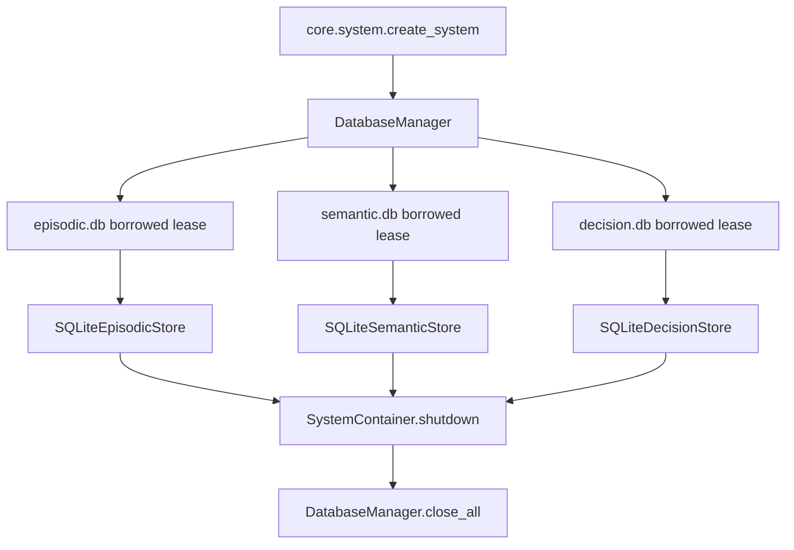
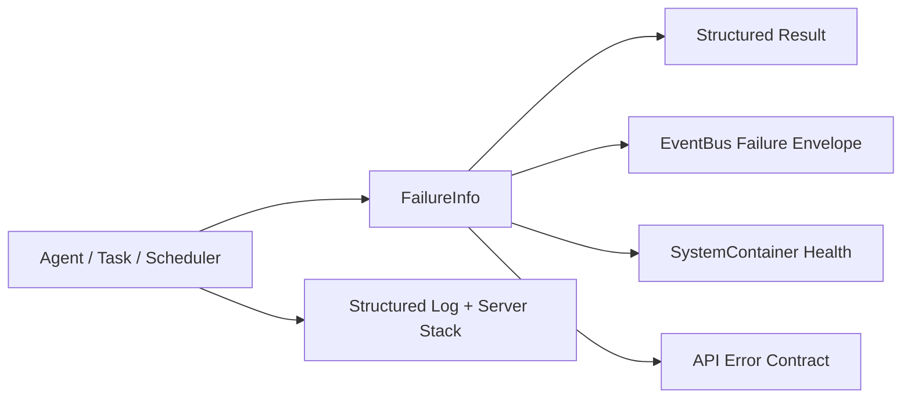
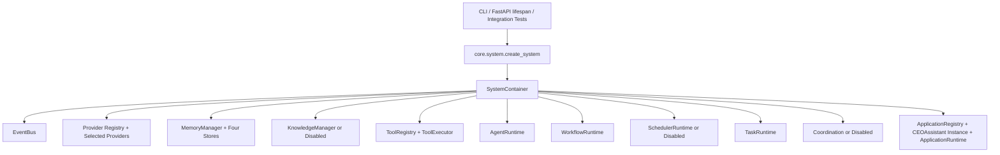

# AI-Lab 架构文档

## v0.33.0 产品基线

v0.33.0 汇总 SP-001 Single Composition Root、SP-002 Failure Semantics & Observability 和 SP-003 DatabaseManager Connection Ownership。产品版本唯一来源是 `pyproject.toml` 的 `[project].version`；运行时、CLI 与 API 只读取派生版本，不维护第二份产品版本常量。

该基线不代表 Reminder/UserTask-Scheduler、Knowledge Reindex/Chunk Persistence/Citation、自动 Tool Calling、Coordination 主链路、Database backup/restore 或 shutdown 全局请求闸门已经完成。SP-004 尚未开始。

## 依赖与打包契约

`pyproject.toml` 是产品版本、运行依赖、可选能力和 setuptools 包发现的唯一权威来源。最小 Core 安装仅包含 Pydantic、PyYAML 与 python-dotenv；API、Real Provider、Knowledge、Test、Build、Dev 通过独立 extras 声明，`local` 提供不含大型 Knowledge 依赖的完整本地验收组合。`requirements.txt` 只代理 `.[local]`，不维护第二套依赖版本。

正式 wheel 包含 `core`、`agents`、`knowledge`、`applications`、`workflows`、`api` 与 `cli`；排除 tests、data、logs、runtime、Chroma 数据和构建缓存。Windows `.bat` 仍定位为源码 checkout 启动入口，不作为 Python package data 发布。

## SP-003 Memory SQLite 连接所有权

> SP-003 状态：Completed
>
> Merge PR：#5 · 合并方式：Squash Merge · 审查结论：APPROVED
> SP-003 Merge Commit：`ce3655ff5f7a625da6b168058873dadfc2289b5f` · 合并时间：`2026-07-14T19:59:33Z`

Composition Root 创建唯一 `DatabaseManager`，并将它注入 Episodic、Semantic、Decision 三个 SQLite Memory Store。Managed Mode 下 Manager 是连接唯一 Owner，Store 通过 `ConnectionLease(owned=False)` 借用连接；lease 在完整借用周期持有 per-database lock，关闭操作必须等待 lease 退出。Standalone Mode 下 Store 使用 `ConnectionLease(owned=True)` 创建并关闭 operation-scoped connection。



数据库路径仍为 `settings.sqlite_dir/episodic.db`、`semantic.db`、`decision.db`，不迁移、不复制、不修改 Schema。同一逻辑名不可在 Manager 生命周期内重绑其他路径。写操作显式 commit/rollback，`batch_save` 采用单事务；每个逻辑数据库使用独立 `RLock`，SQL 不在全局注册锁内执行。连接只有在关闭成功后才从缓存移除，关闭失败保留所有权并允许重试。完整契约见 `docs/architecture/DATABASE_CONNECTION_OWNERSHIP.md` 与 `ADR-029`。

Knowledge SQLite Store 与 SchedulerPersistence 本轮不迁移。当前关闭过程也尚未提供阻止所有外部并发数据库调用的全局闸门，调用入口必须先停止请求，再执行 `SystemContainer.shutdown()`。

## SP-002 失败语义收敛

> SP-002 状态：Completed
>
> Merge PR：#3 · 合并方式：Squash Merge · 审查结论：APPROVED
> Merge Commit：`a39dc6a2434b409d311709b08b2c0df9a555a610` · 合并时间：`2026-07-14T18:22:14Z`

AI-Lab 在唯一 Composition Root 之上新增统一失败契约 `core/errors/`。`FailureInfo` 现在贯穿 Agent、Task、Scheduler、失败事件、System Health 与 API，错误不再通过普通回答、成功 result 或静默异常表达。



Task Runtime 使用每个 Workflow 独立的 attempt 循环并默认 fail-fast；Scheduler 跟踪 tick 连续失败和后台 Job task；Agent 执行失败进入 `ERROR`，回答成功但 Memory 写入失败进入 `DEGRADED`。完整规则见 `docs/architecture/FAILURE_SEMANTICS.md`。

首轮审查修复进一步收紧运行边界：Agent 仅在请求显式关闭某项能力时跳过该能力；Application 的 `error/failed/not_configured/disabled` 不允许作为 HTTP 200 返回；MemoryManager 在 Store 成功操作或显式健康探针通过后清除临时失败；关键组件处于 `stopped/not_initialized/not_configured/disabled/failed` 时，顶层 Health 必须为 `failed`。

SP-002 最终本地验证记录为 `768 passed, 26 warnings in 34.43s`。合并时 GitHub 没有远端 CI checks，该统计来自本地 pytest，不是 GitHub Actions 结果。

## SP-001 系统组合收敛

AI-Lab 的模块层次保持不变，但所有进程级依赖现在由唯一 Composition Root 组装：

SP-001 已通过 PR #1 合并到 `main`（Merge Commit：`0a36e250ab8382af6cf3ab3068e432aa69ba3399`）。`core.system.create_system()` 是当前 `main` 的权威系统组合入口。



启动由 `SystemContainer.start()` 统一完成，关闭由 `SystemContainer.shutdown()` 反序执行。CLI 不再创建 Store 或 Provider，API dependency 不再创建空 Runtime，ApplicationRuntime 不再直接依赖具体 Provider。

当前默认状态：Knowledge、Scheduler、Coordination 为 `disabled`；仅在明确配置后启用。Mock Provider 只能在显式 `mock/test` 模式创建。完整说明见 `docs/architecture/SYSTEM_COMPOSITION.md`。

| 组件 | 当前状态 | 边界 |
|---|---|---|
| Knowledge | Implemented / Disabled | Reindex、Chunk Persistence、Citation 与真实主链路未完成 |
| Scheduler | Implemented / Disabled | Runtime 基础存在；Reminder/UserTask 闭环未完成 |
| Coordination | Implemented / Disabled | 默认关闭；CEO Assistant 主链路未接入 |
| Tool Runtime | Integrated | Registry/Executor 与低风险工具已接入；自动 Tool Calling、完整 MCP 产品闭环未完成 |
| CEO Assistant | Integrated / Verified / Alpha | CLI、API 工作记录和持久化已验证，不代表生产就绪 |

## 架构总览

AI-Lab 采用十层架构（v0.22.0）：

```
┌─────────────────────────────────────────────────────────────┐
│              Governance Layer（治理层）                     │
│  开发策略 · Agent 策略 · 知识策略 · 模型策略 · 版本策略     │
├─────────────────────────────────────────────────────────────┤
│              Application Layer（业务应用层）                │
│   Investment Office · Enterprise AI · Quotation System     │
├─────────────────────────────────────────────────────────────┤
│              Task Runtime（任务编排层）★ v0.22.0           │
│  TaskManager · Planner · DependencyResolver · Checkpoint   │
├─────────────────────────────────────────────────────────────┤
│              Scheduler Layer（调度层）★ v0.21.0           │
│  SchedulerRuntime · TriggerEngine · JobExecutor · Persist  │
├─────────────────────────────────────────────────────────────┤
│              Workflow Layer（工作流层）★ v0.20.0           │
│  WorkflowRuntime · StateMachine · Checkpoint · Planner     │
├─────────────────────────────────────────────────────────────┤
│              Agent Layer（智能 Agent 层）                   │
│  AgentRuntime · Lifecycle · ContextBuilder · Executor       │
├─────────────────────────────────────────────────────────────┤
│              Knowledge Layer（知识系统层）                  │
│  Ingestion Pipeline · Chunking · Hybrid Retrieval · Ranking │
├─────────────────────────────────────────────────────────────┤
│              Provider Layer（模型抽象层）                   │
│  LLM · Embedding · Vector · Storage（Protocol + Mock）     │
├─────────────────────────────────────────────────────────────┤
│              Tool Runtime（工具执行层）                     │
│  Executor · Sandbox · Permissions · Audit · MCP Adapter     │
├─────────────────────────────────────────────────────────────┤
│              Memory Layer（记忆系统层）                     │
│  Session · Episodic · Semantic · Decision（四层）          │
│  Consolidation Engine（Importance · Decay · Policy）       │
├─────────────────────────────────────────────────────────────┤
│              Core Layer（基础能力层）                       │
│  配置 · 日志 · 消息总线 · 数据库                            │
└─────────────────────────────────────────────────────────────┘
```

---

## 依赖方向

```
Application → Task → Scheduler → Workflow → Agent → Knowledge → Provider → Tool → Adapter → External
```

严禁反向依赖。

---

## Task Runtime（v0.22.0）

Task Runtime 是 Scheduler + Workflow 之上的统一任务编排中心。

```
Application
      ↓
TaskRuntime
  ├── TaskManager（CRUD + 统计）
  ├── TaskRegistry（注册 / 查找）
  ├── TaskPlanner（Rule / LLM / Tree — 策略模式）
  ├── TaskStateMachine（11 状态）
  ├── DependencyResolver（跨 Task 依赖）
  ├── ContextManager（跨 Workflow 共享上下文）
  ├── CheckpointManager（快照 / 恢复）
  └── EventBus（9 种 Task 事件）
```

| 组件 | 说明 |
| --- | --- |
| TaskRuntime | 统一任务编排，管理 Task 完整生命周期 |
| TaskManager | Task CRUD + 统计 |
| TaskPlanner | 根据 Task 类型生成执行计划（策略模式） |
| DependencyResolver | 解析 Task 间依赖关系 |
| ContextManager | 跨 Workflow 共享上下文 |
| CheckpointManager | Task 级快照，支持暂停恢复 |
| TaskStateMachine | 11 种状态，严格状态机 |

### Task 状态

```
CREATED → READY → RUNNING → COMPLETED
                   ↓
              WAITING / PAUSED / FAILED / RETRYING
                   ↓
              CANCELLED / TIMEOUT / DESTROYED
```

---

## Scheduler Layer（v0.21.0）

```
Application
      ↓
SchedulerRuntime（Tick-loop）
  ├── TriggerEngine（Cron / Interval / One-shot / Manual / Event）
  ├── JobExecutor → WorkflowRuntime
  ├── SchedulerRegistry
  └── SchedulerPersistence（SQLite）
```

| Trigger 类型 | 说明 |
|-------------|------|
| CRON | 定时表达式 |
| INTERVAL | 固定间隔 |
| ONE_SHOT | 一次性 |
| MANUAL | 手动触发 |
| EVENT | 事件驱动（预留） |

---

## Workflow Layer（v0.20.0）

```
CREATED → READY → PLANNING → RUNNING → COMPLETED / FAILED / CANCELLED
              RUNNING → PAUSED → RESUMED
              RUNNING → WAITING
```

---

## Agent Runtime（v0.17.0）

```
Application → AgentRuntime → AgentExecutor → ContextBuilder → LLM → Tool → Memory
```

---

## Knowledge Layer（v0.16.0）

```
Ingestion → Chunking（6 策略）→ Embedding → Hybrid Retrieval → Ranking
```

---

## Provider Layer（v0.15.0）

四种协议（LLM / Embedding / Vector / Storage）+ Mock 实现。Model Agnostic 原则。

---

## Tool Runtime（v0.18.0）+ MCP Adapter（v0.19.0）

```
Agent → ToolExecutor → [Validator → Permission → Sandbox → Tool]
                          ↓                    ↓
                   Metrics/Audit        MCPToolWrapper → MCP Server
```

---

## Memory Layer

四层记忆：Session（内存）| Episodic（SQLite）| Semantic（SQLite）| Decision（SQLite）

---

## Governance Layer

6 策略文件 + RFC/ADR 体系 + Project Health 机制。

---

## 版本历史

| 版本 | 日期 | 变更 |
| --- | --- | --- |
| v0.33.0 | 2026-07-15 | SP-001~SP-003 稳定化成果与统一版本来源 |
| v0.32.4 | 2026-07-13 | CEO Assistant Interactive CLI + Provider Mode 统一 |
| v0.32.0~v0.32.3 | 2026-07-13 | CEO Assistant MVP + First Run + Release Cleanup |
| v0.31.0 | 2026-07-13 | Alpha Field Validation |
| v0.30.0 | 2026-07-13 | Application Foundation & Alpha Deployment |
| v0.23.0 | 2026-07-13 | Multi-Agent Coordination（十一层架构） |
| v0.21.0 | 2026-07-13 | Phase 4.1: Scheduler Runtime |
| v0.20.0 | 2026-07-12 | Phase 4.0: Workflow Engine ★ Alpha |
| v0.19.0 | 2026-07-12 | MCP Adapter + E2E Integration |
| v0.18.0 | 2026-07-12 | Tool Runtime |
| v0.17.0 | 2026-07-12 | Agent Runtime |
| v0.16.0 | 2026-07-12 | Knowledge Layer |
| v0.15.0 | 2026-07-12 | Provider Layer |
| v0.14.0 | 2026-07-12 | Architecture Stabilization |
| v0.13.0 ~ v0.7.0 | 2026-07-12 | Memory Layer + Core Runtime |
| v0.6.0 ~ v0.1.0 | 2026-07-11~12 | Foundation Phase + Governance |
