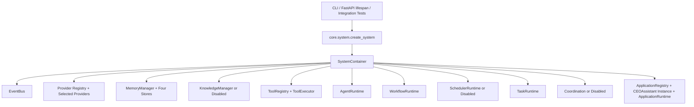

# AI-Lab 架构文档

## SP-001 系统组合收敛

AI-Lab 的模块层次保持不变，但所有进程级依赖现在由唯一 Composition Root 组装：



启动由 `SystemContainer.start()` 统一完成，关闭由 `SystemContainer.shutdown()` 反序执行。CLI 不再创建 Store 或 Provider，API dependency 不再创建空 Runtime，ApplicationRuntime 不再直接依赖具体 Provider。

当前默认状态：Knowledge、Scheduler、Coordination 为 `disabled`；仅在明确配置后启用。Mock Provider 只能在显式 `mock/test` 模式创建。完整说明见 `docs/architecture/SYSTEM_COMPOSITION.md`。

## 架构总览

AI-Lab 采用十层架构（v0.22.0）：

```
┌─────────────────────────────────────────────────────────────┐
│              Governance Layer（治理层）                     │
│  开发策略 · Agent 策略 · 知识策略 · 模型策略 · 版本策略     │
├─────────────────────────────────────────────────────────────┤
│              Application Layer（业务应用层）                │
│   Investment Office · Enterprise AI · Quotation System     │
├─────────────────────────────────────────────────────────────┤
│              Task Runtime（任务编排层）★ v0.22.0           │
│  TaskManager · Planner · DependencyResolver · Checkpoint   │
├─────────────────────────────────────────────────────────────┤
│              Scheduler Layer（调度层）★ v0.21.0           │
│  SchedulerRuntime · TriggerEngine · JobExecutor · Persist  │
├─────────────────────────────────────────────────────────────┤
│              Workflow Layer（工作流层）★ v0.20.0           │
│  WorkflowRuntime · StateMachine · Checkpoint · Planner     │
├─────────────────────────────────────────────────────────────┤
│              Agent Layer（智能 Agent 层）                   │
│  AgentRuntime · Lifecycle · ContextBuilder · Executor       │
├─────────────────────────────────────────────────────────────┤
│              Knowledge Layer（知识系统层）                  │
│  Ingestion Pipeline · Chunking · Hybrid Retrieval · Ranking │
├─────────────────────────────────────────────────────────────┤
│              Provider Layer（模型抽象层）                   │
│  LLM · Embedding · Vector · Storage（Protocol + Mock）     │
├─────────────────────────────────────────────────────────────┤
│              Tool Runtime（工具执行层）                     │
│  Executor · Sandbox · Permissions · Audit · MCP Adapter     │
├─────────────────────────────────────────────────────────────┤
│              Memory Layer（记忆系统层）                     │
│  Session · Episodic · Semantic · Decision（四层）          │
│  Consolidation Engine（Importance · Decay · Policy）       │
├─────────────────────────────────────────────────────────────┤
│              Core Layer（基础能力层）                       │
│  配置 · 日志 · 消息总线 · 数据库                            │
└─────────────────────────────────────────────────────────────┘
```

---

## 依赖方向

```
Application → Task → Scheduler → Workflow → Agent → Knowledge → Provider → Tool → Adapter → External
```

严禁反向依赖。

---

## Task Runtime（v0.22.0）

Task Runtime 是 Scheduler + Workflow 之上的统一任务编排中心。

```
Application
      ↓
TaskRuntime
  ├── TaskManager（CRUD + 统计）
  ├── TaskRegistry（注册 / 查找）
  ├── TaskPlanner（Rule / LLM / Tree — 策略模式）
  ├── TaskStateMachine（11 状态）
  ├── DependencyResolver（跨 Task 依赖）
  ├── ContextManager（跨 Workflow 共享上下文）
  ├── CheckpointManager（快照 / 恢复）
  └── EventBus（9 种 Task 事件）
```

| 组件 | 说明 |
| --- | --- |
| TaskRuntime | 统一任务编排，管理 Task 完整生命周期 |
| TaskManager | Task CRUD + 统计 |
| TaskPlanner | 根据 Task 类型生成执行计划（策略模式） |
| DependencyResolver | 解析 Task 间依赖关系 |
| ContextManager | 跨 Workflow 共享上下文 |
| CheckpointManager | Task 级快照，支持暂停恢复 |
| TaskStateMachine | 11 种状态，严格状态机 |

### Task 状态

```
CREATED → READY → RUNNING → COMPLETED
                   ↓
              WAITING / PAUSED / FAILED / RETRYING
                   ↓
              CANCELLED / TIMEOUT / DESTROYED
```

---

## Scheduler Layer（v0.21.0）

```
Application
      ↓
SchedulerRuntime（Tick-loop）
  ├── TriggerEngine（Cron / Interval / One-shot / Manual / Event）
  ├── JobExecutor → WorkflowRuntime
  ├── SchedulerRegistry
  └── SchedulerPersistence（SQLite）
```

| Trigger 类型 | 说明 |
|-------------|------|
| CRON | 定时表达式 |
| INTERVAL | 固定间隔 |
| ONE_SHOT | 一次性 |
| MANUAL | 手动触发 |
| EVENT | 事件驱动（预留） |

---

## Workflow Layer（v0.20.0）

```
CREATED → READY → PLANNING → RUNNING → COMPLETED / FAILED / CANCELLED
              RUNNING → PAUSED → RESUMED
              RUNNING → WAITING
```

---

## Agent Runtime（v0.17.0）

```
Application → AgentRuntime → AgentExecutor → ContextBuilder → LLM → Tool → Memory
```

---

## Knowledge Layer（v0.16.0）

```
Ingestion → Chunking（6 策略）→ Embedding → Hybrid Retrieval → Ranking
```

---

## Provider Layer（v0.15.0）

四种协议（LLM / Embedding / Vector / Storage）+ Mock 实现。Model Agnostic 原则。

---

## Tool Runtime（v0.18.0）+ MCP Adapter（v0.19.0）

```
Agent → ToolExecutor → [Validator → Permission → Sandbox → Tool]
                          ↓                    ↓
                   Metrics/Audit        MCPToolWrapper → MCP Server
```

---

## Memory Layer

四层记忆：Session（内存）| Episodic（SQLite）| Semantic（SQLite）| Decision（SQLite）

---

## Governance Layer

6 策略文件 + RFC/ADR 体系 + Project Health 机制。

---

## 版本历史

| 版本 | 日期 | 变更 |
| --- | --- | --- |
| v0.32.4 | 2026-07-13 | CEO Assistant Interactive CLI + Provider Mode 统一 |
| v0.32.0~v0.32.3 | 2026-07-13 | CEO Assistant MVP + First Run + Release Cleanup |
| v0.31.0 | 2026-07-13 | Alpha Field Validation |
| v0.30.0 | 2026-07-13 | Application Foundation & Alpha Deployment |
| v0.23.0 | 2026-07-13 | Multi-Agent Coordination（十一层架构） |
| v0.21.0 | 2026-07-13 | Phase 4.1: Scheduler Runtime |
| v0.20.0 | 2026-07-12 | Phase 4.0: Workflow Engine ★ Alpha |
| v0.19.0 | 2026-07-12 | MCP Adapter + E2E Integration |
| v0.18.0 | 2026-07-12 | Tool Runtime |
| v0.17.0 | 2026-07-12 | Agent Runtime |
| v0.16.0 | 2026-07-12 | Knowledge Layer |
| v0.15.0 | 2026-07-12 | Provider Layer |
| v0.14.0 | 2026-07-12 | Architecture Stabilization |
| v0.13.0 ~ v0.7.0 | 2026-07-12 | Memory Layer + Core Runtime |
| v0.6.0 ~ v0.1.0 | 2026-07-11~12 | Foundation Phase + Governance |
