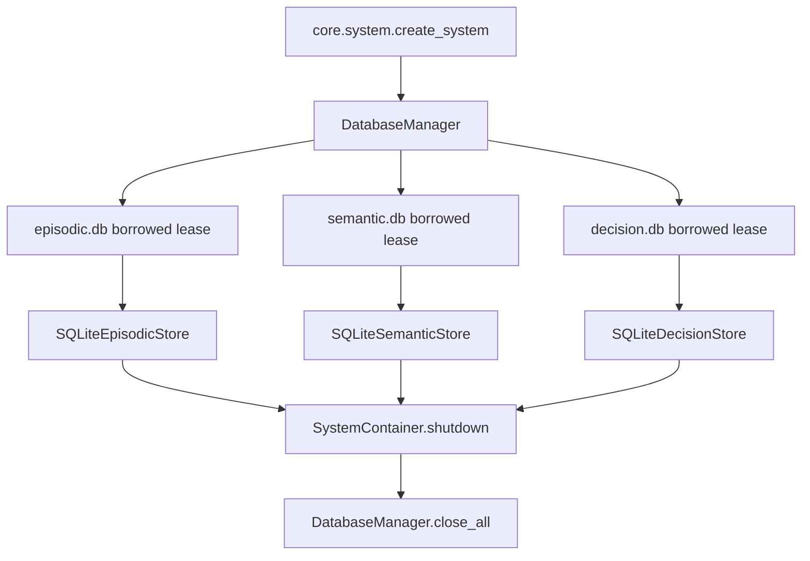
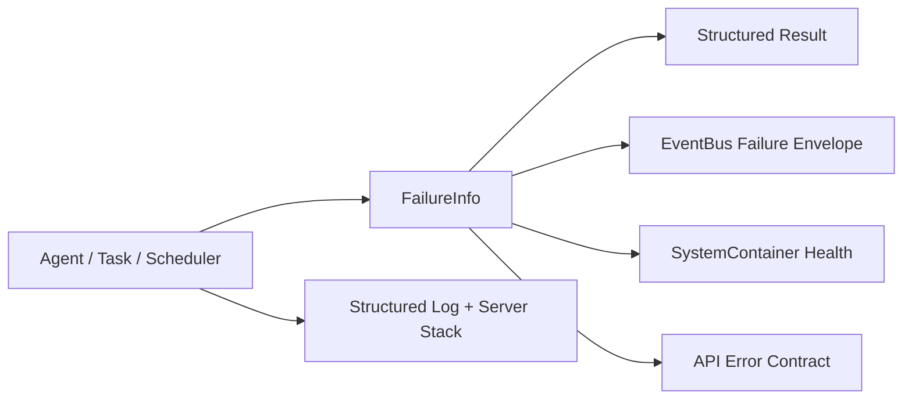
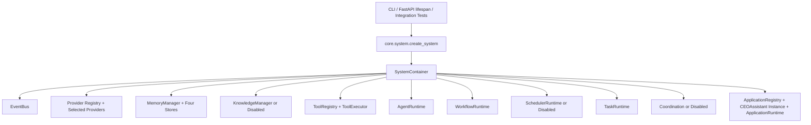

# AI-Lab 架构文档

> 当前工作：None。INT-001 已封存；P0-R 已实现并通过最终独立审查，Pilot Preview authority 已在独立 composition 中建立。
> PILOT-001-IBD 设计已通过最终独立规划审查；Fresh Owner Ingress Evidence 仍为 `UNSUPPORTED`，Bridge 未实现且未授权，Phase 1 未授权。

INT-001 在 `applications/trusted_interaction_adapter` 增加 Shell-neutral application
boundary，并通过官方 MCP SDK 提供本地 stdio projection。该层只依赖 canonical
`InteractionService` 与可注入的 identity/policy authorities；不得直接访问 repository、
数据库或 Shell 私有实现。默认 authorities fail closed，且 MCP allowlist 不包含 approve、
execute、verify 或 canonical commit。该变更不修改 SP-021 domain、Schema 或 Composition Root。

## STRAT-001 目标架构基线

本基线已由 STRAT-001 / PR #63 合并采纳；RFC-031 为 Adopted，ADR-067 与 ADR-068 为
Accepted。ARCH-001 已通过 PR #66 合并、通过 main Quality Gate、完成 post-merge reconciliation
并封存；RFC-032 为 Adopted，ADR-069～072 为 Accepted。该架构采纳不授权产品实现。

AI-Lab OS 的长期架构定位是可信业务操作系统，不再以复制完整通用 Agent 平台为目标。
用户入口经由可替换 Agent Shell、中立 Adapter Contract 和 Trusted Interaction Boundary
访问 AI-Lab Business OS：

```text
企业微信 / Web / 语音 / 桌面
→ 可替换 Agent Shell（Hermes 为首选实现）
→ 中立 Adapter Contract
→ View / Preview / Confirm / Cancel / Status / Verified Result
→ AI-Lab Business OS（业务事实 / 状态 / 规则 / 审计 / 恢复）
→ ERP / 文件 / NAS / 邮件 / 浏览器 / 数据库
```

Hermes Memory 不是业务事实源，Hermes Conversation 不是审批事实源，Hermes Tool
Response 不是最终成功证明。Hermes 不得直接访问 AI-Lab 数据库；AI-Lab 不得 import
或依赖 Hermes 内部实现。AI-Lab 掌握业务对象、状态、规则、Preview、Confirmation、
Approval、Audit、Verified Result 与 Recovery。

通用 Agent、渠道、Skills、Browser、Computer Use 和通用 Cron 优先由 Agent Shell
提供；AI-Lab 保留业务 Reminder/Scheduler。通用 Tool Runtime 扩张冻结，但 MCP 仍可
作为 Adapter transport 候选，且不得绕过可信交互边界。完整规划见
`docs/project/PRODUCT_STRATEGY.md`、`docs/project/CAPABILITY_OWNERSHIP.md` 和 RFC-031。

实际执行者不固定为 Agent Shell：Agent Shell、AI-Lab 的正式外部系统 Adapter 或其他
受控 Execution Adapter 均可承担执行。无论执行者是谁，AI-Lab 始终掌握业务 Policy、
Preview、Confirmation、Approval、Audit、Status、Verified Result 与 Recovery。

ARCH-001 进一步提出 `trusted-interaction/v1` Shell-neutral、Transport-neutral 合同，覆盖 View、Preview、
Confirm、Cancel、Modify、Status、Verified Result 与 Recovery，并将 lifecycle 与 execution、verification、
recovery 子状态分离。Preview 与 Confirmation 是 AI-Lab canonical facts；最终成功必须先形成 AI-Lab
Verified Result；identity/Workspace 映射失败关闭。完整规划见
`docs/project/ARCH-001-TRUSTED-INTERACTION-ARCHITECTURE.md`、RFC-032 与 ADR-069～072。

SP-021 已建立 canonical Interaction aggregate、Preview、Confirmation、Approval、Execution、
VerifiedResult、Recovery、持久化幂等/CAS/audit 与 transport-neutral Status/View application boundary。
PR #68 已 Squash Merge，ACC-021 A～R 与 main Quality Gate 均通过，SP-021 已完成对账并封存。
Composition Root 默认注入 disabled Execution/Verification ports，不会产生真实外部副作用。
INT-001 已通过 ACC-INT-001 A～Q、最终独立审查、PR #70 Squash Merge 与 main Quality Gate，
并完成 post-merge reconciliation 和封存。PILOT-001-P0R 已实现并通过最终独立审查，通过独立 `pilot_001_mcp_server`
显式注入本地单 Owner binding 与 Preview-only policy，通用 MCP 入口仍 fail closed。该 binding 是
`NOT_PRODUCTION_IDENTITY_AUTHENTICATION`；Vanilla Hermes 的 MCP client 只转发模型生成的 tool
arguments，没有把 channel event metadata 作为模型不可伪造的 provenance 注入 AI-Lab。因此
Fresh Owner 入站证据为 `UNSUPPORTED`，不得进入 Phase 1、业务 mutation 或 Coordinator；REL-036 未启动。

## PILOT-001-IBD 可信入站证据桥设计草案

已 Adopted 的 RFC-033 与已 Accepted 的 ADR-073 在 Hermes 的模型前 WeCom inbound boundary 使用受支持的用户安装型 platform plugin
观察真实 channel event，再由隔离的 Evidence Issuer helper 使用专用 Ed25519 私钥签发最小 canonical envelope。
AI-Lab 是唯一 Evidence Verification Authority 和 replay/consumption owner：它验证 issuer、签名、Owner/channel/
conversation binding、content digest、freshness 与 Preview ordering，并在持久化事务中以 CAS 单次消费 evidence。

R1 将 plugin → issuer 边界收紧为 privileged supervisor 建立的 non-inheritable anonymous IPC capability；issuer
没有具名 listener、共享 token 或通用 mint/sign API。`evidence_id` 是唯一稳定 event identity，独立于
`received_at` 与 `issuer_key_id`；签名采用 RFC 8785/JCS exact bytes，identifier 使用 operator-provisioned opaque
binding IDs。若 future spike 无法证明 signing-oracle isolation，必须停止实现。

R2 将唯一 authoritative channel event ID 固定为 authenticated WeCom callback `body.msgid`，拒绝 req_id、Hermes
message ID/UUID、session/correlation、MCP 与 LLM fallback。AI-Lab 在 Preview 创建后生成不可预测 one-time
`preview_confirmation_challenge`；单一真实 WeCom event 必须包含完整精确 command。`accepted_at` 只证明 deposit
顺序，不能单独证明 event causality。

该设计严格区分 Fresh Ingress Evidence 与 Confirmation Intent。Evidence 只证明真实新 Owner 消息存在；受控逻辑仍需
判断 Message B 是否明确确认指定 Preview。Message A 不能在同一 Agent turn 自动确认。MCP 未来只传 opaque

`evidence_id` 与待校验 confirmation text；MCP success 仍不等于 business success。设计 baseline 已批准，但
`FRESH_OWNER_INGRESS_EVIDENCE_UNSUPPORTED / BRIDGE_IMPLEMENTATION_NOT_AUTHORIZED / PHASE_1_NOT_AUTHORIZED`。

## v0.35.0 Alpha 产品基线

v0.35.0 Alpha 在 v0.34.0 已发布基线上汇总 SP-016～SP-020 已验收的 Waiting-For、Work Log、Daily Review 与 Local Daily Operating Loop，不改变业务行为、Schema、依赖或运行 Profile 逻辑。产品版本唯一来源是 `pyproject.toml` 的 `[project].version`；根 `project_state.json` 记录稳定的仓库治理状态、历史验证基线和发布授权配置。当前 Git HEAD、Tag 和 GitHub Release 等外部事实通过 Git/GitHub 按需查询；运行时、CLI 与 API 只读取派生版本，不维护第二份产品版本常量。

v0.35 开发线新增独立 canonical Waiting-For domain：`core/waiting_for` 使用 DatabaseManager 管理的 `followups.db` 保存 CAS 快照与 append-only 事件。FastAPI、CLI 与 Daily Agenda 均通过 Composition Root 中同一个 `WaitingForService` 访问真相源；Daily Agenda 将 UserTask、Reminder、Waiting-For 与 Work Log 视为可选来源，未启用来源不阻断其他来源查询。

SP-018 新增唯一 `core/work_log/WorkLogService` 与 `SQLiteWorkLogRepository`。它复用 DatabaseManager 管理的既有 `episodic.db / episodic_memories`，不创建新表或索引；新记录采用 `wl_<32 hex>`，Legacy 记录只读投影为 `wl_legacy_<sha256>`。public get/list 在 SQL Workspace scope 后才解码或投影，API/CLI/CEO 输入验证共享 WorkLogService FailureInfo；Agenda 按真实 status 聚合并对 ALL 稳定分页，Legacy naive DST 不存在或歧义时间 fail closed。CEO Assistant、API、CLI、Inbox、Daily Agenda 与 Daily Brief 只通过该服务访问 Work Log；ACC-018 A～O 与合并后验证均已通过。

SP-017 已完成验收并封存。正式链路为 `CEO Assistant capture -> InboxService.resolve_to_waiting_for() -> WaitingForService.create()`，复用 `inbox_resolution_claims` 的 `CLAIMED -> TARGET_CREATED -> COMPLETED`，不新增 Saga 表或 Waiting-For lifecycle Schema；自然语言写入必须先捕获并通过 Inbox ID 确认，后续 mutation 必须使用 canonical `wf_...` ID。

REL-035 已发布 `v0.35.0 Alpha — Local Daily Operating Loop` GitHub Pre-release，
不改变上述运行时架构。升级不需要破坏性 Migration、既有表重写、legacy import 或
dual-write；缺失 `followups.db` 时，Waiting-For 表与索引按 `IF NOT EXISTS` 增量初始化。
旧 `.env` 不能直接视为 Local Daily Profile 合格配置，必须显式提供稳定绝对 data/sqlite
路径、IANA timezone、Provider、feature flags、API token 与完整 WorkspaceKey。当前源码
版本为 `0.35.0`；annotated Tag `v0.35.0` 指向冻结 Release Head
`60fc299c4f4fd1ba22fc4a00d1490f3b2b893503`，GitHub Pre-release 已远端验证且无二进制附件。
REL-035 已最终对账并封存，但 Alpha、local-first、single-user-oriented 边界保持不变。

SP-004 Canonical UserTask Domain 已通过 PR #8 完成审查并以 Squash Merge 进入 `main`。审查结论为 `APPROVED`，SP-004 merge baseline 为 `10d1534049be2d526c930c513912dc661ac41728`，合并时间为 `2026-07-15T11:39:33Z`。该提交是主分支合并基线，不是 PR Head。

SP-005 Reminder & Scheduler Bridge 已通过 PR #10 审查并以 Squash Merge 进入 `main`。审查结论为 `APPROVED`，SP-005 merge baseline 为 `167b0d78f7713b1d5bfc85198c1461c7a35f63d3`，合并时间为 `2026-07-15T14:03:32Z`。Scheduler 通过数据库 CAS claim、持久化 JobRun 和 Action Handler 支持可靠 One-shot；Reminder/Occurrence 使用 `reminders.db`、唯一键和 Saga reconciliation。该能力默认关闭；通知渠道、Recurring Reminder、Knowledge Reindex/Chunk Persistence/Citation、自动 Tool Calling、完整 MCP 闭环、Coordination 主链路、UI、Database backup/restore、in-flight counting 和 drain timeout 仍未完成。

SP-010 Reminder Inbox 已通过 PR #21 以 Squash Commit `af437afc32dcb17da68d600d6840ec94c8cbe681` 合并，状态为 APPROVED / MERGED / RECONCILED / ARCHIVED。Composition Root 持有唯一 `ReminderInboxService`，通过 SQLite 稳定分页、UserTask workspace metadata 与 ADR-040 聚合状态，为 API、CLI 和 CEO Assistant 提供同一只读列表边界。该跨 SQLite 聚合不是快照事务，深度稀疏过滤仍是性能观察点；它不扩展到通知投递或 UI。

**SP-012：APPROVED / MERGED / RECONCILED / ARCHIVED。** 已通过 PR #25 以 Squash Commit `d550ab8757b50e4d12587d5e71a0058089bd3821` 进入 main。引入不可变 `IntentDecision` 显式区分 `read/write/chat`，Reminder 查询先于 Work Log 写规则，CLI 将原始输入交给同一 canonical 决策，集中 `ReminderUserErrorPresenter` 在不改变 FailureInfo 机器码的前提下提供中文操作提示。不是 LLM 分类器或通用权限系统；查询兼容性由 SP-013 场景 H 覆盖，不虚构独立完整手工验收。RFC-022 已 Adopted，ADR-046/047/048 已 Accepted。

SP-011 Reminder Management Closure 已通过 PR #23 以 Squash Commit `5c4b442b2b5c7f934ac381020ba8b310976d5d3a` 合并，状态为 APPROVED / MERGED / RECONCILED / ARCHIVED。Composition Root 持有唯一 `ReminderManagementService`，继续委托现有 `ReminderSchedulerBridge` Saga 完成取消和改期，不建立第二套持久化协调。API、CLI 与 CEO Assistant 共享 workspace 校验、终态规则、标题歧义、幂等和失败语义；确定性 Reminder 响应与 LLM Provider 装配分离。RFC-021 已 Adopted，ADR-043/044/045 已 Accepted。Reminder 与 Scheduler 仍是独立持久化边界，不声称跨数据库原子事务。

SP-014B 只在 `TaskReminderIntentParser` 的小时 token 边界增加中文 `一` 至 `十二` 映射，并要求中文小时同时具有明确 `上午/下午/晚上`。转换后继续进入原有 period、分钟、IANA 时区、UTC、past-time、title 与 FailureInfo 路径；不新增日期引擎、LLM 解析、持久化或 Inbox 依赖。

SP-014 Unified Inbox 已通过 PR #32 合入并完成 ACC-014 A～L 验收。`InboxService` 由 canonical Composition Root 统一注入 API、CLI 与 CEO Assistant；持久化 `inbox_resolution_claims` 在任何目标写入前确定唯一解析类型，并支持 UserTask、Reminder、Work Log、Note 与 Dismiss 的幂等完成及崩溃恢复。进程内锁不是跨进程正确性边界，Workspace 三元组继续约束所有查询与写入。

## Reminder 与 Scheduler Bridge（SP-005）

`core/reminders` 将 UserTask、Reminder、ReminderOccurrence 与 Scheduled Job 保持为四个独立概念。Scheduler 使用 SQLite 条件 UPDATE 获取唯一 claim；Handler 成功后 One-shot Job 原子进入 completed。Reminder Handler 在 `reminders.db` 单事务内提交 Reminder 与唯一 Occurrence，EventBus 在提交后发布。两个数据库之间不声称原子事务，而是通过 pending 状态、补偿和可重复 reconciliation 恢复。完整契约见 `docs/architecture/REMINDER_SCHEDULER_BRIDGE.md`。

SP-005 的 Windows 隔离 Python 3.12 本地最终验证为 `888 passed, 27 warnings in 45.19s`，不是 GitHub Actions 或跨平台 CI 结果。

## UserTask 领域

`core/user_tasks` 是用户待办的唯一领域边界：Domain → UserTaskService → SQLiteUserTaskRepository → DatabaseManager lease → `tasks.db`。API 与 CEO Assistant 只调用 Service；`core/task` 继续专注 Workflow 执行任务，`core/scheduler` 继续管理 Scheduled Job。

UserTask 将 `due_at` 统一持久化为 UTC，并用经过 IANA 校验的 `timezone` 保留用户展示语义；Legacy Decision Memory 通过 offset 分页导入并显式迁移 deadline、priority、status、session、agent 与 source。revision 必须大于等于 1，损坏持久化行归类为 Persistence Failure。

SP-004 的 Windows 本地最终验证记录为 `847 passed, 27 warnings in 38.81s`，不是 GitHub Actions 结果。首次全量测试的 5 个错误来自 pytest 子进程继承的 SOCKS 代理环境；仅清理测试子进程代理变量后全量通过，未修改系统代理或 `.env`。

## 依赖与打包契约

`pyproject.toml` 是产品版本、运行依赖、可选能力和 setuptools 包发现的唯一权威来源。最小 Core 安装仅包含 Pydantic、PyYAML 与 python-dotenv；API、Real Provider、Knowledge、Test、Build、Dev 通过独立 extras 声明，`local` 提供不含大型 Knowledge 依赖的完整本地验收组合。`requirements.txt` 只代理 `.[local]`，不维护第二套依赖版本。

正式 wheel 包含 `core`、`agents`、`knowledge`、`applications`、`workflows`、`api` 与 `cli`；排除 tests、data、logs、runtime、Chroma 数据和构建缓存。Windows `.bat` 仍定位为源码 checkout 启动入口，不作为 Python package data 发布。

## 项目状态与发布治理契约

- `project_state.json`：机器可读的稳定仓库治理状态，记录历史验证基线、SP、Quality Gate、技术债与发布授权配置；不镜像当前 Git HEAD、Tag 或 GitHub Release 实时事实。
- `pyproject.toml`：唯一运行时产品版本来源。
- README：面向使用者的当前能力和限制，不承担逐 SP 历史流水账。
- Project Brain：长期架构事实和封存产品事实。
- Roadmap：未来版本范围和候选任务。
- Changelog / Release Notes：按产品版本记录用户可见变化、升级和限制。

治理一致性测试只读解析这些来源并失败关闭；不得自动改写文档或根据开发分支 Head 冒充 `main`。

## SP-003 Memory SQLite 连接所有权

> SP-003 状态：Completed
>
> Merge PR：#5 · 合并方式：Squash Merge · 审查结论：APPROVED
> SP-003 Merge Commit：`ce3655ff5f7a625da6b168058873dadfc2289b5f` · 合并时间：`2026-07-14T19:59:33Z`

Composition Root 创建唯一 `DatabaseManager`，并将它注入 Episodic、Semantic、Decision 三个 SQLite Memory Store。Managed Mode 下 Manager 是连接唯一 Owner，Store 通过 `ConnectionLease(owned=False)` 借用连接；lease 在完整借用周期持有 per-database lock，关闭操作必须等待 lease 退出。Standalone Mode 下 Store 使用 `ConnectionLease(owned=True)` 创建并关闭 operation-scoped connection。


```mermaid
flowchart TD
    Factory["core.system.create_system"] --> Manager["DatabaseManager"]
    Manager --> E["episodic.db borrowed lease"]
    Manager --> S["semantic.db borrowed lease"]
    Manager --> D["decision.db borrowed lease"]
    E --> ES["SQLiteEpisodicStore"]
    S --> SS["SQLiteSemanticStore"]
    D --> DS["SQLiteDecisionStore"]
    ES --> Shutdown["SystemContainer.shutdown"]
    SS --> Shutdown
    DS --> Shutdown
    Shutdown --> CloseAll["DatabaseManager.close_all"]
```

数据库路径仍为 `settings.sqlite_dir/episodic.db`、`semantic.db`、`decision.db`，不迁移、不复制、不修改 Schema。同一逻辑名不可在 Manager 生命周期内重绑其他路径。写操作显式 commit/rollback，`batch_save` 采用单事务；每个逻辑数据库使用独立 `RLock`，SQL 不在全局注册锁内执行。连接只有在关闭成功后才从缓存移除，关闭失败保留所有权并允许重试。完整契约见 `docs/architecture/DATABASE_CONNECTION_OWNERSHIP.md` 与 `ADR-029`。

Knowledge SQLite Store 与 SchedulerPersistence 本轮不迁移。当前关闭过程也尚未提供阻止所有外部并发数据库调用的全局闸门，调用入口必须先停止请求，再执行 `SystemContainer.shutdown()`。

## SP-002 失败语义收敛

> SP-002 状态：Completed
>
> Merge PR：#3 · 合并方式：Squash Merge · 审查结论：APPROVED
> Merge Commit：`a39dc6a2434b409d311709b08b2c0df9a555a610` · 合并时间：`2026-07-14T18:22:14Z`

AI-Lab 在唯一 Composition Root 之上新增统一失败契约 `core/errors/`。`FailureInfo` 现在贯穿 Agent、Task、Scheduler、失败事件、System Health 与 API，错误不再通过普通回答、成功 result 或静默异常表达。


```mermaid
flowchart LR
    Runtime["Agent / Task / Scheduler"] --> Failure["FailureInfo"]
    Failure --> Result["Structured Result"]
    Failure --> Event["EventBus Failure Envelope"]
    Failure --> Health["SystemContainer Health"]
    Failure --> API["API Error Contract"]
    Runtime --> Log["Structured Log + Server Stack"]
```

Task Runtime 使用每个 Workflow 独立的 attempt 循环并默认 fail-fast；Scheduler 跟踪 tick 连续失败和后台 Job task；Agent 执行失败进入 `ERROR`，回答成功但 Memory 写入失败进入 `DEGRADED`。完整规则见 `docs/architecture/FAILURE_SEMANTICS.md`。

首轮审查修复进一步收紧运行边界：Agent 仅在请求显式关闭某项能力时跳过该能力；Application 的 `error/failed/not_configured/disabled` 不允许作为 HTTP 200 返回；MemoryManager 在 Store 成功操作或显式健康探针通过后清除临时失败；关键组件处于 `stopped/not_initialized/not_configured/disabled/failed` 时，顶层 Health 必须为 `failed`。

SP-002 最终本地验证记录为 `768 passed, 26 warnings in 34.43s`。合并时 GitHub 没有远端 CI checks，该统计来自本地 pytest，不是 GitHub Actions 结果。

## SP-001 系统组合收敛

AI-Lab 的模块层次保持不变，但所有进程级依赖现在由唯一 Composition Root 组装：

SP-001 已通过 PR #1 合并到 `main`（Merge Commit：`0a36e250ab8382af6cf3ab3068e432aa69ba3399`）。`core.system.create_system()` 是当前 `main` 的权威系统组合入口。


```mermaid
flowchart TD
    Entry["CLI / FastAPI lifespan / Integration Tests"] --> Factory["core.system.create_system"]
    Factory --> Container["SystemContainer"]
    Container --> Bus["EventBus"]
    Container --> Provider["Provider Registry + Selected Providers"]
    Container --> Memory["MemoryManager + Four Stores"]
    Container --> Knowledge["KnowledgeManager or Disabled"]
    Container --> Tools["ToolRegistry + ToolExecutor"]
    Container --> Agent["AgentRuntime"]
    Container --> Workflow["WorkflowRuntime"]
    Container --> Scheduler["SchedulerRuntime or Disabled"]
    Container --> Task["TaskRuntime"]
    Container --> Coordination["Coordination or Disabled"]
    Container --> Apps["ApplicationRegistry + CEOAssistant Instance + ApplicationRuntime"]
```

启动由 `SystemContainer.start()` 统一完成，关闭由 `SystemContainer.shutdown()` 反序执行。CLI 不再创建 Store 或 Provider，API dependency 不再创建空 Runtime，ApplicationRuntime 不再直接依赖具体 Provider。

当前默认状态：Knowledge、Scheduler、Coordination 为 `disabled`；仅在明确配置后启用。Mock Provider 只能在显式 `mock/test` 模式创建。完整说明见 `docs/architecture/SYSTEM_COMPOSITION.md`。

### SP-020 本地日常运行闭环（已验收并封存）

RFC-029 定义 Windows Local Daily Profile：使用稳定绝对 data/sqlite root、显式
IANA timezone、Provider mode、feature flags、localhost bind 与 API auth。

Daily Review CLI 直接复用现有无数据库、无事件、无 LLM、无写入的
`DailyReviewService`。Action Hint 只能作为由 `source_type + status + reason_code`
确定的纯 presentation，并将明确动作委托现有 canonical domain services。

生命周期 Phase 0 已证明 partial-start rollback、重复 shutdown（包括当前同一流程的
两次 Scheduler shutdown 调用）、连接释放和新进程恢复。备份只规划优雅停机后的完整
data directory Quiescent Backup 与隔离恢复，不承诺在线跨 SQLite 一致快照。上述内容
实现分支已提供严格 Local Daily Profile、共享 Composition Root 的 Daily Review CLI、
纯确定性 Action Hint 和委托 canonical UserTaskService 的 revision-aware 薄入口。API
由共享 request-to-WorkspaceKey 适配器统一传递 tenant、workspace、namespace、
session、agent 与 trace；缺失 header 使用 Profile 默认值，显式空白 header 在访问
任何 canonical source 前以 validation FailureInfo 拒绝。CLI 覆盖值遵循相同的
fail-closed 边界：`None` 使用 Profile 默认值，非空值先 `strip()`，显式空白值不得
回退 Profile 或 `default` workspace。Phase 0
自动化门禁已覆盖 partial-start rollback、重复 shutdown、持续 tick、连接观测和新容器恢复。
Action Hint 不写数据库、不发布事件、不调用 Provider，也不声明不存在的入口；Reminder
reschedule 的 idempotency key 是可选保护能力，Inbox Waiting-For Hint 只声明真实入口
可直接接收的参数。

RFC-029、ADR-063 与 ADR-064 的决策保持不变；ACC-020 A～V 已在冻结实现 Head 上正式
执行一次且仅执行一次，独立证据复核通过，状态为 `PASSED / FINAL`。SP-020 已由 PR #57
Squash Merge 为 `9ea4b72241bd855319231c09fa6b80c112a14305`，main Quality Gate
`30687851816` 为 SUCCESS，并完成治理对账与封存。这不等于 production-ready：External
Notification、Recurring Reminder、Web UI、强身份/RBAC 与多租户边界仍未实现。

| 组件 | 当前状态 | 边界 |
|---|---|---|
| Knowledge | Implemented / Disabled | Reindex、Chunk Persistence、Citation 与真实主链路未完成 |
| Scheduler / Reminder | Integrated / Verified / Disabled by default | SP-005 已合并；通知投递未实现 |
| Coordination | Implemented / Disabled | 默认关闭；CEO Assistant 主链路未接入 |
| Tool Runtime | Integrated | Registry/Executor 与低风险工具已接入；自动 Tool Calling、完整 MCP 产品闭环未完成 |
| CEO Assistant | Integrated / Verified / Alpha | CLI、API 工作记录和持久化已验证，不代表生产就绪 |

## 架构总览

AI-Lab 采用十层架构（v0.22.0）：

```
┌─────────────────────────────────────────────────────────────┐
│              Governance Layer（治理层）                     │
│  开发策略 · Agent 策略 · 知识策略 · 模型策略 · 版本策略     │
├─────────────────────────────────────────────────────────────┤
│              Application Layer（业务应用层）                │
│   Investment Office · Enterprise AI · Quotation System     │
├─────────────────────────────────────────────────────────────┤
│              Task Runtime（任务编排层）★ v0.22.0           │
│  TaskManager · Planner · DependencyResolver · Checkpoint   │
├─────────────────────────────────────────────────────────────┤
│              Scheduler Layer（调度层）★ v0.21.0           │
│  SchedulerRuntime · TriggerEngine · JobExecutor · Persist  │
├─────────────────────────────────────────────────────────────┤
│              Workflow Layer（工作流层）★ v0.20.0           │
│  WorkflowRuntime · StateMachine · Checkpoint · Planner     │
├─────────────────────────────────────────────────────────────┤
│              Agent Layer（智能 Agent 层）                   │
│  AgentRuntime · Lifecycle · ContextBuilder · Executor       │
├─────────────────────────────────────────────────────────────┤
│              Knowledge Layer（知识系统层）                  │
│  Ingestion Pipeline · Chunking · Hybrid Retrieval · Ranking │
├─────────────────────────────────────────────────────────────┤
│              Provider Layer（模型抽象层）                   │
│  LLM · Embedding · Vector · Storage（Protocol + Mock）     │
├─────────────────────────────────────────────────────────────┤
│              Tool Runtime（工具执行层）                     │
│  Executor · Sandbox · Permissions · Audit · MCP Adapter     │
├─────────────────────────────────────────────────────────────┤
│              Memory Layer（记忆系统层）                     │
│  Session · Episodic · Semantic · Decision（四层）          │
│  Consolidation Engine（Importance · Decay · Policy）       │
├─────────────────────────────────────────────────────────────┤
│              Core Layer（基础能力层）                       │
│  配置 · 日志 · 消息总线 · 数据库                            │
└─────────────────────────────────────────────────────────────┘
```

---

## 依赖方向

```
Application → Task → Scheduler → Workflow → Agent → Knowledge → Provider → Tool → Adapter → External
```

严禁反向依赖。

---

## 任务运行时（v0.22.0）

Task Runtime 是 Scheduler + Workflow 之上的统一任务编排中心。

```
Application
      ↓
TaskRuntime
  ├── TaskManager（CRUD + 统计）
  ├── TaskRegistry（注册 / 查找）
  ├── TaskPlanner（Rule / LLM / Tree — 策略模式）
  ├── TaskStateMachine（11 状态）
  ├── DependencyResolver（跨 Task 依赖）
  ├── ContextManager（跨 Workflow 共享上下文）
  ├── CheckpointManager（快照 / 恢复）
  └── EventBus（9 种 Task 事件）
```

| 组件 | 说明 |
| --- | --- |
| TaskRuntime | 统一任务编排，管理 Task 完整生命周期 |
| TaskManager | Task CRUD + 统计 |
| TaskPlanner | 根据 Task 类型生成执行计划（策略模式） |
| DependencyResolver | 解析 Task 间依赖关系 |
| ContextManager | 跨 Workflow 共享上下文 |
| CheckpointManager | Task 级快照，支持暂停恢复 |
| TaskStateMachine | 11 种状态，严格状态机 |

### Task 状态

```
CREATED → READY → RUNNING → COMPLETED
                   ↓
              WAITING / PAUSED / FAILED / RETRYING
                   ↓
              CANCELLED / TIMEOUT / DESTROYED
```

---

## 调度层（v0.21.0）

```
Application
      ↓
SchedulerRuntime（Tick-loop）
  ├── TriggerEngine（Cron / Interval / One-shot / Manual / Event）
  ├── JobExecutor → WorkflowRuntime
  ├── SchedulerRegistry
  └── SchedulerPersistence（SQLite）
```

| Trigger 类型 | 说明 |
|-------------|------|
| CRON | 定时表达式 |
| INTERVAL | 固定间隔 |
| ONE_SHOT | 一次性 |
| MANUAL | 手动触发 |
| EVENT | 事件驱动（预留） |

---

## 工作流层（v0.20.0）

```
CREATED → READY → PLANNING → RUNNING → COMPLETED / FAILED / CANCELLED
              RUNNING → PAUSED → RESUMED
              RUNNING → WAITING
```

---

## 智能体运行时（v0.17.0）

```
Application → AgentRuntime → AgentExecutor → ContextBuilder → LLM → Tool → Memory
```

---

## 知识层（v0.16.0）

```
Ingestion → Chunking（6 策略）→ Embedding → Hybrid Retrieval → Ranking
```

---

## Provider 层（v0.15.0）

四种协议（LLM / Embedding / Vector / Storage）+ Mock 实现。Model Agnostic 原则。

---

## 工具运行时（v0.18.0）+ MCP 适配器（v0.19.0）

```
Agent → ToolExecutor → [Validator → Permission → Sandbox → Tool]
                          ↓                    ↓
                   Metrics/Audit        MCPToolWrapper → MCP Server
```

---

## 记忆层（Memory Layer）

四层记忆：Session（内存）| Episodic（SQLite）| Semantic（SQLite）| Decision（SQLite）

---

## 治理层（Governance Layer）

6 策略文件 + RFC/ADR 体系 + Project Health 机制。

---

## 版本历史

| 版本 | 日期 | 变更 |
| --- | --- | --- |
| v0.34.0 Alpha | 2026-07-22 | UserTask、Reminder、Intent Safety、Daily Agenda、Unified Inbox、Capture-to-Action 与治理/Release 收口；已作为 GitHub Pre-release 发布 |
| v0.33.0 | 2026-07-15 | SP-001~SP-003 稳定化成果与统一版本来源 |
| v0.32.4 | 2026-07-13 | CEO Assistant Interactive CLI + Provider Mode 统一 |
| v0.32.0~v0.32.3 | 2026-07-13 | CEO Assistant MVP + First Run + Release Cleanup |
| v0.31.0 | 2026-07-13 | Alpha Field Validation |
| v0.30.0 | 2026-07-13 | Application Foundation & Alpha Deployment |
| v0.23.0 | 2026-07-13 | Multi-Agent Coordination（十一层架构） |
| v0.21.0 | 2026-07-13 | Phase 4.1: Scheduler Runtime |
| v0.20.0 | 2026-07-12 | Phase 4.0: Workflow Engine ★ Alpha |
| v0.19.0 | 2026-07-12 | MCP Adapter + E2E Integration |
| v0.18.0 | 2026-07-12 | Tool Runtime |
| v0.17.0 | 2026-07-12 | Agent Runtime |
| v0.16.0 | 2026-07-12 | Knowledge Layer |
| v0.15.0 | 2026-07-12 | Provider Layer |
| v0.14.0 | 2026-07-12 | Architecture Stabilization |
| v0.13.0 ~ v0.7.0 | 2026-07-12 | Memory Layer + Core Runtime |
| v0.6.0 ~ v0.1.0 | 2026-07-11~12 | Foundation Phase + Governance |

### SP-006：API 安全边界（实施候选）
- `applications/security/` 模块集中提供 Authenticator 与 ApiSecurityConfig。
- Bearer-token 认证使用恒定时间比较 `hmac.compare_digest`。
- CORS 使用显式 allowlist；启用认证时不允许通配符。
- 受保护路由要求 `Depends(require_auth)`；health/metrics 保持公开。
- 状态：通过 PR #12 合并，`APPROVED / MERGED`。

> SP-007 System Lifecycle Admission Gate: APPROVED / MERGED / RECONCILED / ARCHIVED. PR #14 以 Approved Head `527ecba0ee411edb260b5bbcfdfc24dfa22a5bb4` 合并，main Squash Commit 为 `ceb8ac4b120898d2d83dbe0e3afb4dd52dcb85ee`，时间为 `2026-07-16T10:08:47Z`，版本仍为 `0.33.0`。

> SP-008 Internal Work Admission Boundary: **APPROVED / MERGED / RECONCILED / ARCHIVED**。PR #16 以 Squash Commit `1858d4991379058948559cc96e2672df44e42b67` 合并。Composition Root 创建的单一 `WorkAdmissionGate` 覆盖 `ApplicationRuntime`、CEO Assistant、CLI 经 Runtime 的调用及 Scheduler producer；Task、Workflow 与 Agent 属于已准入工作的下游，不重复检查。

> Accepted scope 绑定当前 `asyncio.Task` 身份：同一 Task 的下游调用可继续，普通 detached child 不继承 bypass；仅 Scheduler 可通过 `spawn_accepted_task()` 显式延续已经接受的 Job。FastAPI Runtime dependency 仍先经过 `get_system()`，Runtime 在真实执行点再次检查以关闭竞态窗口。

> 当前仍无进程级 in-flight counter、drain timeout、强制取消或多进程 admission coordination。当前源码版本为 `0.35.0` Alpha；v0.35.0 annotated Tag 与 GitHub Pre-release 已远端验证。发布不改变这些架构限制，也不表示 production-ready。

## SP-009 自然语言提醒闭环

`CEOAssistant -> TaskReminderIntentParser -> NaturalLanguageReminderOrchestrator -> UserTaskService -> ReminderSchedulerBridge -> SchedulerRuntime` 是已合并生产链。Parser 将 intent kind 与可选 `due_at` 分开：task-only 可保存截止时间但不创建 Reminder/Job；Reminder 必须具有受支持的未来时间。小时可使用既有阿拉伯数字，或在明确 `上午/下午/晚上` 时使用中文 `一` 至 `十二`；不带 period 的中文小时不做隐式猜测。时间由注入的 UTC Clock 与 `AI_LAB_TIMEZONE` 解释，持久化保持 UTC。无显式幂等键的 API 请求生成独立请求键，显式键继续提供重试复用与冲突检测。`ReminderStatusView` 从真实 Task、Reminder、Job 与 Occurrence 聚合站内状态，不使用 LLM 或 EventBus 作为真相。

状态：**SP-009 APPROVED / MERGED / RECONCILED / ARCHIVED**。PR #19 的 Approved Head 为 `42697e2787d9d9e33f4a7b40c3dd0ea092dcf742`，Squash Commit 为 `b1274d066cbc01053144cba8d5654a5f8c8a21da`，合并时间为 `2026-07-16T13:54:55Z`。RFC-019 已 Adopted，ADR-039 与 ADR-040 已 Accepted；外部通知、Inbox、Recurring Reminder 和复杂自然语言日期仍明确延期。
