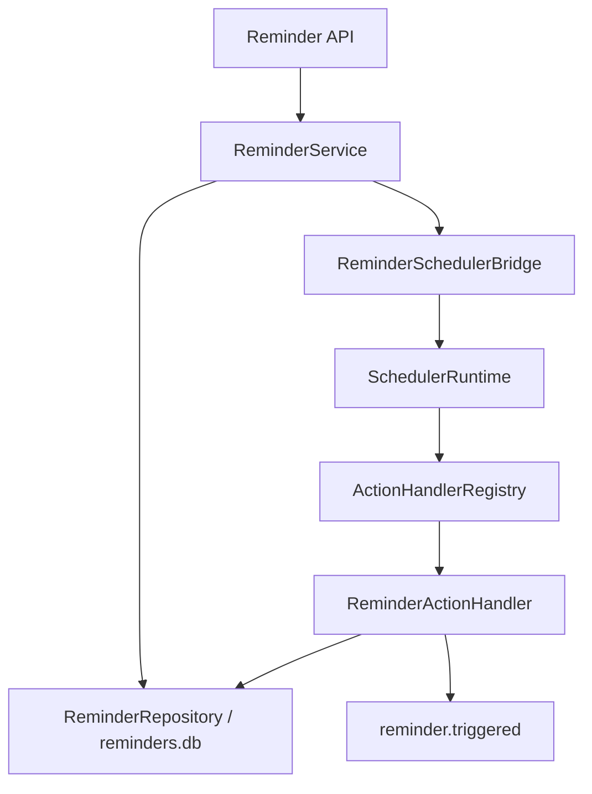

# Reminder 与 Scheduler 桥接架构

## 定位

SP-005 在 Canonical UserTask 与 Scheduler 之间建立持久化 One-shot Reminder。一次 Scheduler Handler 可能因崩溃或状态保存失败而重复调用，但数据库唯一约束保证同一 `(reminder_id, scheduled_at)` 只有一条成功的 `ReminderOccurrence`。这是可验证的 effectively-once occurrence，不是 exactly-once execution。

## 依赖关系

Scheduler 不依赖 CEO Assistant，也不使用特殊 Workflow 名称模拟 Reminder。Workflow 和 Reminder 都通过显式 Action Handler 注册到 Scheduler。

## 数据与状态

`Reminder` 保存 UserTask 引用、UTC `remind_at`、IANA `timezone`、调度状态、Scheduler Job ID、脱敏 FailureInfo 和 revision。状态包括 `pending_schedule`、`scheduled`、`pending_reschedule`、`pending_cancel`、`triggered`、`cancelled`、`failed`。

`ReminderOccurrence` 保存计划时间、实际触发时间、状态、attempt、trace ID 和脱敏 FailureInfo。`UNIQUE(reminder_id, scheduled_at)` 与唯一 `idempotency_key` 均由 SQLite 强制执行。

## Scheduler Claim

SchedulerPersistence 使用 SQLite 单事务条件 `UPDATE` 取得 Job：只有 `status`、`next_run_at`、claim expiry 同时符合条件且 affected rows 为 1 的 Runtime 才能执行。每次 claim 使用唯一 token；续租和终态写入均校验 token，旧 owner 不能覆盖新 owner。数据库事务只保护 claim 和状态写入，绝不包围业务 Handler。

One-shot 成功后在同一事务中写入 JobRun success，并将 Job 设置为 `completed`、清空 `next_run_at`、claim 和 last_error。claim 过期会把未完成 JobRun 记录为脱敏失败，并按 retry policy 恢复或终止。

## Trigger 事务

Reminder Handler 在 `reminders.db` 单事务内创建或复用 Occurrence，将 Occurrence 与 Reminder 同时更新为 `triggered`，记录 `triggered_at` 后提交。`reminder.triggered` 只在提交后发布。EventBus 失败不会回滚领域状态，只会让 observability health 降级。

## 跨库 Saga

`reminders.db` 与 `scheduler.db` 没有跨库原子事务。创建、重新安排和取消使用显式 pending 状态、补偿操作和启动 reconciliation。API 失败时可能已经存在 pending/failed Reminder，错误 details 只返回 Reminder ID、recovery state、retryable 和 trace ID，不声称“什么都没有创建”。

Reconciliation 可重复执行并逐条处理 pending schedule/reschedule/cancel、缺失 Job、终态 UserTask、triggered Occurrence 与非 completed Job、cancelled Reminder 与活动 Job、过期 claim。单条失败不阻断后续记录，并使 Health 降级。

## UserTask 生命周期

UserTask complete/cancel 先按 revision 提交真实终态，再同步调用 Reminder 生命周期协调器。取消部分失败时 API 返回结构化非 2xx，UserTask 保持真实终态，Reminder 保存 `pending_cancel` 证据。重复相同终态请求仍会再次执行补偿。reopen 不恢复旧 Reminder，due_at 修改也不自动调整 Reminder。

## 生命周期与健康

启动顺序为 UserTask → Reminder Store → Scheduler recovery → Reminder reconciliation → Scheduler tick。关闭时先停止 Task/Scheduler 并收集 Handler，再关闭 Reminder、UserTask 和 DatabaseManager。System Health 聚合 Reminder Store、Bridge 和 Scheduler；Reminder 启用但 Scheduler 缺失时为 failed，显式关闭时为 disabled。

## 已知限制

- 本阶段不包含外部通知渠道、Inbox、自然语言提醒、Recurring Reminder 或 UI。
- SchedulerPersistence 仍是 `scheduler.db` 的独立 connection owner，尚未迁移到 DatabaseManager；其 CAS、幂等迁移、锁和关闭生命周期由自身负责。
- EventBus 是进程内 observability，不是可靠事件投递或事务 Outbox。
- 当前每个 Job 只允许一个持久化活跃 claim，`max_concurrent=1`。
