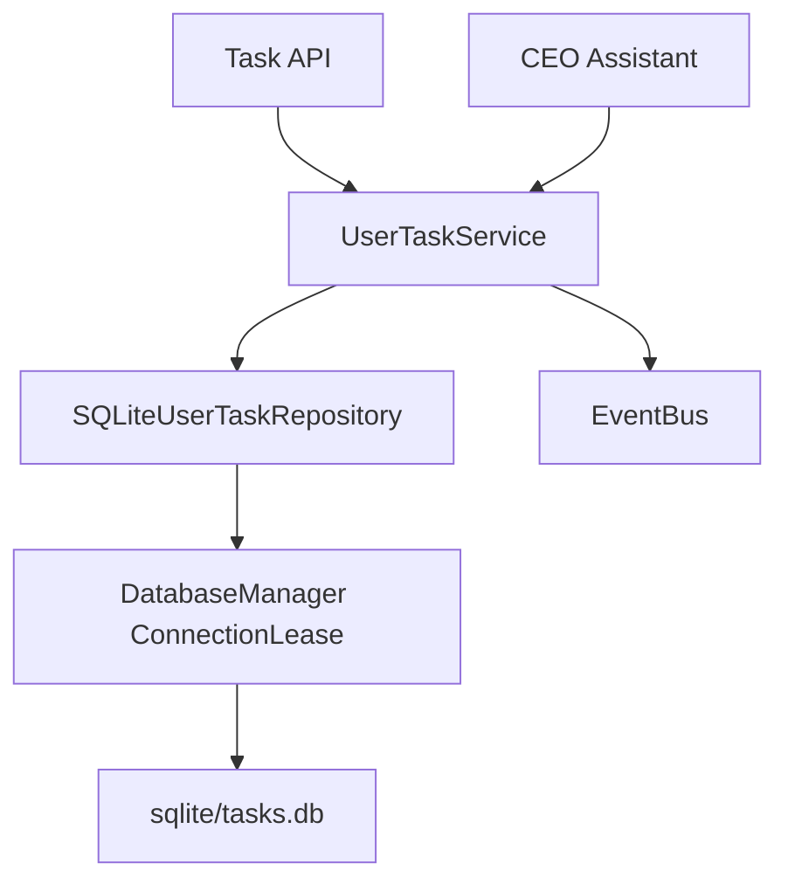

# UserTask 架构

## 实现状态

SP-004 已完成并通过 PR #8 以 Squash Merge 合并到 `main`，审查结论为 `APPROVED`。SP-004 merge baseline 为 `10d1534049be2d526c930c513912dc661ac41728`，合并时间为 `2026-07-15T11:39:33Z`。当前产品版本仍为 v0.33.0，未创建 v0.34.0 Tag 或 GitHub Release。

## 领域边界

- **UserTask**：用户可见的待办、承诺和工作事项，由 `core/user_tasks` 管理。
- **Execution Task**：`core/task` 中执行 Workflow 的内部运行任务，不承载用户待办。
- **Scheduled Job**：`core/scheduler` 的定时执行基础设施。
- **Reminder**：未来把 UserTask 与 Scheduled Job 连接的提醒领域，SP-004 不实现。

## 数据流

`tasks.db` 位于统一 `sqlite_dir`。Repository 只借用 DatabaseManager 管理的连接，不关闭借用连接；写操作使用事务并在异常时回滚。更新采用 `revision >= 1` 的乐观并发，`0`、负数和过期 revision 均不会静默覆盖。持久化行的 JSON、枚举或时间损坏属于 Persistence Failure，不归类为客户端校验错误。

## 时间与 metadata 契约

`due_at` 是带时区的绝对时间，进入领域模型后统一转换并持久化为 UTC；`timezone` 必须是有效 IANA 时区，用于输入语义和展示转换。`due_at_in_timezone()` 可将 UTC 瞬间转换回用户时区。列表 API 将原始 `due_from`/`due_to` 交给 Service 构造 `UserTaskQuery`，因此 naive datetime 会进入统一 Validation Failure 契约，aware datetime 则转换为 UTC 后查询。Windows 通过条件依赖 `tzdata` 保证 IANA 数据可用。metadata 对任意深度的字典和列表递归拒绝 `api_key`、`token`、`secret`、`password`、`authorization` 等敏感键。

## 生命周期

持久化状态为 `active`、`completed`、`cancelled`。`overdue` 根据 active 状态、UTC 截止时间和当前时间派生，不写入数据库。重复完成或取消同一终态是幂等操作；completed 与 cancelled 之间直接切换是冲突；显式 `reopen()` 可恢复为 active。

## 历史兼容

`UserTaskService.import_legacy()` 是显式、非破坏的迁移入口。它使用 `MemoryQuery.offset` 按 500 条分页直到耗尽，只读取 Decision Memory 中 `type=task` 的记录，并以旧记录 ID 生成稳定任务 ID。旧 `deadline` 的日期值按原 IANA 时区的当日 `23:59:59` 解释后转为 UTC；缺失时区的历史记录使用 `Asia/Shanghai`。priority/status 使用显式中英文映射，session、agent 和 source 从旧 content/metadata 保留。completed/cancelled 任务只迁移旧记录中真实存在的对应终态时间；缺失时保持 `None`，不得以创建时间编造。重复执行不会重复导入，原记录不删除、不修改。损坏记录计入失败并使 Health degraded，但不阻断正常记录。

## 已知限制

- SP-004 不实现 Reminder Trigger 或 UserTask-Scheduler Bridge。
- CEO Assistant 只解析“今天/明天”及阿拉伯数字的整点、半点、一刻和分钟表达；匹配后仍有“三刻”、秒数等未消费时间片段时，保存为无截止日期并明确提示，不做部分匹配推断。
- 当前并发控制是单记录 revision 乐观锁，不提供跨任务事务。
