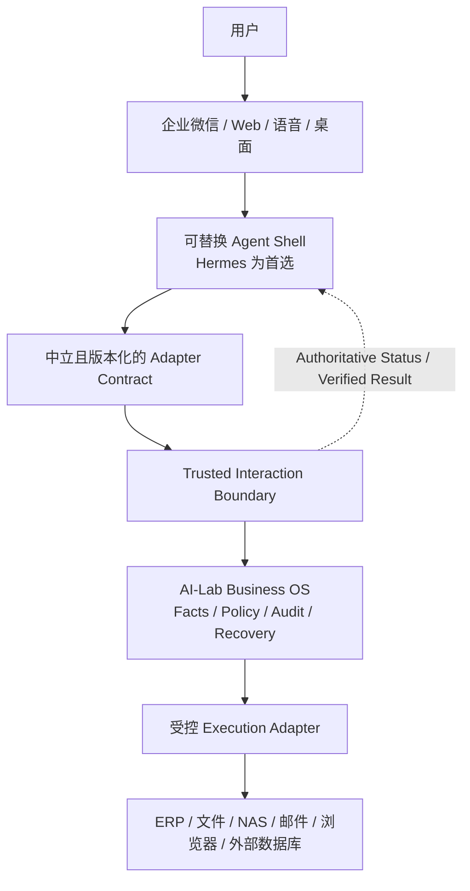
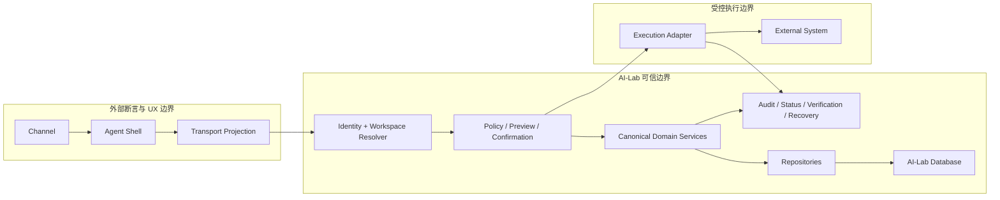
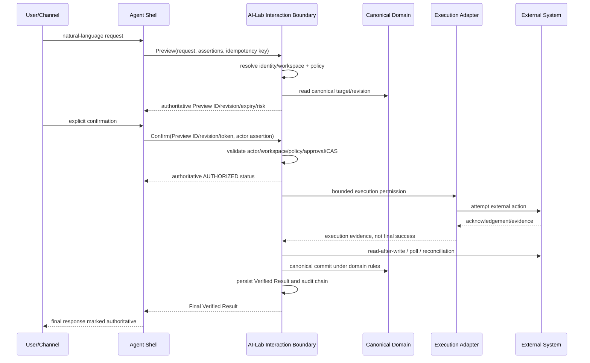

# ARCH-001：可信交互架构基线

- 状态：APPROVED / MERGED / MAIN_QUALITY_GATE_PASSED / POST_MERGE_RECONCILED / ARCHIVED
- 类型：RFC / ADR / Planning Task / Governance Documentation / Contract Design
- 授权 Base：`7bf12b1f4206608f0c67223546e8400eb9066c8e`
- 分支：`docs/arch-001-trusted-interaction-architecture`
- Current Product SP：None
- Current Governance Task：None
- Planning PR：#66 / MERGED / CLOSED / `4f9eab191fc0d99898ee69a2b42912017e4740e3`
- 日期：2026-08-06

## 执行摘要（Executive Summary）

ARCH-001 定义 Agent Shell、用户渠道与 AI-Lab Business OS 之间的可信交互架构合同，不实现
任何运行时能力。合同为 Shell-neutral、Transport-neutral、版本化合同；Hermes 是首个首选但可
替换的 Agent Shell。HTTP、Python API、MCP 或其他 transport 只能投影合同，不能改变业务所有权。

AI-Lab 是 canonical business facts 与 action authority。Shell 或受控 Execution Adapter 可以呈现、
转发或执行动作，但不能绕过 AI-Lab 的 Policy、Preview、Confirmation、Approval、Audit、Status、
Verified Result 与 Recovery。最终成功必须由 AI-Lab 权威验证；Tool Response、HTTP 2xx 和外部系统
acknowledgement 都只可能是验证证据。

本基线为 SP-021、INT-001、PILOT-001 与 REL-036 提供唯一架构输入。四项工作保持分离且均未启动。

## 问题陈述（Problem Statement）

v0.35.0 已有 canonical UserTask、Reminder、Inbox、Waiting-For、Work Log、Agenda、Daily Review、
Action Hint，以及 revision/CAS、idempotency、Saga、FailureInfo、shutdown、restart 和局部恢复能力。
但是这些能力没有形成跨 Shell 的统一 Interaction：

- 当前 API header 可携带 WorkspaceKey，但没有权威的 channel/shell identity binding；
- CEO Assistant 的自然语言写路径和 Inbox 确认是局部交互，不是通用 Preview/Confirmation 事实；
- Action Hint 的 `requires_confirmation` 是展示元数据，不是可审计的 Confirmation；
- Agent、Tool、Workflow 与 Coordination 的 `success` 或 checkpoint 不是业务 Verified Result；
- idempotency、status、audit 和 recovery 分散在各领域，尚无统一 Interaction 证据链；
- streaming 标志不构成可恢复的 progress/status/final contract。

因此，系统需要先定义“谁能声明什么事实、什么条件下可以执行、什么证据足以成功、失败后如何恢复”，
再规划领域模型和集成。直接接入 Hermes 或增加 API 会放大所有权与重试风险。

## 战略约束（Strategic Constraints）

以下约束不可由后续 transport、adapter 或 channel 变更：

```text
Hermes Memory != Business Fact Source
Hermes Conversation != Approval Fact Source
Hermes Tool Response != Final Success Proof
```

- Hermes 不得直接访问 AI-Lab 数据库；AI-Lab 不得 import 或依赖 Hermes 私有模块、协议或存储。
- Canonical Object/ID、Business State Machine、Business Rule、Workspace、Revision/CAS、Idempotency、
  Saga、Preview、Confirmation、Approval、Audit、Status、Verified Result、Recovery、Business
  Reminder/Scheduler 与长期业务事实由 AI-Lab 拥有。
- 通用 Agent、Tool、Workflow 与 Coordination Runtime 的继续扩张冻结；现有实现保留兼容，不在本任务删除。
- MCP 只是中立 Adapter Transport 候选，不是产品核心，也不能绕过 Trusted Interaction Boundary。
- 高风险动作需要显式 Confirmation，并按 Policy 要求独立 Approval；失败必须可见、状态必须可查询和恢复。

## 当前实现审计（Current Implementation Audit）

### 依赖方向与数据库所有权

`core/system/factory.py` 是共享 Composition Root：API、CLI 与 CEO Assistant 获得同一组 application/domain
services；repositories 通过 `DatabaseManager` lease 访问 AI-Lab 自有 SQLite。当前没有 Hermes 集成。
目标依赖方向保持为：

```text
Channel -> Shell -> Adapter Contract -> Interaction Application Service
        -> Canonical Domain Service -> Repository -> DatabaseManager -> AI-Lab Database
```

Shell、Channel 和外部 Execution Adapter 不得依赖 Repository、DatabaseManager 或数据库布局。API route
只可投影 application contract，不得成为第二业务规则源。

旧 PR #62 仅作为历史设计证据：`CLOSED / NOT_MERGED / SUPERSEDED_BY_STRAT_001 /
IMPLEMENTATION_NEVER_AUTHORIZED`，Head 为 `31cf7125b2543fb2d29ed38f373ddcebe4170b70`。ARCH-001 不重新
打开、合并、cherry-pick 或直接复用其实现提交。

### 实现事实与缺口

| 审计对象 | 当前实现与测试证据 | 当前所有权 / 状态源 | ARCH-001 结论 |
|---|---|---|---|
| Composition Root | `core/system/factory.py`、system lifecycle tests | AI-Lab；唯一装配与生命周期所有者 | 复用，不允许 Shell 旁路装配 |
| FailureInfo | `core/errors/models.py`、`mapping.py`、错误测试 | AI-Lab；统一安全错误语义 | 扩展 code catalog 应另行实现，禁止平行错误模型 |
| DatabaseManager | `core/database/manager.py`、lease/lifecycle tests | AI-Lab；连接所有权 | 数据库仅内部受控服务访问；`backup()` 仍未实现 |
| Workspace / session | `core/context/models.py`、`api/workspace.py`、context middleware tests | header/profile 可提供值；AI-Lab service 执行 scope | 当前不是权威身份绑定；未来必须 fail closed |
| API chat | `api/routes/chat.py`、workspace context integration tests | request/trace/idempotency envelope；业务委托 CEO Assistant | 保留兼容；不是 Interaction Contract |
| CEO Assistant | `applications/ceo_assistant/application.py` 及应用测试 | 确定性 intent router；多个直接业务写入口 | ADAPT 到未来 Interaction service；本任务不改行为 |
| UserTask | `core/user_tasks`、API/service/repository tests | canonical ID、status、revision、workspace | CORE；部分入口 expected revision 可选，不能视为通用 CAS 完成 |
| Reminder / Scheduler | `core/reminders`、`core/scheduler`、bridge/restart tests | durable status、claim、occurrence、Saga/reconciliation | CORE；业务 scheduler 保留，不等同通用 cron |
| Inbox | `core/inbox`、capture-to-action integration tests | durable resolution claim 与 target evidence | CORE；可复用 Saga/idempotency 模式，不是 generic Interaction |
| Waiting-For | `core/waiting_for`、event/restart tests | canonical snapshot + append-only events + CAS | CORE；可复用生命周期与审计模式 |
| Work Log | `core/work_log`、service/restart tests | canonical factual record、WorkspaceKey | CORE；不是 conversation memory |
| Agenda / Daily Review | read-model services 与 integration tests | canonical sources 的只读聚合 | CORE View 候选；不创建第二事实源 |
| Action Hint | `core/daily_review/action_hints.py`、review-to-action tests | deterministic presentation；含 revision/idempotency hints | RETAIN；`requires_confirmation` 不等于 canonical Confirmation |
| Agent Runtime / Memory | `core/agents`、`core/memory`、agent tests | 通用会话/上下文/LLM 状态 | FREEZE / EXTERNALIZE；Memory 不得升格为业务事实 |
| Tool Runtime | `core/tools`、executor tests | validator/permission/sandbox/logger/ToolResult | FREEZE；Tool `success` 只表示调用层结果 |
| Workflow Runtime | `core/workflow`、checkpoint tests | 进程内 checkpoint 与 workflow status | FREEZE；checkpoint 不是业务 recovery authority |
| Coordination Runtime | `core/coordination`、coordination tests | 通用 task/message orchestration，默认关闭 | EXTERNALIZE；不得作为业务状态机 |
| MCP foundations | `core/tools/adapters/mcp`、adapter tests | 当前是 mock/in-memory protocol foundation | ADAPT；仅 transport 候选，不接入本任务 |
| shutdown/restart/recovery | system/scheduler/reminder/inbox/restart tests | AI-Lab lifecycle 与局部 durable evidence | CORE；统一 Interaction recovery 尚缺 |

### 当前对象所有权结论

API、CLI、CEO Assistant 和未来 Shell 都只能是入口。canonical services 与 repositories 决定业务状态；
DatabaseManager 管理存储。Conversation、Shell Session、ToolResult、LLM memory 和 transport response 均不
能成为 approval、execution 或 success 的权威来源。

## 能力分类（Existing Capability Classification）

| 能力 | 分类 | 已投入价值与当前依赖 | 后续归属 | 非目标 / 兼容风险 |
|---|---|---|---|---|
| Composition Root、Database ownership、FailureInfo | CORE | 所有主入口共享；稳定运行基础 | AI-Lab Business OS | 不改实现；旁路会造成 split-brain |
| UserTask、Reminder、Inbox、Waiting-For、Work Log | CORE | 已验收 canonical facts、CAS/Saga/restart 模式 | AI-Lab domain | 不在 ARCH-001 泛化或迁移 |
| Agenda、Daily Review、Action Hints | RETAIN | 真实只读闭环和确定性提示 | AI-Lab View projection | 不把 hint 当 authorization |
| API chat、CEO Assistant、CLI | ADAPT | 现有可用入口和兼容面 | 后续委托 Interaction boundary | 当前直接写语义需渐进兼容 |
| WorkspaceKey 与 authentication skeleton | ADAPT | 已有 scope 和 bearer gate | SP-021/INT-001 规划权威映射 | header 不能直接成为 trusted identity |
| Reminder Scheduler | CORE | durable claim、occurrence、reconciliation | AI-Lab business scheduler | 不扩张成通用 cron |
| Knowledge foundations | RETAIN | 已有 ingestion/retrieval 骨架 | v0.38 业务知识闭环 | 不扩张通用 RAG 平台 |
| Agent Runtime | FREEZE | 通用 Agent Loop 骨架 | 优先 Agent Shell | 保留兼容；禁止新通用抽象 |
| Tool Runtime | FREEZE | validator/permission/sandbox/audit logger | Shell 或受控 adapter；AI-Lab policy 不外移 | Tool success 不是 Verified Result |
| Workflow Runtime | FREEZE | workflow state/checkpoint 骨架 | 通用 orchestration 优先外置 | checkpoint 当前进程内，不能承诺恢复 |
| Coordination Runtime | EXTERNALIZE | 默认关闭的通用协调骨架 | 成熟 Shell / 外部系统 | mock success 路径不能进入业务证明 |
| MCP foundations | ADAPT | 早期 protocol/adapter 投资 | 可选 transport | 不选定 MCP、不实现连接 |
| 通用 memory 扩张 | FREEZE | conversation/episodic/semantic/decision 能力 | Shell memory 或业务明确的知识/事实域 | 不能混同 long-lived business facts |
| 未接主链路的重复平台抽象 | DEPRECATION_CANDIDATE | 有历史兼容与测试投入 | 后续依赖审计后决定 | 本任务不弃用或删除 |
| 经独立审计确认无消费者的重复代码 | REMOVE_LATER | 尚未形成清单 | 独立治理任务 | 本任务不判定具体删除对象 |

## 所有权边界（Ownership Boundary）

| 事实 / 能力 | 用户渠道（Channel） | Agent Shell（交互外壳） | Interaction Adapter（交互适配器） | AI-Lab Business OS（业务核心） | Execution Adapter / 外部系统 |
|---|---|---|---|---|---|
| 原始消息与 channel identity assertion | 提供 | 接收 / 标记来源 | 转交 | 验证并绑定 | 无 |
| Conversation 与 UX memory | 可显示 | 拥有 | 只传 correlation | 不作为业务事实 | 无 |
| Workspace / actor / role 解析 | 提供候选 | 提供 assertion | 不推断 | 权威解析、拒绝冲突 | 仅接收最小授权上下文 |
| Canonical Object / ID / state | 无 | 只引用 | 只转交 | 唯一权威 | 只引用 |
| Policy / risk | 无 | 可展示 | 不覆盖 | 唯一权威 | 遵守 execution permission |
| Preview / Confirmation / Approval | 表达意图 | 呈现 / 转交 | 保持绑定 | 创建、校验、持久化 | 不创建 |
| 外部执行 | 无 | 可承担 | 路由 | 授权、记录 Status | 可承担并返回证据 |
| Audit / Status / Verified Result / Recovery | 无 | 查询 / 展示 | 投影 | 唯一权威 | 提供候选证据 |

## 术语（Terminology）

- **Request**：入口的一次请求；可重试、可重复，不等于 Interaction。
- **Interaction**：AI-Lab 持有的跨请求业务交互聚合，拥有 canonical ID 与 revision。
- **Conversation**：Shell UX 上下文；不是 Workspace、Session、Interaction 或 approval。
- **Preview**：AI-Lab 创建的零副作用、版本化、可过期计划事实。
- **Acknowledgement**：已看见信息，不授权执行。
- **Confirmation**：绑定 actor、Workspace、Preview ID/revision、expiry 与 risk 的明确同意事实。
- **Approval**：Policy 指定 Approver 对高风险动作作出的独立决定。
- **Authorization**：身份和 Policy 校验结果；不是用户表达。
- **Execution Permission**：Confirmation/Approval/Policy/CAS 全部满足后，AI-Lab 发给执行者的限域许可。
- **Execution**：一次受控外部或内部动作尝试，具有独立 ID 和确定性状态。
- **Verified Result**：AI-Lab 根据足够证据形成的权威验证事实。
- **Recovery**：不确定或跨边界不一致后恢复到可解释状态的显式过程。

## 系统上下文（System Context）



## 信任边界（Trust Boundaries）



Channel、Shell、Adapter、Transport 和 External Principal 均必须作为不同审计主体记录。Transport
认证只能证明连接或客户端，不自动证明 AI-Lab User、Owner、Operator 或 Approver。

## 中立 Adapter Contract（Adapter Contract）

合同标识候选为 `trusted-interaction/v1`。它是 application/domain contract，不是 JSON、HTTP route、
Python class 或 MCP schema。Transport projection 必须保留字段含义、错误语义与所有权。

### 通用请求与响应信封

每个请求至少携带：contract version、operation、request ID、trace ID、可选 interaction ID、Workspace
assertion、actor assertion、channel/shell/adapter/transport 标识、expected revision、idempotency key、
causation/correlation，以及 operation payload。AI-Lab 必须返回 authoritative/provisional 标记、canonical
IDs、current revision、status、FailureInfo reference、audit reference 和允许的 next actions。

外部 assertion 在解析前均为 provisional；AI-Lab 解析后的 actor、role、WorkspaceKey 与 policy decision
才是 authoritative。响应不得泄露内部诊断、secret、token 或原始外部响应。

### 操作合同

| 操作 | 核心输入 | 权威输出 | 副作用 | 前置 / 后置条件 | 重试与审计 |
|---|---|---|---|---|---|
| View | actor assertion、Workspace assertion、query、request/trace | canonical view + provenance + revision | 无业务写；可写 audit | 身份与 Workspace 已解析；不改变对象 | request key 可去重；记录查询范围与 redaction |
| Preview | normalized intent、target ID/revision、parameters、risk context | Preview ID/revision/expiry/policy/risk/required approvals | 仅创建 Preview 与 audit；零业务副作用 | target 与 policy 可评估；输出可解释 | 相同 key+payload 返回原 Preview；冲突失败 |
| Confirm | Preview ID/revision、confirmation token、actor、expected interaction revision | Confirmation ID + authoritative status | 写 Confirmation；不得执行，除非独立 command 明确推进且 policy 允许 | Preview 有效、主体/Workspace/risk 匹配 | 重复同意幂等；payload/actor 冲突失败 |
| Cancel | Interaction ID、expected revision、reason | canonical status + cancellation evidence | 可改变 Interaction；执行副作用取决于阶段 | 未执行可取消；已执行进入 stop/verify/recovery 语义 | CAS；race 返回当前状态而非伪造取消 |
| Modify | Interaction/Preview ID、expected revision、patch intent | 新 Preview ID/revision 或 rejection | 旧 Preview 作废；不直接改业务对象 | 修改经重新解析和 policy | 不得沿用旧 confirmation；完整审计 diff |
| Status | Interaction ID、Workspace、actor | authoritative lifecycle/execution/verification/recovery status | 无业务写；可推进受控 reconciliation | 调用者有查看权限 | 可安全重试；返回 last authoritative transition |
| Verified Result | Interaction/Execution ID、verification evidence selector | AI-Lab Verified Result + canonical object refs | 可提交验证/业务状态 | 证据满足 operation-specific verifier | 仅 verifier/service 可形成；重复提交按证据去重 |
| Recovery | Interaction ID、expected revision、recovery action/claim | recovery status/evidence/next action | 可能补偿、重查或人工决议 | RECOVERY_REQUIRED 且 actor 有权限 | 每次尝试独立 key；禁止盲目重放原动作 |

Contract 的 side-effect 标记必须区分 `NONE`、`CANONICAL_INTERACTION_ONLY`、
`CANONICAL_BUSINESS_WRITE`、`EXTERNAL_EFFECT` 与 `RECOVERY_EFFECT`。任何 Adapter 都不能把
provisional response 投影为 authoritative success。

## 身份与 Workspace 映射（Identity and Workspace Mapping）

| 概念 | 提供者 | AI-Lab 权威规则 |
|---|---|---|
| Channel User / Channel Identity | Channel | 仅作为 signed/verified assertion 输入；未验证则不可信 |
| Shell Identity / Shell Session | Shell | 标识客户端与 UX session；不得映射为业务 actor 或 AI-Lab Session |
| AI-Lab User | AI-Lab | 由已审计 binding 解析；跨渠道可绑定同一用户 |
| Tenant / Owner / WorkspaceKey | AI-Lab | 从有效 binding 与授权关系解析，不从自然语言猜测 |
| Operator / Approver | AI-Lab Policy | role 必须按 operation、Workspace、risk 校验；Owner 不自动等于 Approver |
| Conversation | Shell | 只作 correlation；不得等同 Workspace 或 Interaction |
| Request / Interaction / Preview / Confirmation / Execution | AI-Lab | 各自 canonical ID；不得复用 Shell message ID 作为权威 ID |
| External Principal | Execution Adapter / external system | 与 execution permission 绑定并审计；不得成为 AI-Lab actor |

Binding 的建立、验证、撤销和替换必须由后续独立任务设计持久事实和审计事件。解析缺失、多个 binding
冲突、assertion 验证失败、Workspace 跨界或 role 不足时一律 fail closed，返回 FailureInfo；系统不得
根据消息文本、conversation title、Shell memory 或历史工具参数猜测 Workspace、Owner 或 Approver。

跨渠道 Confirmation 仅在两个渠道都权威绑定到同一 AI-Lab actor，且 Policy 允许该 confirmation channel
时成立。跨 Shell 同理。Confirmation 主体必须匹配 Preview 的 actor constraints、Workspace、policy
snapshot/reference、risk、revision 和 expiry。

ARCH-001 不决定 OAuth、企业微信 binding、多租户 Schema 或账户恢复实现。

## Interaction 生命周期（Interaction Lifecycle）

### 状态与子状态分离

一个扁平 enum 无法准确表达“外部动作可能已发生但验证失败”。后续 SP-021 应分别建模：

- `lifecycle_state`：REQUESTED、PREVIEWED、AWAITING_CONFIRMATION、AUTHORIZED、EXECUTING、
  VERIFYING、SUCCEEDED、FAILED、CANCELLED、EXPIRED、RECOVERY_REQUIRED；
- `resolution_phase`：UNRESOLVED、RESOLVING、RESOLVED；
- `execution_status`：NOT_STARTED、ACCEPTED、ATTEMPTED、ACKNOWLEDGED、COMPLETED、REJECTED、
  FAILED、UNCERTAIN；
- `verification_status`：NOT_REQUIRED、PENDING、VERIFIED、FAILED、UNCERTAIN；
- `recovery_status`：NOT_REQUIRED、PENDING、IN_PROGRESS、RECOVERED、FAILED。

这些是合同语义，不是本任务授权的 Schema 或 Enum。`RESOLVED` 作为 resolution phase，不作为最终
lifecycle success，以免与“自然语言已解析”和“业务已成功”混淆。

### 状态转换表

| 起始状态（From） | 目标状态（To） | 转换主体（Actor） | 前置条件 | 失败 / race 结果 | 审计证据 |
|---|---|---|---|---|---|
| — | REQUESTED | AI-Lab boundary | identity/workspace 已解析；request key 合法 | validation/auth/workspace FailureInfo | request envelope |
| REQUESTED | PREVIEWED | AI-Lab service | intent resolved、policy evaluated、zero-side-effect preview persisted | FAILED 或保持 REQUESTED 可修正 | Preview + policy decision |
| PREVIEWED | AWAITING_CONFIRMATION | AI-Lab service | Policy 要求 confirmation/approval | EXPIRED 或 policy rejection | required actors/risk/expiry |
| PREVIEWED | AUTHORIZED | AI-Lab service | 低风险且 policy 明确允许无 confirmation | policy rejection | authorization decision |
| AWAITING_CONFIRMATION | AUTHORIZED | actor + AI-Lab policy | token、actor、Workspace、revision、expiry 匹配，所需 Approval 完整 | conflict/stale/expired；不执行 | Confirmation/Approval evidence |
| AUTHORIZED | EXECUTING | AI-Lab executor coordinator | CAS 成功、execution permission 创建 | duplicate owner 返回现状 | Execution ID + permission |
| EXECUTING | VERIFYING | executor / AI-Lab | attempt evidence 已持久化；结果需验证 | UNCERTAIN -> VERIFYING 或 RECOVERY_REQUIRED | attempt/ack evidence |
| VERIFYING | SUCCEEDED | AI-Lab verifier | Verified Result 已形成，所需 canonical commit 完成 | verification failure 或 recovery | verifier evidence + object revision |
| non-terminal | CANCELLED | actor / policy | 尚无不可逆副作用，CAS 成功 | race 返回 EXECUTING/VERIFYING/terminal | cancellation evidence |
| PREVIEWED/AWAITING_CONFIRMATION | EXPIRED | clock / AI-Lab | expiry 到达且未授权 | 新 Preview 才可继续 | expiry evidence |
| any non-terminal | FAILED | AI-Lab service | 确定未产生需恢复的不一致，且失败为 terminal | 不确定结果不得进入普通 FAILED | FailureInfo |
| EXECUTING/VERIFYING | RECOVERY_REQUIRED | AI-Lab verifier/coordinator | outcome uncertain 或 external/canonical divergence | 禁止盲重试 | failure + observed evidence |
| RECOVERY_REQUIRED | FAILED | recovery owner | 确认未成功且无需再补偿 | recovery failed 可保留 RECOVERY_REQUIRED | recovery decision |
| RECOVERY_REQUIRED | SUCCEEDED | AI-Lab verifier | reconciliation 证明外部与 canonical 最终一致 | 未验证不得成功 | recovery + Verified Result |

所有 transition 使用 expected revision/CAS。terminal 为 SUCCEEDED、FAILED、CANCELLED、EXPIRED；但
存在外部副作用不确定性时不能终结为 FAILED/CANCELLED。Recovery 完成后可以进入 SUCCEEDED 或确定性
FAILED，也可在未解决时保持 RECOVERY_REQUIRED。canonical object commit 不自动等于 Interaction success：
operation contract 必须声明所需 commit 与 verification evidence，两者均满足才可 SUCCEEDED。

### 交互序列（Interaction Sequence）



## Preview 与 Confirmation 合同（Preview and Confirmation）

Preview 是 AI-Lab canonical fact，必须满足 Zero Side Effect、Canonical Preview ID、Workspace Bound、
Actor Bound、Policy Bound、Revisioned、Expirable、Auditable、Reproducible or Explainable 和
Confirmation-addressable。

Preview 至少记录 normalized input summary、规范化参数、target canonical object/revision、计划动作、
预计外部副作用、risk level、required confirmation/approval、preview revision/expiry、policy snapshot
hash 或 immutable reference、redacted display model 与 audit reference。Reproducible 表示相同 canonical
inputs 与 policy 可得到等价动作；若依赖易变外部数据，则必须保存足够 explainable evidence，不承诺逐字文本相同。

Confirmation token 是高熵、单用途、受限 scope 的 capability reference，不是自然语言短语，也不包含
secret 业务数据。它绑定 Preview ID/revision、Interaction ID、WorkspaceKey、actor constraints、risk、
expiry 与 allowed operation；只保存 hash 或等价安全表示。自然语言“好的”“确认”“执行吧”只能作为
Shell 收到的用户意图，必须经过权威 identity、Workspace、token、revision、expiry、risk 与 Policy
匹配才能形成 canonical Confirmation。

stale/expired Preview、重复但相同 Confirmation、相同 token 不同 actor、并发冲突、modify 后旧 token、
跨渠道/跨 Shell 确认和 restart 后恢复都必须返回当前 authoritative status 与 FailureInfo。Modify 只要
改变 target、normalized parameters、external effect、risk、policy、revision 或 required approvers，就必须
生成新 Preview 并使旧 Confirmation/Approval 不再可用。

Confirmation 证明 actor 同意准确 Preview；Approval 证明 Policy 指定角色同意；Authorization 是 AI-Lab
规则判定；Execution Permission 是 AI-Lab 在执行时生成的限域许可。五者不能互换。

## 执行与验证结果（Execution and Verified Result）

以下层级必须分别记录：

```text
Tool Invocation Accepted
External Action Attempted
External System Acknowledged
Execution Outcome Uncertain
AI-Lab Verified Result
Canonical Business State Committed
```

同步、幂等且由 AI-Lab canonical service 完成的内部动作，可由同一事务后的 read-back 验证。外部动作按
operation-specific verifier 选择 read-after-write、status API、webhook、poll 或 reconciliation；仅在证据
满足 minimum verifier policy 后生成 Verified Result。HTTP 2xx 或 executor `success=true` 不足以生成它。

Verified Result 关联 Interaction ID、Execution ID、operation、Workspace、canonical object ID/revision、
external reference、verification method、redacted evidence digest、verified_at 与 verifier identity。外部成功
而 canonical commit 失败时进入 RECOVERY_REQUIRED；canonical commit 成功但响应丢失时，重复请求或
Status 通过 idempotency key/Interaction ID 返回已提交结果，不重做动作。无法判断外部是否执行成功时，
execution_status=UNCERTAIN，禁止盲目重试。

## Timeout、Retry、Ordering 与 Idempotency

| 层 | key 生成者 / scope | timeout 后规则 | 允许重试 | 冲突与审计 |
|---|---|---|---|---|
| Channel retry | Channel message ID + channel identity | 仅说明投递未知 | 可重投同一 assertion | 不同 payload 同 message ID 拒绝 |
| Shell retry | Shell；request key 绑定 actor/workspace/operation | 查询 Status 优先 | transport 未接受可重试 | 保留 Shell attempt correlation |
| Transport retry | client；同 request ID/key | acceptance 不明先 Status | 仅相同 payload | serialization 差异规范化后比较 |
| AI-Lab API retry | AI-Lab idempotency registry | 返回已有 Interaction/Failure | 安全 | 同 key 不同 payload = conflict |
| Domain command retry | AI-Lab service；workspace/object/operation/revision | CAS 判定 | 仅 retry-safe command | 记录 expected/current revision |
| Execution Adapter retry | AI-Lab execution coordinator；Execution ID | 外部副作用未知则禁止重放 | verifier 证明未执行或外部有同 key 才可 | 每次 attempt 独立 evidence |
| External system retry | 外部 idempotency capability | 无 capability 时 outcome uncertain | operation-specific | 保存 external key/reference |
| Verification retry | AI-Lab verifier | 不改变 execution | 可按 backoff/policy | 每次观察持久化摘要 |
| Recovery retry | recovery owner；Recovery attempt ID | 保持 RECOVERY_REQUIRED | 受控、可停止 | dead-letter/manual review 候选 |

key 至少绑定 WorkspaceKey、resolved actor、operation、normalized payload digest 与目标 revision；TTL 必须不短于
该 operation 的最大 replay/recovery window，执行型 key 通常随 Interaction evidence 长期保留。duplicate
message/confirmation 返回原事实；out-of-order event 只有在 transition 与 revision 合法时接受。Saga/compensation
只用于跨事务/外部边界，且不能假设所有副作用可逆。manual recovery 与 dead-letter 是 SP-021 的候选设计，
不是“必要时人工处理”的模糊兜底：必须指定 owner、claim、deadline、allowed actions 和 evidence。

## Streaming 与最终结果（Streaming and Final Result）

| 输出层级 | 权威性 | 可丢失 / 重复 | 持久化要求 | 恢复方式 |
|---|---|---|---|---|
| Progress Event | provisional UX | 可丢失、可重复 | 非必须；关键 transition 除外 | Status 查询 |
| Intermediate Text | provisional UX | 可丢失、可重复 | 不作为业务事实 | 重新生成或忽略 |
| Provisional Response | 明确标记非权威 | 可重复 | 可选 UX telemetry | 查询 Interaction |
| Authoritative Status | canonical | 可重复、不可悄然丢失 | 必须持久化 transition | Interaction ID 查询 |
| Final Verified Result | canonical final | 可重复投影、不可变造 | 必须持久化 | Interaction ID / idempotency key 查询 |
| Recovery Notice | canonical status projection | 可重复 | Recovery transition 必须持久化 | Status/Recovery 查询 |

streaming 中断或 Shell 重连不改变 Interaction。多渠道观察同一 Interaction 时都读取同一 authoritative
revision/status；中间自然语言不得直接写入业务事实。Shell Memory 不替代 Audit/Status，final response
丢失后通过 Interaction ID 查询。

## FailureInfo 投影（FailureInfo Projection）

必须复用现有 `FailureInfo`，由 domain-safe `code/category/message/retryable/severity/trace_id` 与内部受限
diagnostic 分层。Transport 只映射 HTTP/MCP/Python error；Channel-safe presentation 可以本地化，但不能把
failure 改写为 success 或改变 retryability。

| Failure 类别 | Domain-safe 结果 | 可重试性（retryability） | Transport / Channel 投影 | RECOVERY_REQUIRED 条件 |
|---|---|---|---|---|
| Adapter / Transport failure | unavailable/timeout + trace | 未接受可重试；接受未知先 Status | 503/504 或等价；不暴露堆栈 | 已可能发起外部动作 |
| Authentication / identity mapping | unauthenticated/identity conflict | 修复凭据或 binding 后新请求 | 401/安全提示 | 否 |
| Authorization / Workspace / Policy | permission/workspace/policy rejected | 不自动重试 | 403/明确所需角色 | 否 |
| Stale / expired Preview/Confirmation | conflict/expired + current revision | 重新 Preview | 409/410 或等价 next action | 否 |
| Confirmation / idempotency conflict | conflict + canonical reference | 不重放；查询 Status | 409/安全摘要 | 只有执行状态未知时 |
| External unavailable/rejected | dependency unavailable/rejected | operation-specific | 502/503 或安全业务提示 | 已尝试且结果未知 |
| Verification failed / uncertain | verification failed/uncertain | 只重试 verification | 202/409/503 依状态；标记非成功 | uncertain 或状态分叉 |
| Canonical commit failed | persistence failure | 不盲重做外部动作 | 500/503 + recovery reference | 外部可能成功 |
| Recovery required/failed | recovery required/failed | 受控 recovery policy | 返回 Recovery ID 与 owner next action | 保持直到权威决议 |

敏感 identity assertion、confirmation token、secret、原始外部响应与未脱敏参数只能进入受限 diagnostic store
或直接丢弃；canonical audit 保存 redacted fields、digest、reference 与最小必要证据。

## 安全模型与审计证据（Security Model and Audit Evidence）

权限与 Workspace 隔离在 Trusted Interaction Boundary 和 canonical service 两层执行；前者授权 Interaction，
后者继续保护具体业务对象，不能只依赖 Shell。风险等级由 AI-Lab Policy 根据 operation、对象、参数、外部
副作用和 actor role 计算；Shell 可建议但不可降低。高风险动作至少需要 explicit Confirmation，并按 Policy
要求由不同 Approver 提供 Approval。

Trusted Interaction Audit Envelope 候选字段：Request ID、Trace ID、Interaction ID、WorkspaceKey、
Tenant/Owner、Actor、Approver、Channel、Shell、Adapter、Transport、Operation、Risk Level、Preview ID/
Revision、Confirmation ID、Execution ID、Canonical Object ID、External Reference、Idempotency Key、Policy
Decision、Status Transition、Verified Result、Recovery Evidence、timestamps 和 FailureInfo reference。

Audit envelope 是 canonical evidence，不是普通日志。每个 transition 记录 previous/current revision、actor、
policy decision、redacted evidence digest 和 causal reference。用户展示文本是可本地化 projection；日志可以
帮助诊断，但不能替代 audit。数据库仍只由 AI-Lab repositories/controlled services 访问。

## 恢复模型（Recovery Model）

Recovery owner 必须通过 CAS claim 获得处理权，避免并发补偿。恢复动作只允许：查询外部状态、完成缺失
canonical commit、执行明确可逆 compensation、重建安全 projection、或提交人工权威决议。每次尝试记录
Recovery ID、owner、deadline、observed evidence、action、result 与 next retry time。

restart 后扫描非终态 Interaction、过期 execution claim 和 RECOVERY_REQUIRED 队列；不得根据进程内
Workflow checkpoint 宣称恢复完成。外部动作已成功但 canonical commit 失败时优先 reconciliation；canonical
commit 成功但响应丢失时 Status 返回既有结果；不确定是否执行时不重放，保持显式不确定状态。

## Transport 中立性（Transport Neutrality）

HTTP status、JSON schema、Python exception 或 MCP result 是 transport serialization。它们必须映射同一
contract version、operation、revision、idempotency、FailureInfo 和 authoritative marker。Transport negotiation
可以拒绝不支持版本，但不能静默降级安全字段。MCP 不拥有 domain state；HTTP 2xx 不证明 business success；
Python in-process adapter 也必须经过相同 Policy 与 audit 边界。

## Reference / Fake Adapter Contract-Test 策略

INT-001 前应先实现不依赖 Hermes 的 Reference/Fake Adapter test kit；本任务只定义策略：

1. 用固定 Clock、Fake Identity Binding、Fake Policy 与 in-memory/fake execution evidence 驱动合同；
2. 对 View/Preview/Confirm/Cancel/Modify/Status/Verified Result/Recovery 建立 transport-independent vectors；
3. 验证 zero-side-effect Preview、actor/workspace/revision/expiry/token binding、CAS race 与 idempotency conflict；
4. 注入 timeout-before-acceptance、timeout-after-side-effect、duplicate/out-of-order、restart 与 response-loss；
5. 证明 Tool response/HTTP 2xx/ack 不会形成 SUCCEEDED；
6. 证明 Fake Adapter 与 Hermes Adapter 使用相同 vector，且均无数据库访问；
7. transport-specific tests 只验证 projection/serialization，不复制 domain assertions。

Contract Test 实现属于后续任务，不在 ARCH-001 创建 Python model、fixture、endpoint 或 adapter。

## 被拒绝的设计（Rejected Designs）

| 方案 | 决定 | 理由 |
|---|---|---|
| Hermes 直接访问 AI-Lab 数据库 | 拒绝 | 绕过 service、Policy、audit 与 migration ownership |
| Hermes memory 作为业务状态 | 拒绝 | retention、revision、workspace 与恢复语义不受 AI-Lab 控制 |
| Conversation text 作为 approval evidence | 拒绝 | 无可靠 actor/preview/revision/expiry/risk 绑定 |
| Tool response 作为最终成功 | 拒绝 | 只证明调用层返回，不证明外部状态和 canonical commit |
| HTTP 2xx 作为 canonical success | 拒绝 | transport acceptance 不等于业务完成 |
| MCP 作为产品核心 | 拒绝 | transport lock-in 且可能外移业务所有权 |
| Transport-specific domain contract | 拒绝 | 无法替换 Shell/transport，会复制规则 |
| 自然语言推断 Workspace | 拒绝 | 跨租户/工作区风险，必须 fail closed |
| Shell 生成未验证 Confirmation | 拒绝 | Shell 不能证明 canonical Preview 与 Policy 绑定 |
| timeout 后盲目重试 | 拒绝 | 可能重复不可逆副作用 |
| Domain+Adapter+Channel+Pilot+Release 单一大 SP | 拒绝 | 审查、回滚、验收与授权边界不可分离 |
| 立即删除 Agent/Tool/Workflow runtimes | 拒绝 | 存在兼容和历史投入，需独立依赖审计与授权 |
| 重新打开或合并 PR #62 | 拒绝 | 已关闭、未合并、被 STRAT-001 取代且实现从未授权 |

## 备选方案（Alternatives Considered）

- 仅扩展现有 `/chat`：变更小，但会把自然语言、身份、确认与执行继续耦合在单 route，拒绝。
- 直接复用 Tool Runtime pipeline：可复用 validator 思路，但 ToolResult 语义不足，保留为局部执行组件候选。
- 每个业务域各自做 Preview/Confirmation：能快速交付，但会形成不一致的 token、risk、audit 与 recovery，
  应由统一 Interaction domain 提供合同、由领域服务保留业务规则。
- 只做同步请求响应：不能覆盖外部动作、断线、poll/webhook 和 uncertain outcome，拒绝。

## 风险（Risks）

- 把合同设计成过度通用平台：缓解方式是 SP-021 只覆盖批准的真实业务 operation allowlist。
- Interaction 与 canonical domain 双状态漂移：operation contract 明确 commit point、verifier 和 recovery owner。
- identity binding 尚未实现：PILOT 前必须 fail closed，不以 header 或文本猜测替代。
- 外部系统缺少 idempotency/status API：对应 operation 必须降级为人工审批、单次执行与显式 uncertain recovery。
- audit 保存过多敏感数据：默认最小化、redaction、digest/reference，raw response 不进入 canonical audit。
- 现有入口兼容期存在新旧写路径：SP-021 必须定义 allowlist、迁移门禁和观测，不在本任务切换。

## 已知限制（Known Limitations）

- 本文没有 Schema、API endpoint、binding、token、worker、adapter 或 contract test 实现。
- 当前 bearer token 与 Workspace header 不是强身份/RBAC/多租户边界。
- 现有 Action Hint、Inbox confirmation、Tool audit、Workflow checkpoint 只提供局部证据。
- `DatabaseManager.backup()` 仍未实现；v0.35 的正式恢复边界是静止数据目录备份与隔离恢复。
- 外部系统的 verifier、compensation 与 retention 必须按具体 operation 设计。
- QUALITY-003 保持 `CANDIDATE / NON_BLOCKING / REAL_PROVIDER_ONLY / NOT_STARTED / NOT_AUTHORIZED`，
  本任务不运行真实 Provider。

## 后续任务职责矩阵（Follow-up Responsibility Matrix）

| 工作项 | 唯一范围 | 明确排除 | 当前状态 |
|---|---|---|---|
| ARCH-001 | 定义 terminology、ownership、lifecycle、contract、identity/workspace rules、security/audit/reliability 与 acceptance strategy | 所有 runtime/schema/integration 实现 | APPROVED / MERGED / MAIN_QUALITY_GATE_PASSED / POST_MERGE_RECONCILED / ARCHIVED |
| SP-021 | 实现 canonical Interaction domain、state machine、services、repository interfaces、persistence design、CAS/idempotency、facts 与 domain tests | Shell/channel/release 集成 | NEXT_CANDIDATE / NOT_STARTED / REQUIRES_SEPARATE_AUTHORIZATION / IMPLEMENTATION_NOT_APPROVED |
| INT-001 | 实现 Shell-neutral adapter、Hermes binding、transport projection、Fake/Reference contract tests 与 status/streaming projection | DB direct access、企业微信 | NOT_STARTED / NOT_APPROVED |
| PILOT-001 | 企业微信 channel、Owner binding、Workspace mapping、operation allowlist、人工验收与恢复演练 | 通用渠道平台 | NOT_STARTED / NOT_APPROVED |
| REL-036 | v0.36 evidence、readiness、limitations、upgrade/recovery、Tag/Pre-release governance | 新功能实现 | NOT_STARTED / NOT_APPROVED |

## 验收标准（Acceptance Criteria）

- [x] 主文档、RFC-032 与 ADR-069～072 通过独立审查；RFC 已 Adopted，ADR 已 Accepted。
- [x] Adapter contract 覆盖八个操作、通用 envelope、副作用、权威性、FailureInfo 与 audit。
- [x] identity/workspace 模型明确 fail closed、跨渠道与角色约束。
- [x] lifecycle、race、timeout、uncertain outcome、Verified Result 和 Recovery 可由状态表审查。
- [x] Fake/Reference contract-test strategy 证明 Hermes 与 transport 可替换。
- [x] 现有能力逐项分类，通用平台扩张冻结但不删除。
- [x] `project_state.json` 与 Markdown 一致：Current Product SP=None；对账后 Current Governance Task=None。
- [x] SP-021、INT-001、PILOT-001 与 REL-036 均未启动；QUALITY-003 状态未提升。
- [x] governance、version、non-real 与有效 credentials-isolated gate 全绿；误调用事实另见 ARCH-001A 对账记录。
- [x] 产品代码、Schema、Migration、Runtime、依赖、版本、Tag 和 Release 均未改变。

## 非目标（Non-goals）

本任务不创建 Interaction Python model、database table、migration、API endpoint、Hermes/MCP adapter、
企业微信配置、Execution Adapter、background worker、scheduler job 或 runtime feature flag；不重写或删除现有
模块；不执行真实 Provider 测试；不处理 QUALITY-003；不修改 v0.35.0、Tag 或 GitHub Release。

## 授权边界（Authorization Boundary）

ARCH-001 Planning PR 在独立审查前只能保持：

```text
ARCH-001:
OPEN / DRAFT / PENDING_INDEPENDENT_REVIEW /
NOT_READY / NOT_MERGE_AUTHORIZED / IMPLEMENTATION_NOT_APPROVED
```

上述门禁已经由后续独立审查与 Owner 授权逐项满足。PR #66 合并后，RFC-032 为 Adopted，
ADR-069～072 为 Accepted，ARCH-001 完成 post-merge reconciliation 并封存。SP-021、INT-001、
PILOT-001、REL-036 的启动仍需要后续单独 Owner 授权。
