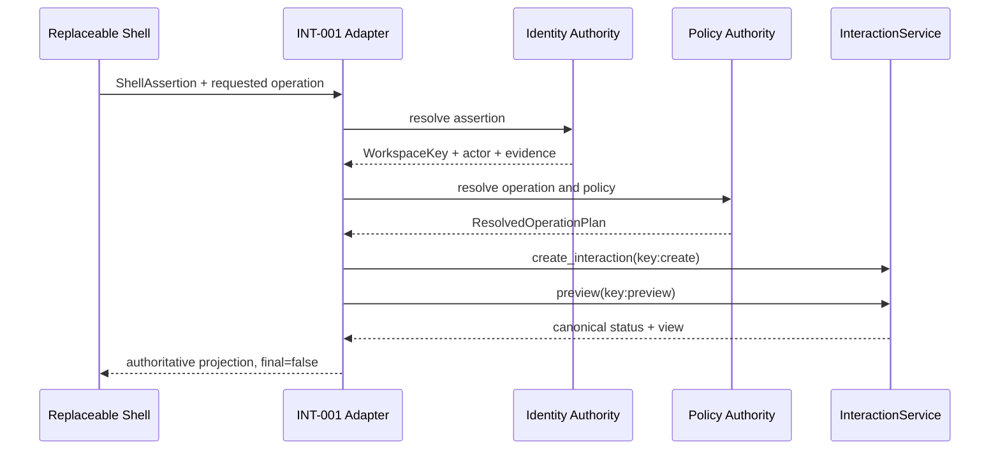

# INT-001 — Shell-Neutral Trusted Interaction Adapter 实现

- 状态：IMPLEMENTATION_AUTHORIZED / OPEN / DRAFT / PENDING_INDEPENDENT_REVIEW / NOT_READY / NOT_MERGE_AUTHORIZED
- Base：`49d77b6bd6bde3fe39eaecd5a7f8aa5b66249356`
- Product SP：None
- Current Governance Task：None
- 实现授权不等于验收、Ready 或 Merge 授权。

## 执行摘要（Executive Summary）

INT-001 在 `applications/trusted_interaction_adapter` 建立 `trusted-interaction/v1`
Shell-neutral application boundary，并把该合同投影为本地 stdio MCP tools。它复用 SP-021
的 `InteractionService`，不访问其 repository、数据库或私有存储。默认 identity binding 与
operation policy resolver 均 fail closed；只有 AI-Lab 权威 resolver 能把 Shell assertion
转换为 `WorkspaceKey`、actor 与 canonical operation plan。

永久边界保持不变：

```text
Hermes Memory != Business Fact Source
Hermes Conversation != Approval Fact Source
Hermes Tool Response != Final Success Proof
```

## 实现范围（Scope）

本任务实现：

- `ShellAssertion`、`ResolvedShellContext`、`ResolvedOperationPlan` 与 `AdapterResponse`；
- `ShellBindingResolver` 与 `OperationPolicyResolver` authority ports；
- fail-closed production defaults 与 test-only Reference authorities；
- Preview / Modify / Confirm / Cancel / Status / View / Recovery application facade；
- 官方 MCP SDK v2 的本地 stdio projection；
- Fake/Reference、restart persistence 与 ACC-INT-001 A～Q 自动证据。

## 所有权边界（Ownership Boundary）

| 能力 | Shell / Channel 职责 | INT-001 Adapter 职责 | AI-Lab canonical domain 职责 |
|---|---|---|---|
| 自然语言、会话、渠道 UX | provisional | 不拥有 | 不从文本猜测事实 |
| 身份与 Workspace assertion | 提供未信任 assertion | 请求权威 resolver | `WorkspaceKey` 与 actor 校验 |
| Operation proposal | 提供候选参数 | 请求 policy resolver | 持久化 canonical operation/policy |
| Preview / Confirmation / Status | 展示与转发 | 编排并投影 | 唯一事实源 |
| Execution / Verification / Commit | 不在 allowlist | 不提供 authority | 仅由后续受控 Adapter 与 domain service 负责 |
| Audit / Recovery | 不可替代 | 只调用 canonical API | 唯一权威事实与状态机 |

Adapter 只依赖 `InteractionService`、`ShellBindingResolver` 与
`OperationPolicyResolver`。它不得直接依赖 repository、`DatabaseManager`、raw SQL、
Shell 私有模块、Session 或 Memory。

## 权威解析（Authority Resolution）

`ShellAssertion` 中的 channel identity、Shell session、asserted workspace 与消息相关字段
都只是 provisional evidence。`ShellBindingResolver` 必须返回 AI-Lab 权威的
`ResolvedShellContext`，包含完整 `WorkspaceKey`、actor 与 binding evidence。默认
`DisabledShellBindingResolver` 返回
`interaction_adapter.identity_binding_unavailable`。

`OperationPolicyResolver` 必须返回 canonical operation、policy reference、risk、规范化参数、
风险与副作用说明、confirmation/approval/commit 要求及 expiry。默认
`DisabledOperationPolicyResolver` 返回
`interaction_adapter.operation_policy_unavailable`。自然语言不能直接授权操作。

## Canonical 流程



Preview 调用使用外部 idempotency key 的确定性派生：`<key>:create` 与
`<key>:preview`。同 key、同 payload 返回同一 canonical Interaction/Preview；同 key、不同
payload 返回 canonical idempotency conflict。Preview 不调用 execution、verification 或
canonical commit authority。

Modify 通过再次调用 canonical `preview` 生成新 revision 并 supersede 旧 Preview；旧 consent
不再有效。Confirm 必须精确匹配 Interaction ID、Preview ID、Preview revision、Interaction
revision、actor、Workspace 与 idempotency key。Cancel、Status、View 与 Recovery 全部委托给
`InteractionService`；Recovery 不调用 execution，也不盲目重试外部动作。

## 结果语义（Result Semantics）

`AdapterResponse.authoritative=true` 只表示字段来自 canonical status/view，不表示业务成功。
只有 canonical lifecycle 为 `SUCCEEDED`、存在 `VerifiedResult`，并在 Preview 要求 commit 时
存在 `CanonicalCommitEvidence`，`final` 才能为 true。MCP tool 调用成功、JSON-RPC success、
Tool Response 或外部 acknowledgment 都不能替代该判断。

## FailureInfo 失败边界

Adapter 复用 `FailureInfo`，保留 code、category、retryability、trace 与脱敏语义。identity、
Workspace 或 policy 无权威映射时 fail closed；Shell 不得把 failure 改写为 success。Transport
只序列化 failure，不另建平行错误模型。

## 安全与隐私（Security and Privacy）

- Shell 与 MCP 不访问 AI-Lab 数据库；
- assertion 中的 Workspace、Owner 或 Approver 不被自然语言推断；
- request、trace、message、channel、shell session 与 binding evidence 仅作为 correlation；
- `FailureInfo` 对 token、authorization、secret 与常见 credential shape 脱敏；
- MCP 工具没有 approve、execute、verify 或 canonical commit authority。

## Runtime 与依赖边界

新增的唯一依赖是可选 `integration` extra 中的官方 `mcp>=2,<3`，`local` extra 为 CI
和本地开发包含该 integration dependency。基础依赖、lock file、Schema、Migration、SP-021
domain、Composition Root 与既有 Agent/Tool/Workflow/Coordination runtime
均未修改。MCP 是 transport projection，不是产品核心。

## 验收证据（Acceptance Evidence）

自动证据见 `tests/applications/trusted_interaction_adapter`、
`tests/integration/test_trusted_interaction_mcp_projection.py` 与
`tests/acceptance/test_acc_int_001_shell_adapter.py`。状态只能记录为：

```text
AUTOMATED_EVIDENCE_PASSED / PENDING_INDEPENDENT_REVIEW
```

## 非目标（Non-goals）

- 不接入真实 Hermes、企业微信或其他 Channel；
- 不实现账户绑定、OAuth、RBAC、多租户 Schema 或真实 policy engine；
- 不实现 execution、verification、canonical commit 或 Approval authority；
- 不执行 UserTask、Reminder、Inbox、ERP 或其他业务写入；
- 不提供 HTTP/SSE/remote MCP hosting；
- 不启动 PILOT-001 或 REL-036；
- 不修改版本、Tag 或 Release。

## 已知限制（Known Limitations）

Production default 只能启动、发现 tools，并以 fail-closed 方式拒绝 mutation。Reference binding
与 `reference.noop` policy 仅用于自动测试。真实 identity/policy、外部 action、verified result 与
Pilot 运维恢复演练仍需后续独立授权。

## 授权边界（Authorization Boundary）

本 Draft PR 只能等待独立审查。不得自行转 Ready、Merge、创建 INT-001A，或启动
PILOT-001 / REL-036。
