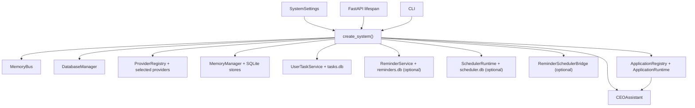
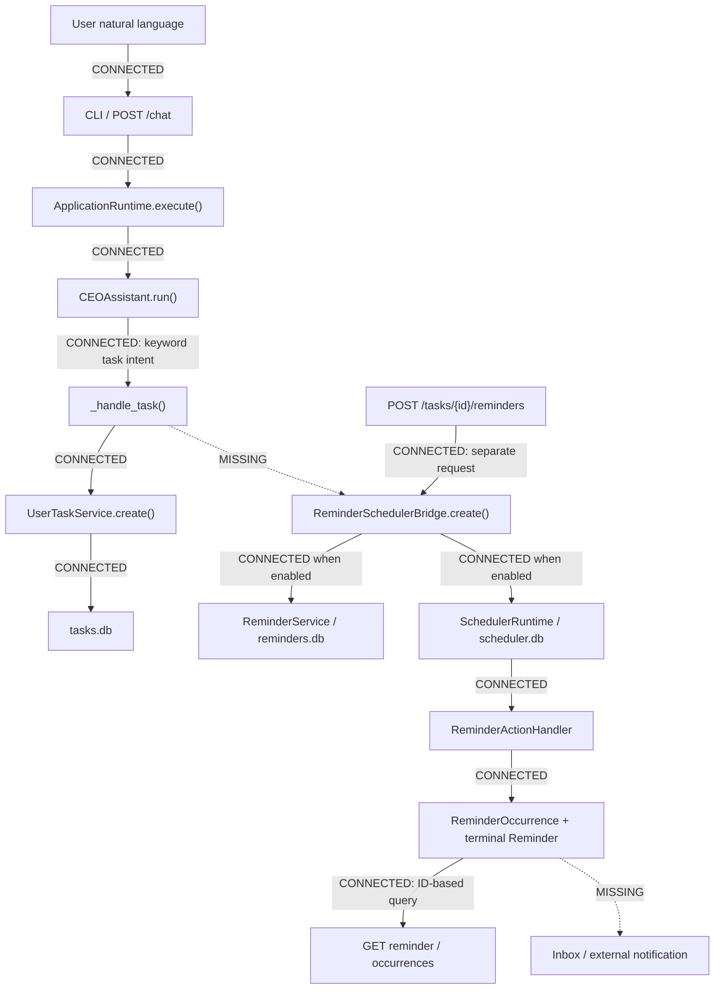
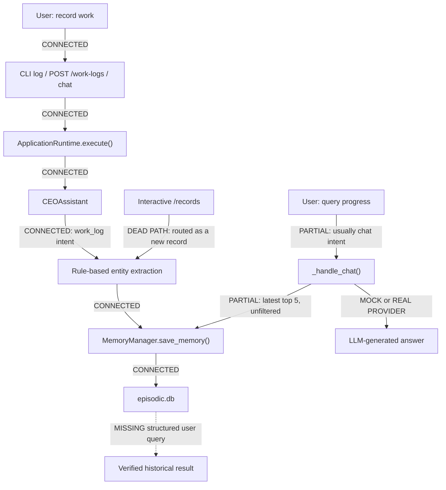
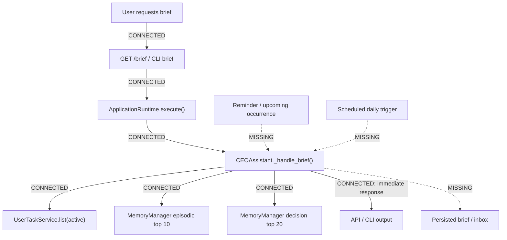
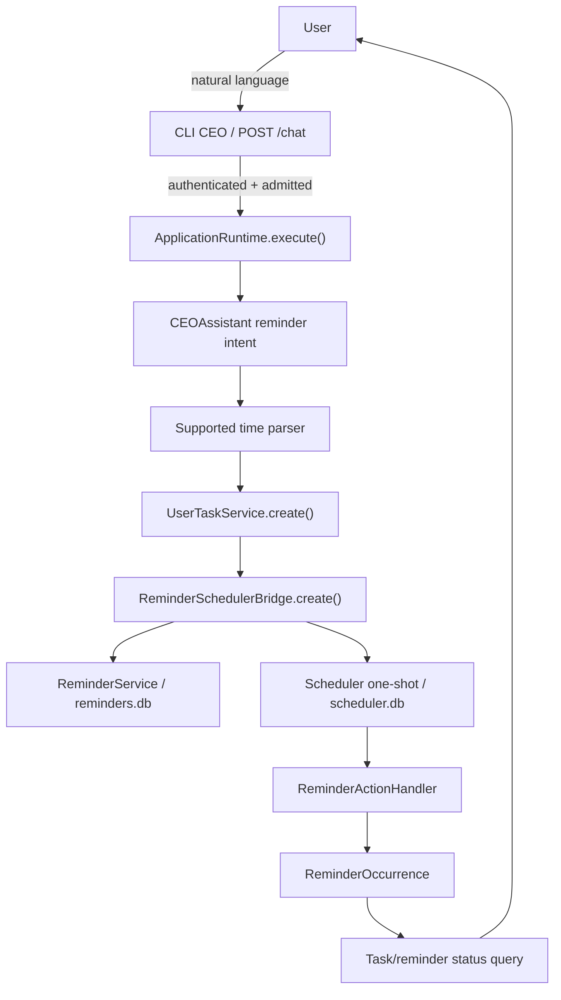

# SR-001 - First Testable Product Slice Assessment

## Executive Summary

本评估基于 `main` commit `30cf12c794fe037e6e2372a2e1eead24d4af87f8`，产品版本为 `0.33.0`。审计结论如下：

1. AI-Lab 已有一套真实、统一的生产 Composition Root，API、CLI、ApplicationRuntime、CEO Assistant、Memory、UserTask 以及可选的 Reminder/Scheduler 都由它组装和管理。
2. 工作记录写入、UserTask CRUD、Reminder 持久调度、ReminderOccurrence effectively-once 触发、手动 Daily Brief 都分别存在真实实现和行为测试。
3. 这些能力尚未形成一个从自然语言输入到后台执行再到用户可查询结果的完整产品闭环。
4. 最接近首个用户可验收产品切片的是 **Candidate A - 自然语言任务与提醒闭环**。它已有最重的持久化、调度、重启恢复和幂等基础，主要缺口集中在 CEO Assistant 到 Reminder Bridge 的业务接线与结果可见性。
5. 下一正式任务适合直接成为产品闭环任务，而不是再做一项通用基础设施任务。

**Recommended First Testable Product Slice:** Candidate A - 自然语言任务与提醒闭环（以站内状态查询为交付结果，不包含外部通知）。

**Proposed SP-009:** `SP-009 - Natural-Language Reminder Closure with In-App Status`。

本轮没有修改生产代码、测试、依赖、数据库、版本、Tag 或 Release，也没有创建 SP-009 分支或 PR。

## Current Main Baseline

| Item | Value |
|---|---|
| Repository | `y19870785/ai-lab-os` |
| Main baseline | `30cf12c794fe037e6e2372a2e1eead24d4af87f8` |
| Product version | `0.33.0` |
| Latest archived work | SP-008 / SP-008A |
| Current development state | Architecture stabilization completed through internal work admission boundary |
| Next SP | Not selected before this assessment |
| SP-009 implementation | Not started |

`30cf12c...` 是本评估读取的 `main` 基线。SR-001 是 review，不是产品功能 SP。

## Assessment Method

本评估没有根据类名或文档声明推断能力，而是逐项核对：

- 对象在哪里构造；
- 是否由 `core.system.factory.create_system()` 注入；
- API/CLI 是否能触达；
- 真实调用的方法；
- 数据是否落入 SQLite；
- 用户是否有稳定查询出口；
- 测试是否经过真实 Composition Root；
- 测试是否使用 fake persistence、fake provider、monkeypatch 或 permissive admission。

只运行了与三个候选直接相关的专项回归，没有用全量测试数量代替架构审计：

```text
42 passed, 1 warning in 7.21s
```

执行环境为 Windows 本地 Python 3.12 虚拟环境。系统默认 Python 3.10 因缺少标准库 `tomllib` 无法收集当前 `requires-python >=3.11` 项目；这不是产品回归，也没有通过修改依赖规避。

## System Entry Points

### API

- 正式入口：`python -m uvicorn api.app:app --host 127.0.0.1 --port 8000`。
- Windows 脚本：`scripts/start_api.bat` 使用同一 Uvicorn 入口。
- `api.app.create_app()` 在 lifespan 中加载 `SystemSettings`，调用 `create_system()`、`system.start()`，退出时调用 `system.shutdown()`。
- `/health`、`/health/*`、`/metrics` 为公开端点；业务 Router 统一经过 Bearer 认证与生命周期 admission gate。
- API 认证默认开启。需要 `AI_LAB_API_TOKEN`；只有显式 `AI_LAB_API_AUTH_ENABLED=false` 才关闭。
- 业务输入主要是 JSON。工作记录使用 `POST /work-logs`，任务使用 `/tasks`，Reminder 使用 `/tasks/{task_id}/reminders` 与 `/reminders/{reminder_id}`。

### CLI 单次请求

- 正式入口：`python -m cli <command>`。
- `brief`、`log`、`task`、`decide`、`ask`、`chat` 通过 `cli.runtime.execute_ceo_request()` 创建统一系统、执行一次请求并关闭。
- 每个单次命令会创建并关闭一个 SystemContainer，但持久化 SQLite 数据可以跨进程保留。
- `health`、`inspect`、`run` 仍直接调用 FastAPI dependency `get_runtime()`，未提供 Request/System 参数；它们不是本评估认可的可靠用户业务入口。

### CLI 交互模式

- 正式入口：`python -m cli ceo`。
- 交互循环只创建一个 SystemContainer，普通输入先经过 CLI 关键词路由，再进入 `ApplicationRuntime.execute()`。
- `/brief`、`/tasks`、`/records` 等命令仍由 CEO Assistant 文本意图处理，而不是独立查询 Service。
- `/records` 当前发送“查看工作记录”，会被 CEO Assistant 的“记录”关键词识别为 work-log 写入，而不是稳定查询；该命令不能作为工作记录查询闭环证据。

### Provider 配置

- 离线验收必须显式设置 `AI_LAB_PROVIDER_MODE=mock`；生产入口不会因配置错误自动回退到 Mock。
- 真实 Provider 需要 API Key、Base URL、Model 和网络，分别通过 `AI_LAB_LLM_API_KEY`、`AI_LAB_LLM_BASE_URL`、`AI_LAB_LLM_MODEL`（或兼容的 `OPENAI_*`）进入统一 Settings。
- `real` extra 提供 OpenAI-compatible client；当前项目历史上使用 DeepSeek OpenAI-compatible endpoint。
- 三个候选的确定性持久化验收不必使用真实 LLM。开放式聊天或由 LLM 生成的自然语言回答才需要真实 Provider。
- 当前 Mock LLM 会回显最后一条用户消息。因此“HTTP 200 且有文本”不能证明检索回答来自真实数据。

## Current Production Composition

生产对象图由 `core/system/factory.py:create_system()` 唯一创建：



默认配置中的 UserTask 开启；Knowledge、Scheduler、Reminder、Coordination 默认关闭。Reminder 可在 Scheduler 关闭时构造，但系统 Health 会明确失败，不能形成可用调度闭环。

## Capability Inventory

| Capability | Implemented | Wired | Reachable | Persisted | Observable | Tested | End-to-end Verified | User-testable |
|---|---:|---:|---:|---:|---:|---:|---:|---:|
| Composition Root / lifecycle | Yes | Yes | API/CLI | N/A | Health | Yes | Yes | Yes |
| CEO Assistant dispatch | Yes | Yes | API/CLI | N/A | Response | Yes | Yes | Yes |
| UserTask CRUD | Yes | Yes | API/CLI | `tasks.db` | Task API | Yes | Yes | Yes |
| Natural-language task parsing | Yes, limited rules | Yes | CEO API/CLI | Via UserTask | Confirmation + task query | Yes | Component-level | Yes for supported phrases |
| Reminder CRUD / Saga | Yes | Optional | API | `reminders.db` | Reminder API | Yes | Yes | Yes when explicitly enabled |
| Scheduler one-shot execution | Yes | Optional | Via Reminder/API | `scheduler.db` + JobRun | Runtime API internally | Yes | Yes | Operationally testable |
| ReminderOccurrence | Yes | Optional | Reminder API | `reminders.db` | Occurrence API | Yes | Yes | Yes when IDs are known |
| Natural language -> Reminder | No | No | No | No | No | No | No | No |
| Work-log write | Yes | Yes | API/CLI | `episodic.db` | Create confirmation | Yes | Yes | Yes |
| Work-log structured query | Partial store primitives only | No | No reliable user path | Existing records persist | No reliable answer | Store-level only | No | No |
| Daily Brief manual generation | Yes | Yes | API/CLI | Source data persists | Immediate response | Yes | Partial | Yes, manually |
| Daily Brief scheduled generation | No | No | No | No brief artifact | No | No | No | No |

`Implemented` 不等于 `User-testable`。例如 Reminder Scheduler 已实现并验证，但自然语言入口没有调用它；工作记录已持久化，但用户查询没有结构化读取出口。

## Candidate A Assessment - Natural-Language Task and Reminder Closure

### Real call graph



### What is real

- CEO Assistant uses deterministic keywords to recognize task/reminder wording.
- Supported “today/tomorrow + explicit clock” expressions are normalized to aware UTC UserTask due times. Unsupported specific time expressions are explicitly saved without a fabricated due time.
- UserTask is persisted in `tasks.db` and can be listed, updated, completed and cancelled through the API.
- Reminder API can create a Reminder for an existing UserTask.
- ReminderSchedulerBridge creates a persistent one-shot Scheduler Job.
- Scheduler performs durable CAS claims and persists JobRun state.
- ReminderActionHandler atomically produces a ReminderOccurrence and terminal Reminder status; unique constraints provide effectively-once behavior.
- Startup reconciliation and restart recovery are tested with the real Composition Root.
- Users can query Reminder and Occurrence by ID through the API.

### Missing links

- `_handle_task()` creates only a UserTask. It never calls ReminderSchedulerBridge, even when the sentence says “提醒我” and a valid due time exists.
- CEOAssistant is not injected with ReminderService/Bridge.
- Scheduler and Reminder are disabled by default, so a normal installation creates tasks but no timed work.
- The confirmation response contains only the UserTask ID; it does not return a Reminder ID, Scheduler Job ID or scheduling status.
- There is no natural-language “show reminder status/failures” path and no CLI reminder command.
- Triggering produces database state and EventBus observability, not a user-facing notification.
- API supports query by known IDs, but there is no inbox or consolidated due/failed reminder view.
- Complex date language such as next week remains intentionally unsupported.

### Test evidence classification

- CEO task parsing tests: real SQLite UserTask repository, but manually assembled CEOAssistant and `PERMISSIVE_TEST_ADMISSION`.
- Reminder API tests: FastAPI lifespan + real Composition Root + real SQLite, but Reminder is created by a second explicit API call.
- Reminder restart integration: real Composition Root, real SchedulerPersistence, real wait/tick, real restart and idempotency.
- No test covers natural language -> UserTask -> Reminder -> Scheduler -> Occurrence -> user query.

### Status

`Implemented + partially Wired + partially Reachable + Persisted + Observable by IDs + Tested`, but **not end-to-end user-testable from one natural-language request**.

## Candidate B Assessment - Work Log and Query Closure

### Real call graph



### What is real

- `/work-logs` and `python -m cli log` dispatch to the registered CEOAssistant instance.
- Work-log content is written to the unified Episodic SQLite store.
- Work logs survive independent system lifecycles.
- Rule extraction currently derives target, subject, status and a small fixed tag vocabulary.
- API failure paths do not convert persistence failures into fake success.

### Missing links and correctness risks

- `_extract_work_entities()` documentation mentions LLM fallback, but the implementation is rule-only.
- There is no GET/search Work Log API and no dedicated query intent/handler.
- `POST /work-logs` always prefixes input with “记录:”, so it cannot query despite its docstring saying “创建/查询”。
- `/records` sends “查看工作记录”; keyword routing treats “记录” as a new work log, so the command can create an unintended record.
- The example “我和张经理的蜂蜡检测进展到哪了？” does not reliably select a retrieval handler. It falls to chat, loads only the latest five episodic entries without entity/tag filtering, then asks the LLM to answer.
- In explicit Mock mode, that chat answer is a Mock echo, not evidence-based retrieval.
- `MemoryQuery.query_text` exists, but SQLiteEpisodicStore does not apply it. Store filters only support a small allowlist and look under JSON `content`.
- Work-log session/agent fields are written into `metadata`, while the Episodic query filter reads `content`; the intended filters do not match the storage shape.
- `workspace_id`/tenant/namespace are not persisted or enforced for work logs. API `ChatRequest.session_id` is also not transferred to `ApplicationRequest.workspace_key`.
- Existing `test_work_log_query` directly reads MemoryManager and counts rows; it is not a user query test.

### Status

Write path is `Implemented + Wired + Reachable + Persisted + Tested`. Query path is **Partial / not reliably Observable / not end-to-end verified / not user-testable**.

## Candidate C Assessment - Daily Work Brief Closure

### Real call graph



### What is real

- `/brief`, `python -m cli brief` and interactive `/brief` reach the production CEOAssistant through ApplicationRuntime.
- The brief is deterministic; it does not call the LLM and does not fabricate narrative content.
- It reads active UserTasks, episodic work logs and decisions from the configured real stores.
- Empty data produces an explicit empty summary.
- Manual brief generation can be validated in Mock/Test mode without network access.

### Missing links and correctness risks

- “Daily” work logs are actually top-ranked recent Episodic entries; no today time range is applied.
- Active tasks are not separated into overdue, due today or upcoming.
- ReminderService is not queried, so “即将到期提醒” and reminder failure/retry state are absent.
- There is no registered Scheduler ActionHandler for daily brief generation.
- The generated brief is not persisted and has no later retrieval endpoint or inbox.
- Component tests manually assemble CEOAssistant with stores and permissive admission. No API/CLI Composition Root test verifies all brief sections together.
- The existing `tests/applications/ceo_assistant/test_end_to_end.py` is a component integration test, not a user-level end-to-end test: it bypasses API/CLI, creates its own services and calls private `_handle_brief()`.

### Status

Manual brief is `Implemented + Wired + Reachable + source-data Persisted + immediately Observable + Tested`, but the target scheduled/persisted daily brief is **not end-to-end verified or complete**.

## Comparative Scorecard

Scores use 1-5, where 5 is best. Risk is reverse-scored (low risk = high score), and Dependency burden is reverse-scored (few external dependencies = high score).

Weights:

- Product value: 20%
- Wiring completeness: 20%
- User visibility: 15%
- Testability: 15%
- Existing implementation: 10%
- Risk: 10%
- Scope control: 5%
- Dependency burden: 5%

| Dimension | Weight | A Reminder | B Work Log Query | C Daily Brief |
|---|---:|---:|---:|---:|
| Existing implementation | 10% | 5 | 4 | 4 |
| Wiring completeness | 20% | 3 | 3 | 3 |
| User visibility | 15% | 3 | 2 | 4 |
| Testability | 15% | 4 | 4 | 4 |
| Product value | 20% | 5 | 4 | 4 |
| Risk (low = high score) | 10% | 3 | 4 | 3 |
| Scope control | 5% | 4 | 5 | 3 |
| Dependency burden | 5% | 5 | 5 | 5 |
| **Weighted total** | **100%** | **3.90 / 5 (78)** | **3.60 / 5 (72)** | **3.70 / 5 (74)** |

Candidate C is closest to an immediately visible manual feature, but its stated target includes scheduled generation, reminder data and durable retrieval, which broadens the work. Candidate B is the smallest isolated change, but correct structured retrieval exposes unresolved workspace/storage-shape issues. Candidate A has the highest product value and reuses the most mature, recently stabilized infrastructure.

## Recommended Product Slice

### Recommended First Testable Product Slice

**Candidate A - 自然语言任务与提醒闭环**

### Why

- UserTask, Reminder, Scheduler Job, JobRun and ReminderOccurrence already have real SQLite persistence.
- Scheduler claim, retry, recovery, Saga reconciliation and effectively-once semantics already exist and have failure/concurrency tests.
- The supported target phrase (“明天下午三点提醒我……”）already maps to a deterministic, timezone-aware due time.
- The remaining work is concentrated at an application seam: create a Reminder from the accepted reminder intent, return durable identifiers, and expose terminal state through a user-facing query.
- The slice can be accepted offline using explicit Mock/Test Provider mode because the supported intent and time parser are deterministic.
- It converts several years-of-architecture-shaped modules into one behavior the user can personally observe.

### Why not Candidate B first

- The write path is strong, but the query path is not merely an omitted Router. `query_text` is ignored by SQLiteEpisodicStore, storage/query field locations disagree, and workspace isolation is absent.
- A quick LLM-based answer would risk presenting unverified or Mock-echo content as retrieval.
- Candidate B remains a good follow-up, but it should receive an explicit WorkLog read contract rather than another prompt-only path.

### Why not Candidate C first

- Manual Brief already provides some user value, so it is less effective as proof that the currently disconnected Scheduler/Reminder architecture can form a product loop.
- A truthful daily brief needs date-bounded WorkLog retrieval, Reminder summaries, scheduled generation, persistence and a reading endpoint. That crosses both Candidate B's query gap and Candidate A's delivery gap.
- It is better built after the first in-app Reminder result and structured WorkLog retrieval are stable.

## Real End-to-End Flow for the Recommended Slice

The intended SP-009 flow should be:



All edges in this target flow must be `CONNECTED`; no Mock Provider output may stand in for Reminder/Occurrence state.

## Missing Links

### Must Have

1. Inject the canonical Reminder orchestration capability into CEOAssistant through the Composition Root.
2. Distinguish reminder intent from task-only intent. A phrase explicitly asking for a reminder must not silently create only a UserTask.
3. For a supported, valid due time, create UserTask and Reminder through a recoverable Saga. Define compensation or explicit partial-failure state so retries do not duplicate tasks/reminders.
4. If Reminder/Scheduler is disabled or unavailable, fail explicitly before reporting a scheduled reminder. No task-only fake success for reminder intent.
5. Return `task_id`, `reminder_id`, due time, timezone and scheduling status in the application response metadata and human confirmation.
6. Add a stable user query path for Reminder state and Occurrence outcome. It may reuse existing API endpoints, but CLI/natural-language users need a discoverable command or response with the exact query identifiers.
7. Surface failed/retrying/triggered state without internal exception text.
8. Prove restart persistence from natural-language creation through Scheduler recovery and terminal Occurrence.
9. Add one real Composition Root acceptance test and one API or CLI user-level test; do not rely only on manually assembled services or permissive admission.
10. Document the explicit runtime settings needed to enable Scheduler and Reminders.

### Should Have

- List reminders by UserTask in CLI/CEO natural language.
- Show latest occurrence and failure summary with the task.
- Add a short supported-language contract for today/tomorrow and exact clock forms.
- Include trace ID continuity from request through UserTask, Reminder, JobRun and Occurrence.
- Add observability for schedule-created, triggered and failed counts.

### Explicitly Deferred

- Web UI.
- Enterprise WeChat, email, SMS, push or other external notification delivery.
- Recurring Reminder.
- Mobile app and voice input.
- Complex natural-language dates such as arbitrary weeks, holidays or fuzzy ranges.
- Multi-user, tenant isolation, JWT/OAuth/OIDC, RBAC/ABAC.
- Distributed Scheduler and distributed locks.
- Full in-flight request counting or drain timeout.
- Knowledge reindex, chunk persistence and citation completion.
- Automatic Tool Calling, full MCP product loop and Coordination main path.
- Daily Brief scheduling and persistence.
- General WorkLog semantic search.

## Proposed SP-009

### SP-009 - Natural-Language Reminder Closure with In-App Status

**Goal:** Connect the supported CEO Assistant reminder intent to canonical UserTask, durable Reminder, Scheduler and queryable ReminderOccurrence without adding external notification channels.

**User-visible outcome:** A user submits “明天下午三点提醒我联系张经理确认蜂蜡检测方案”, receives a truthful task/reminder confirmation with durable IDs, can restart the process, and can query whether the reminder is scheduled, triggered or failed.

**Included:**

- CEOAssistant reminder orchestration dependency injection.
- Supported task/reminder intent distinction.
- UserTask + Reminder Saga and retry/idempotency contract.
- Explicit disabled/unavailable failure behavior.
- Task/reminder/occurrence identifiers in response metadata.
- API and CLI/in-app status query using persisted state.
- Composition Root, restart, failure and user-level acceptance tests.
- Minimal operator documentation for enabling the slice.

**Excluded:**

- External delivery channels and notification inbox UI.
- Recurring schedules.
- Broad NLP or LLM intent redesign.
- WorkLog search redesign.
- Daily Brief scheduling.
- Multi-user security model.
- New version, Tag or Release.

**Primary acceptance test:**

1. Start a system with explicit Test/Mock Provider mode, UserTask, Reminder and Scheduler enabled in a temporary data directory.
2. Submit the supported natural-language reminder through the real API or CLI Composition Root.
3. Assert the response contains one persisted UserTask and one scheduled Reminder with linked IDs.
4. Restart the system using the same data directory.
5. Advance a controlled clock or execute the due Scheduler tick.
6. Query through the public endpoint/command and observe one terminal ReminderOccurrence.
7. Repeat the tick/query and prove no duplicate occurrence.
8. Inject a scheduling/trigger failure and observe explicit persisted failure, not a success answer.

**Estimated changed areas:**

- `applications/ceo_assistant/application.py`
- `core/system/factory.py`
- `core/reminders/` only where a narrow orchestration/query contract is required
- `api/routes/` and/or `cli/` for user-visible status
- focused application, API/CLI and Composition Root acceptance tests
- RFC/ADR and project status documentation

**Main architectural risk:** preserving Saga idempotency when UserTask creation succeeds but Reminder scheduling fails or the client retries. SP-009 must reuse canonical identifiers and persisted recovery state instead of creating duplicate tasks or hiding partial completion.

No SP-009 branch or PR is created by SR-001.

## User Acceptance Scenario

1. User configures explicit offline Mock mode or an authorized real Provider, enables Scheduler/Reminder, and starts API or interactive CLI.
2. User submits: “明天下午三点提醒我联系张经理确认蜂蜡检测方案”。
3. System returns a confirmation containing task ID, reminder ID, normalized local/UTC time and `scheduled` status.
4. User queries the task/reminder and sees the same persisted state.
5. Process restarts; the same task and reminder remain queryable.
6. At the controlled due time, Scheduler creates exactly one ReminderOccurrence.
7. User queries again and sees `triggered`, or an explicit `failed/retrying` status if execution failed.
8. No LLM-generated text is accepted as proof of scheduling or delivery; persisted domain state is authoritative.

This is an in-app status loop, not external notification delivery and not zero-touch consumer reminder UX.

## Risks

| Risk | Impact | Required containment |
|---|---|---|
| UserTask committed but Reminder scheduling fails | Duplicate/orphan state on retry | Persisted Saga state, stable idempotency key, explicit partial failure |
| Reminder feature disabled | “Reminder” sentence becomes task-only fake success | Fail before success response or explicitly negotiate task-only behavior |
| Parser accepts unsupported time | Incorrect scheduled time | Keep strict supported grammar and explicit unparsed response |
| Scheduler only locally enabled | User expects delivery that cannot occur | Health and startup/operator docs must expose disabled/not configured state |
| Result exists only in database | User cannot verify outcome | Public query/CLI command is Must Have |
| Real LLM changes intent | Nondeterministic acceptance | Keep primary acceptance deterministic; real Provider is supplemental |

## Evidence Index

| Evidence | Location | Finding |
|---|---|---|
| Single Composition Root | `core/system/factory.py:138` | Constructs one dependency graph |
| Memory/UserTask/Reminder wiring | `core/system/factory.py:151-190` | SQLite-backed services are created centrally |
| Scheduler/Bridge wiring | `core/system/factory.py:239-267` | Optional Scheduler and Reminder bridge are real objects |
| CEO/Application registration | `core/system/factory.py:282-310` | Real CEOAssistant instance is registered and dispatched |
| Default feature flags | `core/system/settings.py:37-40`, `106-110` | Scheduler/Reminder default to false |
| API lifespan and protected routes | `api/app.py:23-112` | Shared system lifecycle and security boundary |
| CLI shared runtime | `cli/runtime.py:9-25`, `cli/ceo.py:123-190` | CLI uses Composition Root |
| Rule intent routing | `applications/ceo_assistant/application.py:78-122` | Work log/task/brief selection is keyword based |
| Work-log persistence | `applications/ceo_assistant/application.py:187-227` | Writes Episodic Memory |
| Rule entity extraction | `applications/ceo_assistant/application.py:242-293` | No LLM extraction implementation |
| UserTask-only NL handling | `applications/ceo_assistant/application.py:297-429` | Creates UserTask, not Reminder |
| Brief source reads | `applications/ceo_assistant/application.py:550-608` | Reads active tasks, recent logs and decisions |
| Chat retrieval behavior | `applications/ceo_assistant/application.py:612-676` | Loads latest five, then calls Provider |
| Memory query shape | `core/memory/models.py:61-77` | `query_text` exists |
| SQLite episodic query | `core/memory/storage/sqlite_episodic.py:130-160` | `query_text`/offset/sort are not applied; narrow content filters only |
| Reminder scheduling Saga | `core/reminders/bridge.py:47-174` | Persistent one-shot job and explicit failure state |
| Effectively-once trigger | `core/reminders/repository.py:229-318` | Transaction + idempotency key + unique occurrence |
| User-visible Reminder query | `api/routes/reminders.py:62-118` | Reminder and occurrence endpoints exist |
| Work-log API limitation | `api/routes/work_logs.py:10-23` | POST always prefixes record intent |
| Mock Provider behavior | `core/providers/llm/mock.py:39-52` | Returns echo, not retrieval evidence |
| Real Composition test | `tests/integration/test_system_composition.py` | Composition and real CEO instance dispatch |
| Work-log API acceptance | `tests/api/test_work_logs_real_dispatch.py` | API writes unified Episodic Memory |
| Work-log restart | `tests/acceptance/test_work_log_persistence.py` | SQLite record survives restart |
| Reminder restart/effectively-once | `tests/integration/test_reminder_scheduler_bridge.py` | Real system restart and one occurrence |
| Component “E2E” boundary | `tests/applications/ceo_assistant/test_end_to_end.py` | Manual wiring, permissive admission, private brief call |

## Conclusion

AI-Lab 的架构稳定化已经足以支撑首个产品闭环，不需要在 SP-009 之前再插入一项通用基础设施任务。当前最值得做的不是新增模块，而是把已经可靠的 UserTask、Reminder、Scheduler 和 Occurrence 通过 CEO Assistant 接成一个诚实、可查询、可重启验证的用户流程。

因此本评估建议：

```text
Recommended First Testable Product Slice:
Candidate A - Natural-Language Task and Reminder Closure

Proposed SP-009:
SP-009 - Natural-Language Reminder Closure with In-App Status
```

SR-001 只形成建议。SP-009 尚未启动，无分支、无 PR、无实现。
