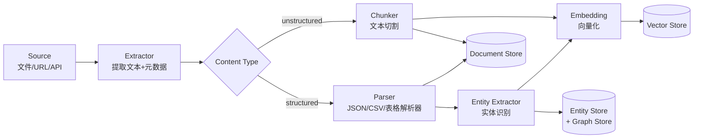

# RFC-004: Knowledge Layer Architecture

## Metadata

| Field        | Value                                |
| ------------ | ------------------------------------ |
| **RFC 编号** | 004                                  |
| **标题**     | Knowledge Layer 架构设计               |
| **状态**     | 草稿                                  |
| **作者**     | Lin Yuyan                            |
| **创建日期** | 2026-07-12                           |
| **更新日期** | 2026-07-12                           |
| **关联 ADR** | ADR-006, ADR-007                     |

## 1. 背景

AI-Lab 五层架构中，Knowledge Layer 是知识系统层——负责接入、管理、检索所有外部知识。它是 Agent 能力的"弹药库"。

当前阶段已有 Memory Layer 管理系统自身记忆，但缺少两个关键能力：

**问题 1：Agent 没有"外部知识"来源**
- Memory Layer 记录的是系统自身的交互历史，不是外部文档
- Agent 无法访问用户上传的 PDF、网页、数据库等外部数据
- 没有 RAG（检索增强生成）能力，Agent 的知识只靠模型自身训练数据

**问题 2：知识体系缺乏结构化设计**
- 五类知识（文档/实体/关系/经验/决策）各自的采集、存储、检索策略不同
- 没有统一的知识元数据模型
- 知识权限和版本管理缺失

**Phase 1.4 的目标**：设计完整的 Knowledge Layer 架构，覆盖五类知识的知识采集、Chunk 策略、Embedding 接口、检索策略和权限控制。**不实现具体知识源接入**。

## 2. 目标

- 定义五种知识类型（文档/实体/关系/经验/决策）的数据模型和存储策略
- 设计统一的知识采集流水线（Ingestion Pipeline）
- 设计可配置的 Chunk 策略框架
- 设计 Embedding 接口（与 Memory Layer 复用/对齐）
- 设计分层检索策略（关键词 → 向量 → 图遍历 → 混合）
- 设计知识权限控制（与 Core Identity 集成）
- 明确 Knowledge Layer 与 Memory Layer 的边界和协作方式
- **不在此次范围**：具体知识源的接入实现、Agent 侧的知识消费逻辑

## 3. 设计方案

### 3.1 整体思路

Knowledge Layer 采用**知识类型驱动**的设计：

1. 五种知识类型各有独立的数据模型和存储策略，但共用同一套知识采集/检索基础设施
2. 知识采集流水线（Ingestion Pipeline）是统一入口，根据知识类型路由到不同的处理链
3. 检索系统采用分层策略：从精确匹配 → 语义检索 → 图遍历 → 混合重排
4. 知识权限与 Core Identity 集成，每个知识条目可设置访问级别

**核心设计模式：Knowledge = KnowledgeType + [Source] + [Chunks] + [Embeddings] + [Relations]**

### 3.2 架构图

```
┌──────────────────────────────────────────────────────────────────┐
│                       Knowledge Layer                             │
│                                                                   │
│  ┌──────────────────────────────────────────────────────────────┐ │
│  │                     Knowledge Manager                        │ │
│  │     统一入口：CRUD + 检索 + 权限 + 版本                      │ │
│  └──────────┬───────────────────────────────────┬───────────────┘ │
│             │                                   │                 │
│  ┌──────────┴──────────┐     ┌──────────────────┴──────────────┐ │
│  │   Ingestion Pipeline│     │       Retrieval Engine          │ │
│  │   (知识采集流水线)    │     │       (分层检索引擎)            │ │
│  └──────────┬──────────┘     └──────────────────┬──────────────┘ │
│             │                                   │                 │
│  ┌──────────┴───────────────────────────────────┴──────────────┐ │
│  │               Storage Layer (存储层)                        │ │
│  │                                                             │ │
│  │  ┌──────────┐  ┌──────────┐  ┌──────────┐  ┌────────────┐  │ │
│  │  │  Doc     │  │  Entity  │  │  Graph   │  │  Vector    │  │ │
│  │  │  Store   │  │  Store   │  │  Store   │  │  Store     │  │ │
│  │  │(原始文档) │  │(实体)    │  │(关系)    │  │(向量索引)   │  │ │
│  │  └──────────┘  └──────────┘  └──────────┘  └────────────┘  │ │
│  └─────────────────────────────────────────────────────────────┘ │
│                                                                   │
│  ┌──────────────────────────────────────────────────────────────┐ │
│  │                   Five Knowledge Types                       │ │
│  │                                                              │ │
│  │  ┌──────────┐ ┌──────────┐ ┌──────────┐ ┌──────────┐ ┌───┐  │ │
│  │  │ Document │ │ Entity   │ │ Relation │ │Experience│ │Decision│ │
│  │  │ 文档知识  │ │ 实体知识  │ │ 关系知识  │ │ 经验知识  │ │决策知识│ │
│  │  └──────────┘ └──────────┘ └──────────┘ └──────────┘ └───┘  │ │
│  └──────────────────────────────────────────────────────────────┘ │
└──────────────────────────────────────────────────────────────────┘
         │                        │
         ▼                        ▼
    Core Layer              Memory Layer
  (基础设施/身份)           (系统记忆/语义实体可作为输入)
```

### 3.3 五种知识类型

#### 类型 1：Document Knowledge（文档知识）

**定义**：外部文档中的数据，包括结构化（表格、JSON）和非结构化（PDF、Markdown、网页）。

```python
class DocumentKnowledge(BaseModel):
    """文档知识。知识的原子单位——一篇文档/一个页面。"""
    id: str
    title: str
    source: str                     # 来源标识：file_path / url / api
    source_type: SourceType         # pdf / markdown / html / csv / api
    content_type: ContentType       # structured / unstructured

    # 原始内容
    raw_content: str                # 原始文本
    metadata: DocumentMetadata      # 文档级别元数据

    # 文档结构
    chunks: list[Chunk] = []        # 切割后的块
    summary: str | None = None      # 文档级摘要
    embedding: list[float] | None = None  # 文档级 embedding

    # 版本与权限
    version: int = 1
    access_level: AccessLevel = AccessLevel.PRIVATE
    created_at: datetime
    updated_at: datetime


class SourceType(str, Enum):
    PDF = "pdf"
    MARKDOWN = "markdown"
    HTML = "html"
    CSV = "csv"
    JSON = "json"
    API = "api"
    TEXT = "text"


class ContentType(str, Enum):
    """内容结构化程度。"""
    STRUCTURED = "structured"       # CSV/JSON/表格
    SEMI_STRUCTURED = "semi_structured"  # Markdown/HTML
    UNSTRUCTURED = "unstructured"   # 纯文本/PDF


class DocumentMetadata(BaseModel):
    """文档级元数据。"""
    author: str | None = None
    created_date: datetime | None = None
    tags: list[str] = []
    language: str = "zh"
    source_url: str | None = None
    file_size: int = 0
    page_count: int | None = None
    custom: dict[str, Any] = {}
```

#### 类型 2：Entity Knowledge（实体知识）

**定义**：独立的概念实体——人、公司、产品、概念、术语。

```python
class EntityKnowledge(BaseModel):
    """实体知识。知识图谱的节点。"""
    id: str
    name: str
    type: EntityType                # person / organization / concept / product / term
    aliases: list[str] = []         # 别名（用于匹配）

    # 实体属性
    attributes: dict[str, Any] = {} # 结构化的属性键值
    description: str = ""           # 自然语言描述
    embedding: list[float] | None = None

    # 来源与权限
    sources: list[str] = []         # 来源文档 ID
    access_level: AccessLevel = AccessLevel.PRIVATE
    created_at: datetime
    updated_at: datetime


class EntityType(str, Enum):
    PERSON = "person"
    ORGANIZATION = "organization"
    CONCEPT = "concept"
    PRODUCT = "product"
    TERM = "term"
    LOCATION = "location"
    EVENT = "event"
    CUSTOM = "custom"
```

#### 类型 3：Relation Knowledge（关系知识）

**定义**：实体之间的语义关系——构成知识图谱的边。

```python
class RelationKnowledge(BaseModel):
    """关系知识。知识图谱的边。"""
    id: str
    source_entity_id: str           # 主体实体
    target_entity_id: str           # 客体实体
    relation_type: str              # "invests_in" / "collaborates_with" / "competes_with" / "belongs_to"
    relation_label: str = ""        # 人类可读描述

    # 关系属性
    weight: float = 1.0             # 关系强度
    attributes: dict[str, Any] = {}
    confidence: float = 1.0         # 抽取置信度

    # 时序
    valid_from: datetime | None = None
    valid_to: datetime | None = None
    sources: list[str] = []

    # 权限
    access_level: AccessLevel = AccessLevel.PRIVATE
    created_at: datetime
```

#### 类型 4：Experiential Knowledge（经验知识）

**定义**：Best Practice、方法论、工作流模板——"怎么做"的知识。

```python
class ExperientialKnowledge(BaseModel):
    """经验知识。如何完成特定任务的实践知识。"""
    id: str
    title: str                      # "如何做行业研究"
    domain: str                     # 应用领域

    # 核心内容
    context: str                    # 适用场景描述
    steps: list[ExperienceStep]     # 步骤化描述
    prerequisites: list[str] = []   # 前置条件
    expected_outcome: str = ""      # 预期结果

    # 知识来源
    derived_from: list[str] = []    # 来源文档/经验 ID
    confidence: float = 0.5         # 可信度
    tags: list[str] = []
    access_level: AccessLevel = AccessLevel.PRIVATE
    created_at: datetime
    updated_at: datetime


class ExperienceStep(BaseModel):
    """经验步骤。"""
    order: int
    description: str                # 步骤描述
    tools_needed: list[str] = []    # 需要的工具/Agent
    expected_duration: str | None = None
    tips: str | None = None
```

#### 类型 5：Decision Knowledge（决策知识）

**定义**：历史决策记录及推理过程——"为什么做这个决定"。

```python
class DecisionKnowledge(BaseModel):
    """决策知识。记录决策的上下文、选项、推理和结果。"""
    id: str
    title: str
    decision_type: str              # "investment" / "architecture" / "strategy"

    # 决策上下文
    context: str                    # 决策背景
    alternatives: list[DecisionAlternative]  # 备选方案
    chosen: str                     # 选中的方案
    reasoning: str                  # 推理过程

    # 决策结果
    outcome: str | None = None      # "success" / "failure" / "pending"
    outcome_notes: str | None = None
    lessons: str | None = None      # 经验教训

    # 关联
    related_entities: list[str] = []
    related_documents: list[str] = []
    tags: list[str] = []
    access_level: AccessLevel = AccessLevel.PRIVATE
    decision_maker: str = ""
    created_at: datetime
    updated_at: datetime


class DecisionAlternative(BaseModel):
    """决策备选方案。"""
    name: str
    description: str
    pros: list[str] = []
    cons: list[str] = []
    estimated_effort: str | None = None
```

### 3.4 模块说明

#### 模块 1：Knowledge Manager（统一入口）

**职责**：Knowledge Layer 的统一门面，封装所有知识操作。

```python
class KnowledgeManager:
    """Knowledge Layer 的统一入口。"""

    # ── 新建知识 ──
    async def create(self, knowledge: KnowledgeItem) -> str: ...
    async def batch_create(self, items: list[KnowledgeItem]) -> list[str]: ...

    # ── 读取 ──
    async def get(self, knowledge_id: str, knowledge_type: KnowledgeType) -> KnowledgeItem | None: ...
    async def query(self, query: KnowledgeQuery) -> list[KnowledgeItem]: ...

    # ── 更新/删除 ──
    async def update(self, knowledge_id: str, knowledge_type: KnowledgeType, updates: dict) -> None: ...
    async def delete(self, knowledge_id: str, knowledge_type: KnowledgeType) -> bool: ...

    # ── 检索（聚合所有知识类型） ──
    async def search(self, request: SearchRequest) -> SearchResult: ...
```

#### 模块 2：Ingestion Pipeline（知识采集流水线）

**职责**：处理新知识的接入流程——从原始数据到可检索的知识条目。



```python
class IngestionPipeline:
    """知识采集流水线。可组合的处理链。"""

    async def ingest(self, source: KnowledgeSource) -> IngestionResult:
        """从来源接入知识。自动路由到合适的处理链。"""
        ...

    async def ingest_file(self, file_path: str, knowledge_type: KnowledgeType) -> IngestionResult:
        """从文件接入。"""
        ...

    async def ingest_url(self, url: str, knowledge_type: KnowledgeType) -> IngestionResult:
        """从 URL 接入。"""
        ...

    async def ingest_text(self, text: str, knowledge_type: KnowledgeType, metadata: dict) -> IngestionResult:
        """直接接入文本。"""
        ...


class IngestionStage(str, Enum):
    """采集流水线的处理阶段。"""
    EXTRACT = "extract"             # 提取原始文本和元数据
    PARSE = "parse"                 # 结构化解析（表格/JSON）
    CHUNK = "chunk"                 # 文本切割
    EXTRACT_ENTITIES = "extract_entities"  # 实体识别
    EMBED = "embed"                 # 向量化
    STORE = "store"                 # 持久化
    INDEX = "index"                 # 建立索引
```

#### 模块 3：Chunk Strategy（切割策略框架）

**职责**：提供可配置的文档切割策略，不同知识类型使用不同策略。

```python
class ChunkStrategy(ABC):
    """文本切割策略抽象。"""

    @abstractmethod
    async def chunk(self, text: str, metadata: DocumentMetadata) -> list[Chunk]: ...


class Chunk(BaseModel):
    """知识块——检索和引用的原子单位。"""
    id: str
    document_id: str
    content: str                    # 块文本
    chunk_index: int                # 在文档中的序号
    metadata: ChunkMetadata

    # 语义信息
    embedding: list[float] | None = None
    summary: str | None = None      # 块级摘要
    entities: list[str] = []        # 块中提到的实体 ID


class ChunkMetadata(BaseModel):
    """块级元数据。用于过滤和引用。"""
    start_char: int = 0
    end_char: int = 0
    heading: str | None = None      # 所属标题（Markdown/Section）
    page_number: int | None = None
    tokens: int = 0


class ChunkMethod(str, Enum):
    """内置切割方法。"""
    FIXED_SIZE = "fixed_size"       # 固定大小（字符/token数）
    RECURSIVE = "recursive"         # 递归分割（由分隔符列表控制）
    SEMANTIC = "semantic"           # 语义分割（按段落/章节边界）
    CODE = "code"                   # 代码专用分割
    CSV = "csv"                     # CSV 表格分割
    MARKDOWN = "markdown"           # Markdown 标题结构分割
    PDF = "pdf"                     # PDF 页面+段落分割
```

**五种知识类型推荐的 Chunk 策略：**

| 知识类型   | Chunk 方法      | Chunk 大小 | Overlap | 说明                       |
| ---------- | --------------- | ---------- | ------- | -------------------------- |
| 文档       | RECURSIVE       | 512 tokens | 64      | 通用文档，平衡精确度和语义 |
| 文档(PDF)  | PDF             | 页面级      | 0       | 按页面切，保留原始布局      |
| 文档(MD)   | MARKDOWN        | 标题级      | 1-2句   | 按标题结构切，保留层级       |
| 实体       | —（不分块）      | —          | —       | 实体本身就是原子单位        |
| 关系       | —（不分块）      | —          | —       | 关系是原子单位              |
| 经验       | SEMANTIC        | 步骤级      | 0       | 按 ExperienceStep 切        |
| 决策       | SEMANTIC        | 完整记录    | 0       | 决策本身不可分割            |

#### 模块 4：Embedding Interface（向量化接口）

**职责**：统一的知识向量化接口，支持多种 embedding 提供者。

```python
class EmbeddingProvider(ABC):
    """Embedding 提供者抽象。与 Memory Layer 复用同一接口。"""

    @abstractmethod
    async def embed(self, texts: list[str]) -> list[list[float]]: ...

    @abstractmethod
    async def embed_query(self, query: str) -> list[float]: ...

    @property
    @abstractmethod
    def dimensions(self) -> int: ...

    @property
    @abstractmethod
    def model_name(self) -> str: ...
```

**内置 Provider 实现规划：**

| Provider | 场景 | 备注 |
| --- | --- | --- |
| `OpenAIEmbedding` | 云端 | 高质量，需 API Key |
| `OllamaEmbedding` | 本地 | 隐私优先，需本地模型 |
| `SentenceTransformerEmbedding` | 本地 | 离线可用，模型文件较大 |
| `DisableEmbedding` | 降级 | 退化为纯关键词检索 |

Embedding 策略配置（按知识类型独立配置）：
```python
class EmbeddingConfig(BaseModel):
    """知识层 vectorization 配置。"""
    provider: str = "none"
    batch_size: int = 16            # 批量 embedding 大小
    retry_on_fail: bool = True
    cache_embeddings: bool = True   # 缓存已计算的 embedding
```

#### 模块 5：Retrieval Engine（分层检索引擎）

**职责**：提供多层次、可组合的知识检索能力。

**检索策略分层：**

```
Level 1: 精确匹配（Exact Match）
  └── 关键词检索（SQL LIKE / FTS）
  └── ID 检索

Level 2: 语义检索（Semantic Search）
  └── 向量相似度检索
  └── 支持过滤条件（时间、标签、访问级别）

Level 3: 图遍历（Graph Traversal）
  └── 从已知实体出发，沿关系遍历
  └── 发现间接关联知识

Level 4: 混合检索（Hybrid Search）
  └── 关键词 + 向量 + 图 多路召回
  └── RRF (Reciprocal Rank Fusion) 融合排序
  └── 重排序（Cross-encoder / LLM）
```

```python
class RetrievalEngine:
    """分层检索引擎。"""

    async def search(self, request: SearchRequest) -> SearchResult:
        """执行分层检索。"""

    async def search_by_text(self, query: str, filters: SearchFilter, top_k: int = 10) -> list[ScoredItem]:
        """文本检索（关键词 + 向量混合）。"""

    async def search_by_embedding(self, embedding: list[float], filters: SearchFilter, top_k: int = 10) -> list[ScoredItem]:
        """纯向量检索。"""

    async def search_graph(self, entity_ids: list[str], relation_types: list[str] | None = None, depth: int = 1) -> list[GraphPath]:
        """图遍历检索。从实体出发沿关系发现关联知识。"""

    async def hybrid_search(self, query: str, entity_ids: list[str] | None = None, config: HybridConfig | None = None) -> SearchResult:
        """混合检索：关键词 + 向量 + 图多路召回 + RRF 融合。"""


class SearchRequest(BaseModel):
    """检索请求。"""
    query: str
    knowledge_types: list[KnowledgeType] | None = None
    filters: SearchFilter = SearchFilter()
    strategy: RetrievalStrategy = RetrievalStrategy.HYBRID
    top_k: int = 20
    min_score: float = 0.0


class RetrievalStrategy(str, Enum):
    """检索策略选择。"""
    KEYWORD = "keyword"             # 仅关键词
    VECTOR = "vector"               # 仅向量
    GRAPH = "graph"                 # 仅图遍历
    HYBRID = "hybrid"               # 混合（默认）
    RERANK = "rerank"               # 混合 + 重排序


class HybridConfig(BaseModel):
    """混合检索配置。"""
    keyword_weight: float = 0.3
    vector_weight: float = 0.5
    graph_weight: float = 0.2
    rrf_k: int = 60                 # RRF 融合常数
    enable_rerank: bool = False
    rerank_top_k: int = 5
```

#### 模块 6：Knowledge Permissions（知识权限）

**职责**：控制知识条目的访问权限，与 Core Identity 集成。

```python
class AccessLevel(str, Enum):
    """知识访问级别。"""
    PUBLIC = "public"               # 所有用户可读
    TEAM = "team"                   # 同一团队可读
    PRIVATE = "private"             # 仅创建者可读
    RESTRICTED = "restricted"       # 指定用户/角色可读


class KnowledgePermission(BaseModel):
    """知识条目权限。"""
    knowledge_id: str
    access_level: AccessLevel = AccessLevel.PRIVATE
    owner_id: str                   # 创建者用户 ID
    allowed_users: list[str] = []   # 明确允许的用户
    allowed_roles: list[str] = []   # 允许的角色

    # 操作权限
    can_read: bool = True
    can_write: bool = False
    can_delete: bool = False
    can_share: bool = False
```

#### 模块 7：Knowledge Events（知识事件）

**职责**：Knowledge Layer 通过 Message Bus 发出事件，供 Agent Layer / Memory Layer 消费。

```python
# 知识事件（通过 Message Bus 发布）
class KnowledgeEvent:
    KNOWLEDGE_CREATED = "knowledge.created"
    KNOWLEDGE_UPDATED = "knowledge.updated"
    KNOWLEDGE_DELETED = "knowledge.deleted"
    KNOWLEDGE_ACCESSED = "knowledge.accessed"
    INGESTION_COMPLETED = "knowledge.ingestion.completed"
    INGESTION_FAILED = "knowledge.ingestion.failed"
```

消费场景示例：
- Agent 监听 `knowledge.updated` → 如果与当前任务相关，触发重新检索
- Memory Layer 监听 `knowledge.accessed` → 写入 Episodic Memory（"用户查了关于 X 的知识"）

### 3.5 与 Memory Layer 的协作

**最关键的设计约束：Knowledge Layer 和 Memory Layer 的边界。**

```
Memory Layer（系统记忆）                    Knowledge Layer（外部知识）
─────────────                              ─────────────
Semantic Memory (entity/relation)  ────→   Entity Knowledge
  系统自动提取的临时实体                        用户管理的正式实体
  TTL 驱动遗忘                                 手动管理生命周期
  低置信度                                     高置信度

Episodic Memory (交互历史)                 Document Knowledge
  系统交互记录                                 外部文档
  自动写入                                     手动导入
  重要性衰减驱动遗忘                             版本管理

                                             Experiential Knowledge
                                               经验萃取和沉淀
                                               方法论和 Best Practice

                                             Decision Knowledge
                                               正式决策记录
                                               可选同步自 Episodic
```

**协作方式：** Memory Layer 可以"升级"为 Knowledge Layer 的输入——当系统发现某条 Episodic Memory 的 importance 持续很高时，可以建议用户将其沉淀为 Knowledge 条目。反之，Knowledge Layer 的检索结果可以注入 Memory Layer 作为 Agent 的上下文。

### 3.6 接口定义

#### 3.6.1 层间依赖

Knowledge Layer 依赖 Core Layer：
- `core.data` → 底层存储（Repository Pattern）
- `core.config` → 知识层配置
- `core.identity` → 用户权限校验
- `core.bus` → 知识事件发布
- `core.logging` → 链路追踪

Knowledge Layer **可选**依赖 Memory Layer：
- `core.memory.semantic` → 实体知识对齐（可选同步）
- 但在 Phase 1 中保持独立，不做强制依赖

Knowledge Layer **不依赖** Agent Layer。

#### 3.6.2 包结构

```
knowledge/
├── __init__.py                      # 包入口
├── manager.py                       # KnowledgeManager 统一入口
├── ingestion.py                     # IngestionPipeline
├── retrieval.py                     # RetrievalEngine
├── permission.py                    # 知识权限模型
├── config.py                        # Knowledge Layer 配置
│
├── models/                          # 知识数据模型
│   ├── __init__.py
│   ├── document.py                  # DocumentKnowledge / Chunk
│   ├── entity.py                    # EntityKnowledge
│   ├── relation.py                  # RelationKnowledge
│   ├── experience.py                # ExperientialKnowledge
│   ├── decision.py                  # DecisionKnowledge
│   └── common.py                    # 共用类型（AccessLevel / SourceType）
│
├── chunking/                        # 切割策略
│   ├── __init__.py
│   ├── protocol.py                  # ChunkStrategy 抽象
│   ├── recursive.py                 # RecursiveChunker
│   ├── fixed_size.py                # FixedSizeChunker
│   ├── markdown.py                  # MarkdownChunker
│   └── pdf.py                       # PdfChunker（骨架）
│
├── embedding/                       # Embedding 接口
│   ├── __init__.py
│   ├── protocol.py                  # EmbeddingProvider 抽象
│   └── provider_none.py             # 降级实现（纯关键词）
│
└── storage/                         # 存储层抽象
    ├── __init__.py
    ├── protocol.py                  # KnowledgeStore 抽象
    ├── vector_store.py              # 向量存储接口
    ├── graph_store.py               # 图存储接口
    └── document_store.py            # 文档存储接口
```

## 4. 可选方案

### 方案 A：知识类型分离设计（选定方案）

五种知识类型各自独立数据模型和存储策略，共用检索和采集基础设施。

**优点**：
- 每种知识类型使用最适合的存储和检索策略
- 新增知识类型不影响已有类型
- 类型间通过检索层统一返回

**缺点**：
- 跨类型混合检索需要融合排序层
- 五种数据模型增加了理解成本

### 方案 B：统一知识模型 + type 字段

所有知识类型共享同一个 `KnowledgeItem` 模型，用 `type` + `content(dict)` 区分。

**优点**：
- 代码量少，统一 CRUD
- 易于扩展新类型（只需新增 type 枚举值）

**缺点**：
- `content` 是 dict，失去类型安全
- 不同类型的字段差异大到无法共用索引策略（文档需要 chunk，实体不需要）
- 与 Memory Layer 的 MemoryItem 模式重复，但语义不同，容易混淆

**为什么不选**：五种知识类型的存储和检索需求的差异足够大，用一个模型硬塞会降低每种知识类型的效率。

### 方案 C：知识类型放在 Memory Layer 作为扩展

在 Memory Layer 中增加 `MemoryType.KNOWLEDGE`，将外部知识作为"记忆"的一种来处理。

**优点**：
- 减少层数，代码复用 Memory Layer 的存储和检索

**缺点**：
- 混淆了"系统记忆"和"外部知识"的不同生命周期
- Memory Layer 的遗忘策略（重要性衰减）不适合外部知识
- 知识权限和版本管理需要大幅改造 Memory Layer

**为什么不选**：Memory 和 Knowledge 的生命周期和所有权完全不同，混在一起会让两层都变得复杂。

## 5. 影响分析

| 维度       | 影响说明                                         |
| ---------- | ------------------------------------------------ |
| 性能       | Ingestion 是大 IO 操作，异步执行；检索延迟受 embedding API 和向量检索速度影响（~50-300ms） |
| 存储       | 新增 Document Store（SQLite/文件），Entity Store（SQLite），Graph Store（SQLite/Neo4j），Vector Store（Chroma） |
| 安全       | 知识条目级权限控制，继承 Core Identity 的用户模型 |
| 可维护性   | 五种知识类型独立演进；Chunk/Embedding/Retrieval 策略可配置可替换 |
| 依赖变更   | Phase 1 无新增外部依赖（复用 Memory Layer 的 Chroma）；Phase 2 可能引入全文检索引擎 |

## 6. 实施计划

### Phase 1.4a：Knowledge Layer 抽象层（当前 RFC 对应的实施步骤）

1. 创建 `knowledge/` 顶层包及目录骨架
2. 实现 `models/`：五种知识类型的数据模型
3. 实现 `manager.py`：KnowledgeManager 统一入口
4. 实现 `ingestion.py`：IngestionPipeline 骨架
5. 实现 `chunking/`：ChunkStrategy 抽象 + Recursive / FixedSize / Markdown 三种实现
6. 实现 `embedding/`：EmbeddingProvider 抽象 + None 降级实现
7. 实现 `retrieval.py`：RetrievalEngine 骨架 + SearchRequest / SearchResult 模型
8. 实现 `permission.py`：知识权限模型
9. 实现 `config.py`：Knowledge Layer 配置

### Phase 1.4b：检索引擎 + 存储实现

1. 实现 Hybrid Search 的召回融合（RRF）
2. 实现 Vector Store 的 Chroma 绑定
3. 实现存储层的 Repository 绑定
4. 编写集成测试：Ingestion → Chunk → Embed → Store → Retrieve 完整链路

### 验收标准

- [ ] 五种知识类型数据模型完整
- [ ] IngestionPipeline 支持 file / url / text 三种接入方式
- [ ] ChunkStrategy 提供 3 种内置切割实现
- [ ] EmbeddingProvider 支持可替换 provider
- [ ] RetrievalEngine 支持 4 种检索策略（keyword / vector / graph / hybrid）
- [ ] 知识权限模型与 Core Identity 集成
- [ ] 所有模块无循环导入

## 7. 相关文档

- [RFC-001: Core Layer Architecture](docs/rfc/001-core-layer-architecture.md)
- [RFC-002: Memory Layer Architecture](docs/rfc/002-memory-layer-architecture.md)
- [RFC-003: Agent Architecture](docs/rfc/003-agent-architecture.md)
- [ARCHITECTURE.md](docs/architecture/ARCHITECTURE.md)
- [ADR-006: Knowledge 存储策略](docs/adr/ADR-006-knowledge-storage-strategy.md)
