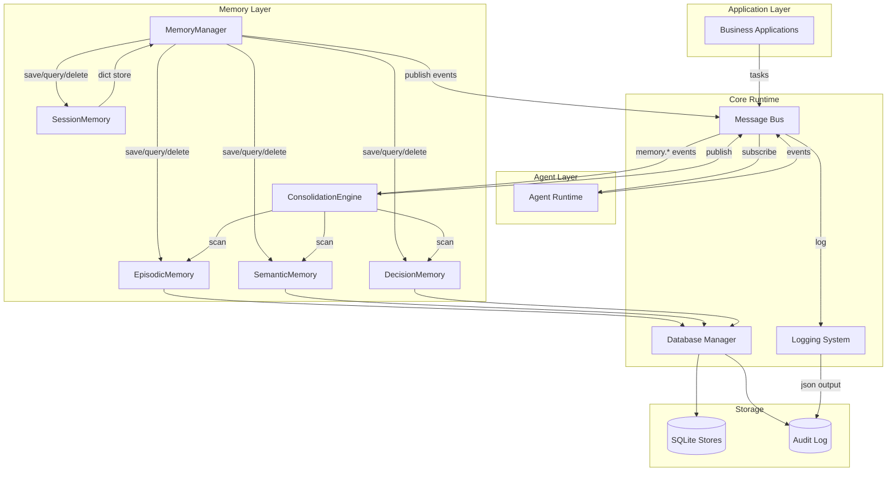

# RFC-005: Core Runtime Architecture

## Status
Accepted (2026-07-12)

## Overview
This RFC documents the data flow between Core Runtime subsystems: Message Bus, Database Manager, Memory Layer, and Logging. It defines the runtime contract that all upper layers (Knowledge, Agent, Application) depend on.

## Architecture Diagram



## Data Flow (Runtime Sequence)

### Memory Write Path
```
Agent/App → MemoryManager.save_memory()
  → route by MemoryType → Store.save()
    → DatabaseManager.get_connection() → SQLite INSERT
  → MemoryManager._publish_event()
    → MessageBus.publish("memory.created")
      → Subscribers notified (Audit, Consolidation, logging)
```

### Memory Read Path
```
Agent/App → MemoryManager.retrieve_memory(query)
  → route by MemoryType (or all) → Store.query()
    → DatabaseManager.get_connection() → SQLite SELECT
  → MemoryManager._publish_event("memory.accessed")
    → Audit log recorded
  → return results
```

### Consolidation Cycle
```
ConsolidationEngine.run_cycle()
  → for each registered Store:
    → Store.query(top_k=1000)
    → for each item:
      → ImportanceScorer.calculate(item)
      → MemoryDecay.calculate_from_item(item)
      → ConsolidationPolicy.evaluate(item, score, decay, access_count)
      → action: RETAIN / COMPRESS / PROMOTE / DELETE
  → publish memory.consolidated event
```

## Key Contracts

| Contract | Between | Semantics |
|----------|---------|-----------|
| MemoryStore protocol | Memory Layer ↔ Storage | 8-method uniform interface |
| MessageBus protocol | Core ↔ All Layers | Pub-Sub + Task Queue |
| make_memory_event() | All memory modules | Standardized payload/metadata |
| DatabaseManager.get_connection() | Stores ↔ DB | Shared connection pool |

## Non-Goals
- LLM model binding (governed by MODEL_POLICY.md)
- Vector search (governed by Knowledge Layer)
- Distributed messaging (future: Kafka/RabbitMQ adapter behind MessageBus protocol)
