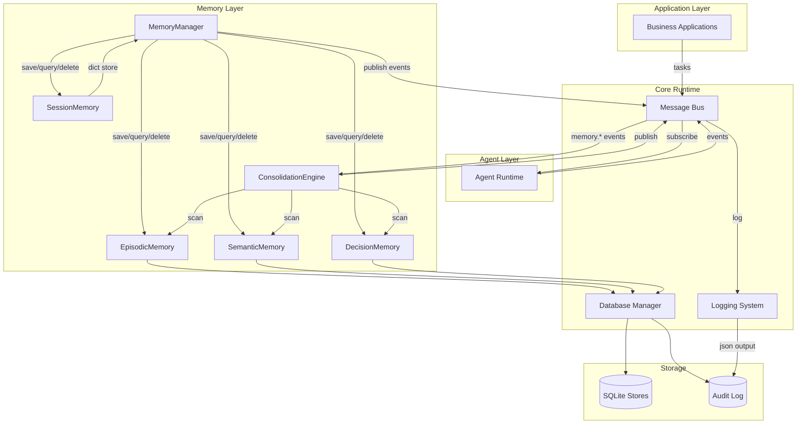

# RFC-005：Core Runtime 架构

## 状态

Accepted（2026-07-12）

## 概述

本文记录 Core Runtime 子系统之间的数据流，包括 Message Bus、Database Manager、
Memory Layer 与 Logging，并定义 Knowledge、Agent 和 Application 等上层依赖的 Runtime
合同。

## 架构图


```mermaid
graph TD
    subgraph "Application Layer"
        APP[Business Applications]
    end
    subgraph "Agent Layer"
        AGENT[Agent Runtime]
    end
    subgraph "Core Runtime"
        BUS[Message Bus]
        LOG[Logging System]
        DB[Database Manager]
    end
    subgraph "Memory Layer"
        MGR[MemoryManager]
        SM[SessionMemory]
        EM[EpisodicMemory]
        SEM[SemanticMemory]
        DM[DecisionMemory]
        CE[ConsolidationEngine]
    end
    subgraph "Storage"
        SQLITE[(SQLite Stores)]
        AUDIT[(Audit Log)]
    end
    APP -->|tasks| BUS
    AGENT -->|events| BUS
    BUS -->|subscribe| AGENT
    BUS -->|log| LOG
    MGR -->|save/query/delete| SM
    MGR -->|save/query/delete| EM
    MGR -->|save/query/delete| SEM
    MGR -->|save/query/delete| DM
    MGR -->|publish events| BUS
    SM -->|dict store| MGR
    EM --> DB
    SEM --> DB
    DM --> DB
    DB --> SQLITE
    DB --> AUDIT
    CE -->|scan| EM
    CE -->|scan| SEM
    CE -->|scan| DM
    CE -->|publish| BUS
    BUS -->|memory.* events| CE
    LOG -->|json output| AUDIT
```

## Runtime 数据流

### Memory 写入路径

```text
Agent/App → MemoryManager.save_memory()
  → route by MemoryType → Store.save()
    → DatabaseManager.get_connection() → SQLite INSERT
  → MemoryManager._publish_event()
    → MessageBus.publish("memory.created")
      → Subscribers notified (Audit, Consolidation, logging)
```

### Memory 读取路径

```text
Agent/App → MemoryManager.retrieve_memory(query)
  → route by MemoryType (or all) → Store.query()
    → DatabaseManager.get_connection() → SQLite SELECT
  → MemoryManager._publish_event("memory.accessed")
    → Audit log recorded
  → return results
```

### Consolidation 周期

```text
ConsolidationEngine.run_cycle()
  → for each registered Store:
    → Store.query(top_k=1000)
    → for each item:
      → ImportanceScorer.calculate(item)
      → MemoryDecay.calculate_from_item(item)
      → ConsolidationPolicy.evaluate(item, score, decay, access_count)
      → action: RETAIN / COMPRESS / PROMOTE / DELETE
  → publish memory.consolidated event
```

## 关键合同

| 合同 | 边界 | 语义 |
| --- | --- | --- |
| `MemoryStore` protocol | Memory Layer ↔ Storage | 八方法统一接口 |
| `MessageBus` protocol | Core ↔ 全部 Layer | Pub-Sub 与 Task Queue |
| `make_memory_event()` | 全部 Memory Module | 标准 Payload/Metadata |
| `DatabaseManager.get_connection()` | Store ↔ DB | 共享连接池 |

## 非目标

- LLM model binding，由 `MODEL_POLICY.md` 治理；
- Vector search，由 Knowledge Layer 治理；
- Distributed messaging，未来可在 `MessageBus` protocol 后增加 Kafka/RabbitMQ Adapter。
