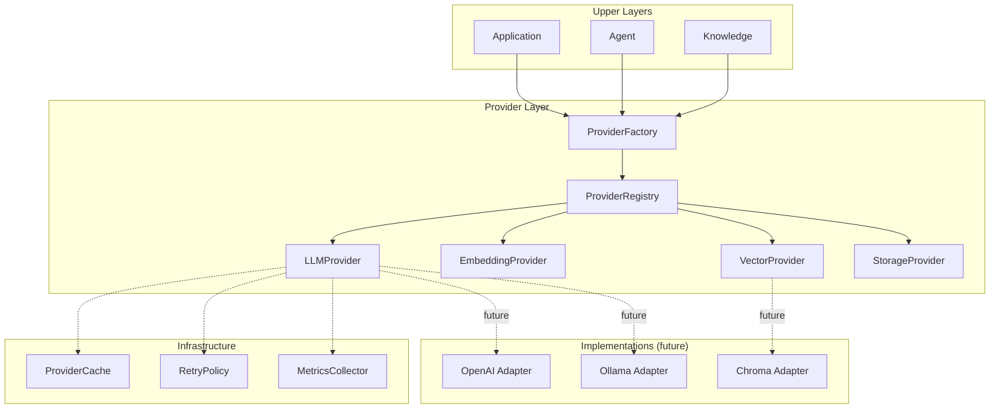

# RFC-006: Provider Layer Architecture

## Status
Accepted (2026-07-12)

## Context
AI-Lab needs to support multiple LLM backends (OpenAI, Anthropic, Ollama, local models), multiple embedding providers, multiple vector databases (Chroma, Qdrant, FAISS), and multiple storage backends (local filesystem, S3, MinIO).

Without a unified abstraction, each upper layer (Knowledge, Agent, Application) would need to call provider-specific SDKs directly. This would:
- Make model switching require code changes
- Break the Model Agnostic principle in MODEL_POLICY.md
- Create vendor lock-in at every layer

## Decision
Create a dedicated **Provider Layer** as the seventh architectural layer, sitting between Core and Knowledge/Agent:

```
Application  →  Agent  →  Knowledge
                ↓            ↓
           Provider Layer (NEW)
                ↓
              Core
```

### Provider Types
1. **LLM Provider** — generate, stream, count_tokens, list_models
2. **Embedding Provider** — embed, embed_query, dimension, normalize
3. **Vector Provider** — insert, search, delete, collection management
4. **Storage Provider** — save, load, delete, list_keys

### Key Design Decisions
- **Interface-first**: Abstract protocols define the contract; mock providers validate it
- **Registry + Factory pattern**: Providers are registered as factories; instances are lazy
- **Unified lifecycle**: All providers share BaseProvider (initialize/shutdown/health_check)
- **No SDK binding in this phase**: Only mock implementations exist; real adapters come later
- **Retry + Cache + Metrics**: Built into the provider infrastructure, not per-provider

## Architecture Diagram



## Directory Structure

```
core/providers/
├── __init__.py          # Public exports
├── base.py              # BaseProvider (lifecycle)
├── registry.py          # ProviderRegistry
├── factory.py           # ProviderFactory
├── models.py            # Data models
├── config.py            # Default configs
├── exceptions.py        # Provider exceptions
├── metrics.py           # MetricsCollector
├── cache.py             # ProviderCache (TTL)
├── retry.py             # RetryPolicy (exponential backoff)
├── llm/                 # LLM Provider
│   ├── protocol.py      #   LLMProvider abstract
│   ├── mock.py          #   MockLLMProvider
│   └── registry.py      #   Built-in registration
├── embedding/           # Embedding Provider
├── vector/              # Vector Provider
└── storage/             # Storage Provider
```

## Consequences
- All upper layers now depend on provider protocols, not SDKs
- Model switching is a config change, not a code change
- 55 new tests validate the provider infrastructure
- Zero external dependencies (pure stdlib + Pydantic)
