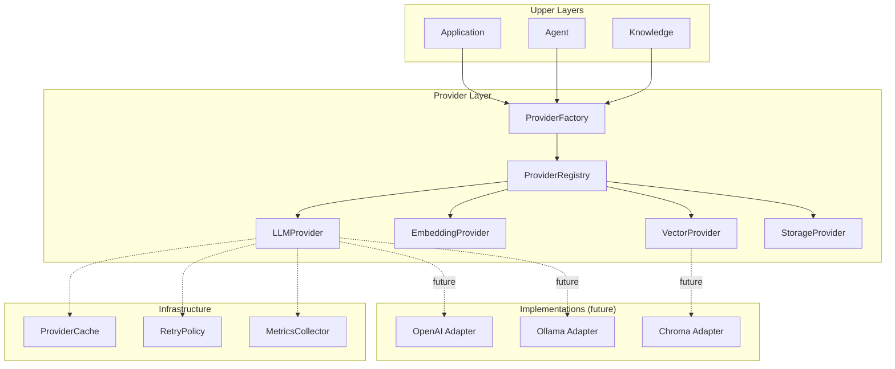

# RFC-006：Provider Layer 架构

## 状态

Accepted（2026-07-12）

## 背景

AI-Lab 需要支持 OpenAI、Anthropic、Ollama 与本地模型等 LLM backend，多种 Embedding
Provider，多种 Vector Database（Chroma、Qdrant、FAISS），以及本地文件系统、S3、MinIO
等 Storage backend。

缺少统一抽象时，Knowledge、Agent 与 Application 等上层必须直接调用特定 SDK，会导致
切换模型需要改代码、破坏 `MODEL_POLICY.md` 的 Model Agnostic 原则，并在每层形成 Vendor
lock-in。

## 决策

在 Core 与 Knowledge/Agent 之间建立独立 Provider Layer：

```text
Application  →  Agent  →  Knowledge
                ↓            ↓
           Provider Layer
                ↓
              Core
```

### Provider 类型

1. **LLM Provider**：`generate`、`stream`、`count_tokens`、`list_models`；
2. **Embedding Provider**：`embed`、`embed_query`、`dimension`、`normalize`；
3. **Vector Provider**：`insert`、`search`、`delete`、Collection 管理；
4. **Storage Provider**：`save`、`load`、`delete`、`list_keys`。

### 关键设计决策

- **Interface-first**：Abstract protocol 定义合同，由 Mock Provider 验证；
- **Registry + Factory**：注册 Factory，并延迟创建实例；
- **统一生命周期**：全部 Provider 共享
  `BaseProvider.initialize/shutdown/health_check`；
- **本阶段不绑定 SDK**：只提供 Mock 实现，真实 Adapter 延期；
- **Retry + Cache + Metrics**：放在 Provider Infrastructure，不由各 Provider 重复实现。

## 架构图


```mermaid
graph TD
    subgraph "Upper Layers"
        APP[Application]
        AGENT[Agent]
        KNOW[Knowledge]
    end
    subgraph "Provider Layer"
        REG[ProviderRegistry]
        FAC[ProviderFactory]
        LLM[LLMProvider]
        EMB[EmbeddingProvider]
        VEC[VectorProvider]
        STO[StorageProvider]
    end
    subgraph "Infrastructure"
        CACHE[ProviderCache]
        RETRY[RetryPolicy]
        METRICS[MetricsCollector]
    end
    subgraph "Implementations (future)"
        OPENAI[OpenAI Adapter]
        OLLAMA[Ollama Adapter]
        CHROMA[Chroma Adapter]
    end
    APP --> FAC
    AGENT --> FAC
    KNOW --> FAC
    FAC --> REG
    REG --> LLM
    REG --> EMB
    REG --> VEC
    REG --> STO
    LLM -.-> CACHE
    LLM -.-> RETRY
    LLM -.-> METRICS
    LLM -.future.-> OPENAI
    LLM -.future.-> OLLAMA
    VEC -.future.-> CHROMA
```

## 目录结构

```text
core/providers/
├── __init__.py
├── base.py
├── registry.py
├── factory.py
├── models.py
├── config.py
├── exceptions.py
├── metrics.py
├── cache.py
├── retry.py
├── llm/
│   ├── protocol.py
│   ├── mock.py
│   └── registry.py
├── embedding/
├── vector/
└── storage/
```

## 后果

- 上层依赖 Provider protocol，而不是特定 SDK；
- 切换模型只需改配置；
- 55 个新增测试验证 Provider Infrastructure；
- 不增加外部依赖，仅使用标准库与 Pydantic。
