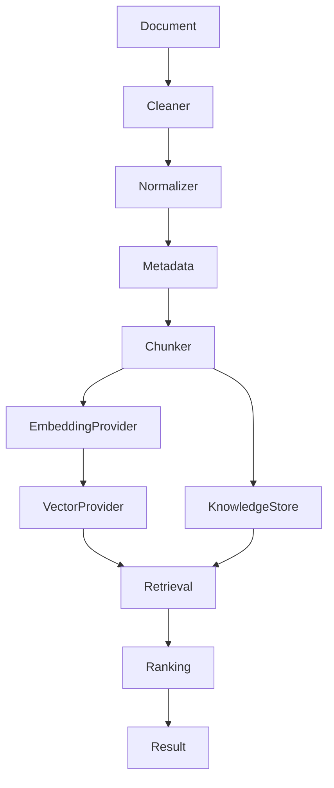

# RFC-007: Knowledge Layer Architecture

## Status
Accepted (2026-07-12)

## Overview
Knowledge Layer provides unified document ingestion, chunking, embedding, vector storage, and hybrid retrieval. All through Provider Layer protocols.

## Architecture

## Components
- IngestionPipeline: clean, normalize, metadata, chunk, embed, index
- ChunkStrategy: 6 strategies (fixed/sentence/paragraph/markdown/recursive/token_window)
- HybridRetriever: vector + keyword with configurable weights
- KnowledgeRanker: composite scoring (vector + keyword + freshness + importance + confidence)
- KnowledgeManager: unified entry point

## Design
- Provider Agnostic: all external access through Provider Layer
- Strategy Pattern: chunkers, retrievers, rankers are plug-in
- 8-method KnowledgeStore protocol aligned with MemoryStore
