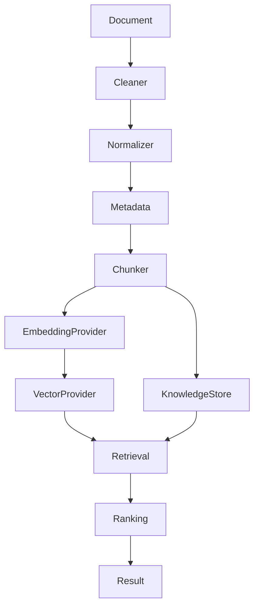

# RFC-007：Knowledge Layer 架构

## 状态

Accepted（2026-07-12）

## 概述

Knowledge Layer 通过 Provider Layer protocol 提供统一的文档摄取、Chunk、Embedding、
Vector Storage 与混合检索。

## 架构

```mermaid
graph TD
    DOC[Document] --> CLEAN[Cleaner]
    CLEAN --> NORM[Normalizer]
    NORM --> META[Metadata]
    META --> CHUNK[Chunker]
    CHUNK --> EMBED[EmbeddingProvider]
    EMBED --> VEC[VectorProvider]
    CHUNK --> STORE[KnowledgeStore]
    VEC --> RETRIEVE[Retrieval]
    STORE --> RETRIEVE
    RETRIEVE --> RANK[Ranking]
    RANK --> RESULT[Result]
```

## 组件

- `IngestionPipeline`：Clean、Normalize、Metadata、Chunk、Embed 与 Index；
- `ChunkStrategy`：fixed、sentence、paragraph、markdown、recursive、token_window 六种策略；
- `HybridRetriever`：可配置权重的 Vector + Keyword；
- `KnowledgeRanker`：组合 Vector、Keyword、Freshness、Importance 与 Confidence 分数；
- `KnowledgeManager`：统一入口。

## 设计

- Provider Agnostic：外部访问统一经过 Provider Layer；
- Strategy Pattern：Chunker、Retriever 与 Ranker 可插拔；
- 八方法 `KnowledgeStore` protocol 与 `MemoryStore` 对齐。
