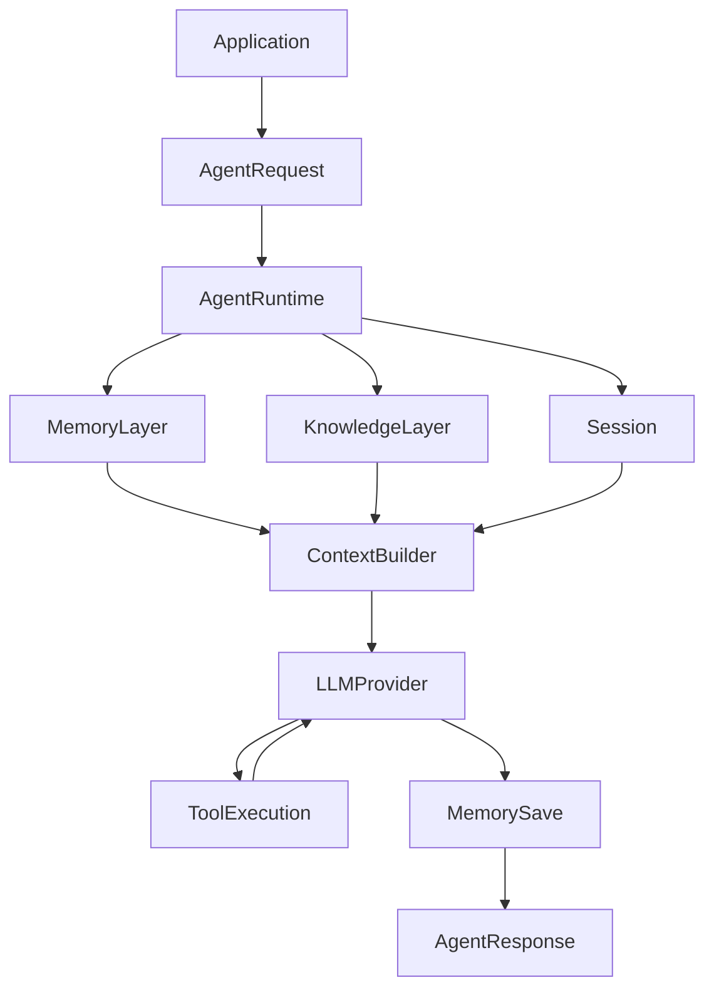

# RFC-008: Agent Runtime Architecture

## Status
Accepted (2026-07-12)

## Overview
Agent Runtime is the execution engine for all AI-Lab agents. It orchestrates session, memory, knowledge, context building, LLM invocation, tool execution, and response assembly.

## Data Flow



## Components
- **AgentRuntime**: orchestrates the full lifecycle
- **AgentExecutor**: runs a single interaction cycle
- **ContextBuilder**: builds prompt context from memory + knowledge + session
- **AgentLifecycleManager**: enforces valid state transitions
- **AgentRegistry**: registration and discovery
- **AgentSession**: per-interaction state

## Lifecycle
```
CREATED -> INITIALIZED -> READY -> RUNNING -> IDLE -> STOPPED -> DESTROYED
```
