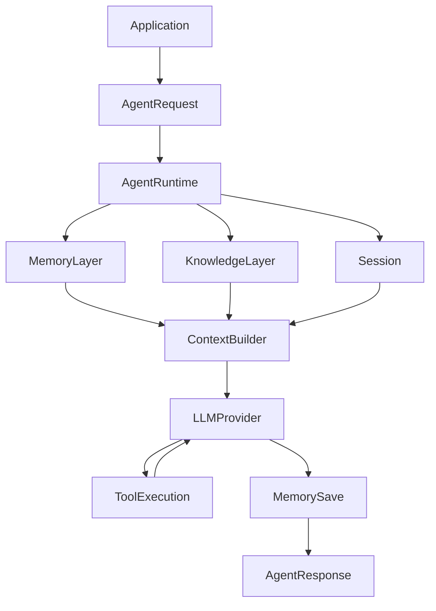

# RFC-008：Agent Runtime 架构

## 状态

Accepted（2026-07-12）

## 概述

Agent Runtime 是全部 AI-Lab Agent 的执行引擎，负责编排 Session、Memory、Knowledge、
Context 构建、LLM 调用、Tool 执行和 Response 组装。

## 数据流


```mermaid
graph TD
    APP[Application] --> REQ[AgentRequest]
    REQ --> RT[AgentRuntime]
    RT --> SES[Session]
    RT --> MEM[MemoryLayer]
    RT --> KNW[KnowledgeLayer]
    MEM --> CTX[ContextBuilder]
    KNW --> CTX
    SES --> CTX
    CTX --> LLM[LLMProvider]
    LLM --> TOOL[ToolExecution]
    TOOL --> LLM
    LLM --> SAVE[MemorySave]
    SAVE --> RESP[AgentResponse]
```

## 组件

- **AgentRuntime**：编排完整生命周期；
- **AgentExecutor**：执行一次交互循环；
- **ContextBuilder**：从 Memory、Knowledge 与 Session 构建 Prompt Context；
- **AgentLifecycleManager**：执行合法状态转换；
- **AgentRegistry**：注册与发现；
- **AgentSession**：保存单次交互状态。

## 生命周期

```text
CREATED -> INITIALIZED -> READY -> RUNNING -> IDLE -> STOPPED -> DESTROYED
```
