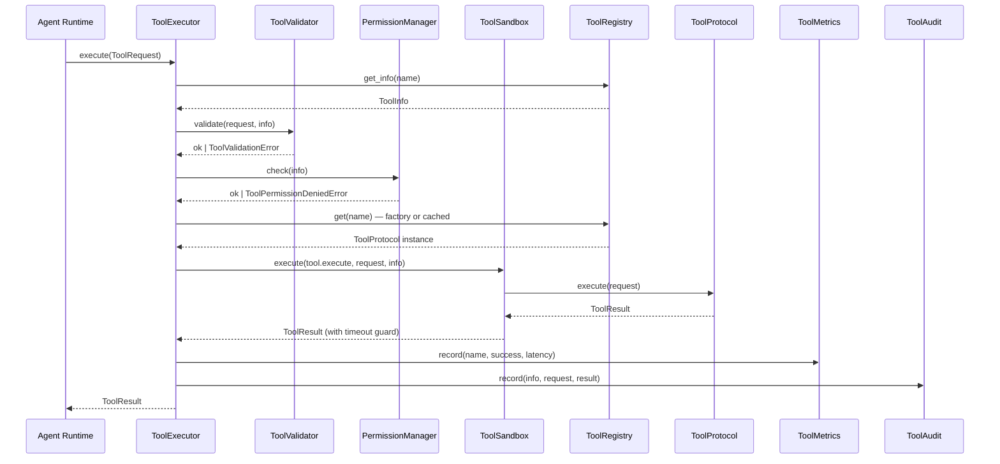

# RFC-009: Tool Runtime Architecture

**Status:** Accepted
**Version:** v0.18.0
**Date:** 2026-07-12
**Author:** AI-Lab Core Team

## Abstract

This RFC defines the Tool Runtime layer — the unified execution, discovery, sandboxing, permission, audit, and metrics system for all tools in AI-Lab. Agent Runtime must route every external capability through this layer; direct tool invocation by agents is forbidden.

## Motivation

AI-Lab will eventually support 100+ tools spanning Python, Shell, Browser, File, SQL, Git, Docker, MCP, ERP, WeChat, Email, Calendar, OCR, and more. Without a unified Tool Runtime, each agent would need to know tool-specific invocation patterns, permission models, and error handling — leading to tight coupling and security risks.

## Architecture

```
Agent Runtime
      │
      ▼
Tool Executor (single entry point)
      │
  ┌───┼───────────┐
  │   │           │
  ▼   ▼           ▼
Validator  Permission  Sandbox
  │       │           │
  └───────┼───────────┘
          ▼
      Tool Registry
          │
    ┌─────┼─────┐
    │     │     │
    ▼     ▼     ▼
  Echo  Calc  DateTime  UUID
    │     │     │     │
    └─────┴─────┴─────┘
          │
    ┌─────┼─────┐
    ▼     ▼     ▼
  Metrics  Audit  Events
```



## Key Design Decisions

1. **Single Entry Point:** ToolExecutor is the only path. Agent Runtime never calls tools directly.
2. **Protocol-First:** All tools implement ToolProtocol (initialize/execute/validate/health_check/shutdown).
3. **Registry + Factory:** ToolRegistry holds ToolInfo + lazy factory; tools instantiated on first use.
4. **Sandbox via asyncio.wait_for:** Timeout enforcement happens at the sandbox layer — no tool can block the event loop indefinitely. Future: Docker sandbox for Python/Shell.
5. **Permission per-tool:** Each ToolInfo declares required permissions; PermissionManager checks agent capabilities before execution.
6. **Metrics & Audit inseparable:** Every execution is recorded — no tool can execute without trace.

## Tool Lifecycle

```
REGISTERED → READY → RUNNING → (IDLE) → STOPPED
                  ↘
                  FAILED → DISABLED
```

## Event Types

| Event | Emitted When |
|-------|-------------|
| `tool.registered` | Tool added to registry |
| `tool.executed` | Tool execution succeeds |
| `tool.failed` | Tool execution fails |
| `tool.timeout` | Tool exceeds sandbox timeout |
| `tool.disabled` | Tool status set to DISABLED |

## Future Extensions

- **MCP Adapter:** Unified adapter for MCP-compliant tools (Phase 3.4)
- **Auto Discovery:** Scan `core/tools/builtin/` and register all ToolProtocol implementations
- **Docker Sandbox:** Isolated execution for Python/Shell tools
- **Tool Marketplace:** Remote tool registry with versioning
- **Tool Composition:** Chain multiple tools via Workflow Engine
