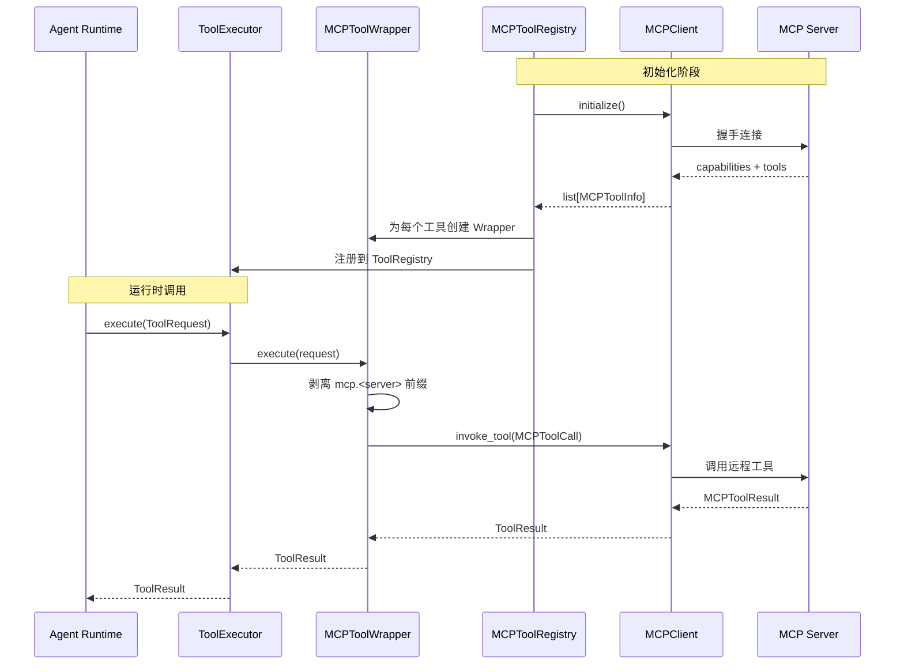

# RFC-010: MCP Adapter Architecture

**状态：** Accepted
**版本：** v0.19.0
**日期：** 2026-07-12

## 摘要

本文定义 MCP（Model Context Protocol）Adapter 的架构设计。MCP Adapter 负责将外部 MCP Server 提供的工具，透明地接入 AI-Lab 的 Tool Runtime，使 Agent 可以像调用内置工具一样调用 MCP 工具。

## 动机

AI-Lab 需要接入大量外部工具：Browser、Shell、ERP、微信、GitHub 等。MCP 协议作为 AI 工具调用的开放标准，可以让 AI-Lab 复用整个 MCP 生态的工具，而无需为每个外部系统单独编写适配器。

## 架构

```
Agent Runtime
      │
      ▼
ToolExecutor (唯一执行入口)
      │
      ▼
ToolProtocol ←── MCPToolWrapper (协议转换层)
      │               │
      ▼               ▼
ToolRegistry ←── MCPToolRegistry ──→ MCPClient ──→ MCP Server
```



## 关键设计决策

1. **双重协议隔离**：MCPToolWrapper 实现 ToolProtocol（对 ToolExecutor 可见），同时内部委托 MCPClientProtocol（对 MCP Server 通信）。两层协议互不耦合。
2. **命名空间前缀**：MCP 工具在 ToolRegistry 中以 `mcp.<server>.<tool>` 命名，避免与内置工具冲突。
3. **懒加载**：MCPToolRegistry 在 `add_server` 时一次性发现并注册所有工具，后续 ToolRegistry 的 `get()` 通过工厂模式懒实例化 Wrapper。
4. **生命周期分离**：MCPClient 的连接由 MCPToolRegistry 管理；MCPToolWrapper 不负责连接生命周期。
5. **Mock 优先**：测试用 Mock MCP Server（纯内存），生产环境替换为 stdio/HTTP MCP SDK。

## 依赖方向（严格遵守）

```
Agent → ToolExecutor → ToolProtocol ← MCPToolWrapper → MCPClientProtocol → MCP Server
                         ↑                                                    ↑
                    内置工具                                          （未来替换实现）
```

严禁 MCP Adapter 向上依赖 Agent Runtime 或业务逻辑。
