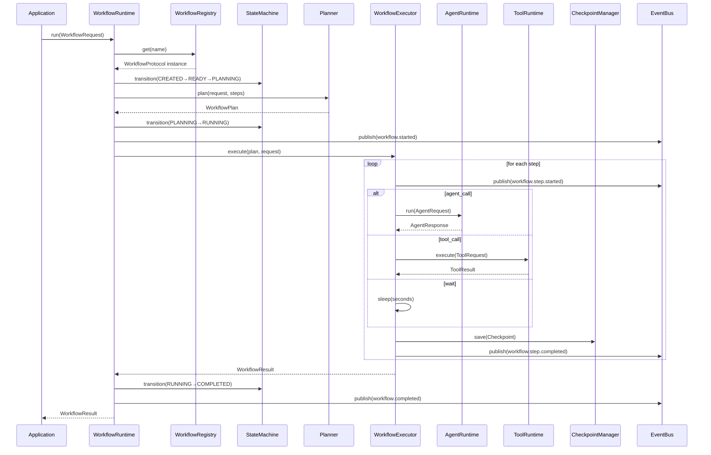

# RFC-011: Workflow Engine Architecture

**状态：** Accepted
**版本：** v0.20.0
**日期：** 2026-07-12

## 摘要

本文定义 AI-Lab Workflow Engine 的架构设计。Workflow Engine 是 AI-Lab 的任务调度中心，Agent、Automation、Scheduler、Multi-Agent 全部建立在此之上。

## 动机

AI-Lab 从单次 Agent 交互走向多步骤自主执行，需要一个统一的 Workflow Runtime 来编排任务、管理状态、处理重试和恢复。这标志着从 Agent Framework 到 AI Operating System 的质变。

## 架构

```
Application
      │
      ▼
WorkflowRuntime (唯一入口)
      │
  ┌───┼──────────┐
  │   │          │
  ▼   ▼          ▼
Registry  Planner  Executor
  │      │          │
  │      │    ┌─────┼─────────┐
  │      │    │     │         │
  │      │    ▼     ▼         ▼
  │      │  Agent  Tool    Checkpoint
  │      │  RT     RT     Manager
  │      │
  ▼      ▼
EventBus + StateMachine
```



## 关键设计决策

1. **WorkflowRuntime 是唯一入口**：Application 层只能调用 WorkflowRuntime，不能直接调用 Executor 或 Planner。
2. **Planner 策略模式**：当前使用 RulePlanner，后续可替换为 LLMPlanner / TreePlanner / GraphPlanner，无需修改 Executor。
3. **Executor 不直接访问 Provider**：WorkflowExecutor 只通过 Agent Runtime 和 Tool Runtime 执行，保持依赖方向。
4. **Checkpoint 内建**：每个步骤执行后自动保存快照，支持暂停/恢复/回放。
5. **状态机统一管理**：所有状态转换通过 WorkflowStateMachine，禁止散落在代码中。

## 依赖方向

```
Application → Workflow → Agent → Knowledge → Provider → Tool → Adapter → External
```

严禁 Workflow 直接调用 Provider、MCP、Database。
