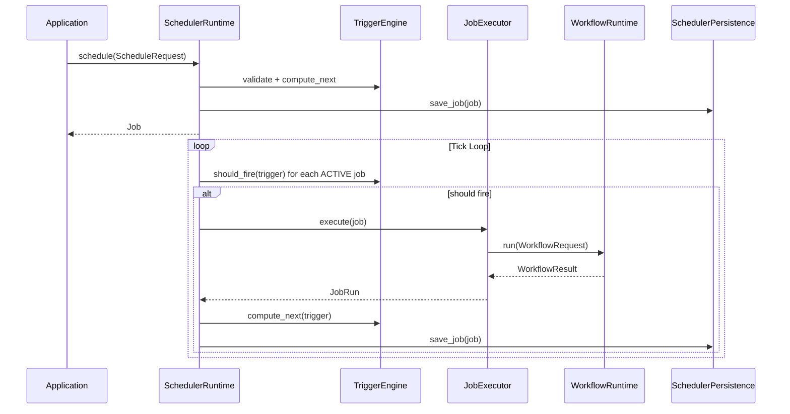

# RFC-012: Scheduler Runtime Architecture

**状态：** Accepted
**版本：** v0.21.0
**日期：** 2026-07-13

## 摘要

本文定义 AI-Lab Scheduler Runtime 的架构设计。Scheduler 是 AI-Lab 的统一调度中心，所有 Cron / Interval / One-shot / Manual / Event 触发的能力都必须经过 Scheduler，最终通过 Workflow Runtime 执行业务。

## 动机

AI-Lab 需要定时执行任务（如每日报告、数据同步、定时巡检）。Workflow Engine 解决了「如何执行多步骤任务」，但缺少「何时执行」的调度能力。Scheduler 填补这个空白。

## 架构

```
Application
      ↓
SchedulerRuntime（统一调度中心）
  ├── SchedulerRegistry（Job 注册）
  ├── TriggerEngine（五种触发类型）
  ├── JobExecutor（委托 Workflow）
  ├── SchedulerPersistence（SQLite 持久化）
  └── EventBus（9 种事件）
      ↓
WorkflowRuntime → AgentRuntime → ToolRuntime
```



## 关键设计决策

1. **Scheduler 不执行业务**：只负责调度，委托 Workflow Runtime 执行。
2. **五种 Trigger 类型**：Cron / Interval / One-shot / Manual / Event，统一接口。
3. **并发控制**：`max_concurrent_jobs` 限制同时间运行的任务数。
4. **持久化恢复**：SQLite 存储 Job，重启自动恢复。
5. **EventBus 集成**：所有调度事件发布到 EventBus。

## 依赖方向

```
Application → Scheduler → Workflow → Agent → Knowledge → Provider → Tool → Adapter
```
