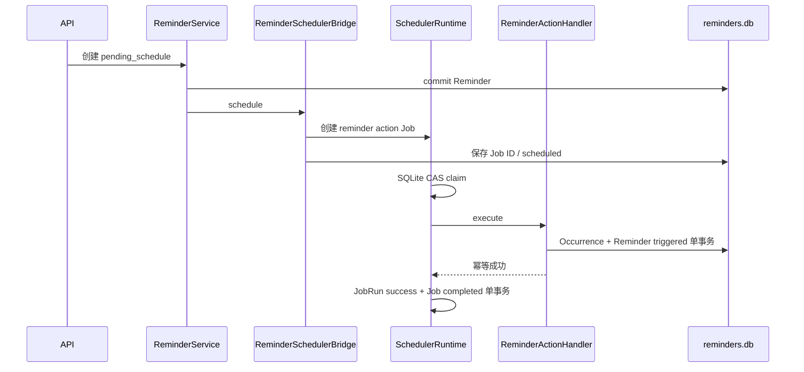

# RFC-015：Reminder 与 Scheduler Bridge

## 状态

Proposed / SP-005 implementation candidate

## 问题

UserTask 表达用户待办，Scheduler Job 表达通用基础设施作业。二者之间缺少独立 Reminder 领域、持久化触发记录、跨重启恢复和幂等桥接。现有 One-shot 成功后仍保留过去时间，会被后续 tick 重复执行；Scheduler 也只能委托 Workflow。

## 决策

1. 新增独立 Reminder 与 ReminderOccurrence，不把 Reminder 当作 UserTask、Execution Task 或 Scheduler Job。
2. Scheduler 新增 Action Handler Registry，Workflow 与 Reminder 通过显式 Handler 分派。
3. Scheduler 使用 SQLite 条件 UPDATE 进行跨 Runtime CAS claim，并持久化 JobRun、claim 和脱敏 FailureInfo。
4. Reminder Handler 使用数据库唯一键实现 effectively-once occurrence。
5. reminders.db 与 scheduler.db 使用显式 Saga、补偿和 reconciliation，不伪造跨库事务。
6. UserTask 终态联动使用同步生命周期协调器；EventBus 只承担通知与观测。

## 数据流

## 失败语义

Handler 成功而 Job terminal save 失败时，claim 到期后允许再次调用 Handler；Handler 读取已触发 Occurrence 后返回幂等成功，Scheduler 再次写入 completed。外部通知不属于本 RFC，因此“触发成功”只表示持久化 Occurrence 已提交。

## 兼容性

旧 Scheduler Job 缺少 action/claim/revision 字段时，幂等 Schema migration 将其解释为 `workflow` Action。旧数据库路径和 Workflow Runtime 调用方式保持不变。产品版本保持 0.33.0，SP-005 尚未形成新 Release。
