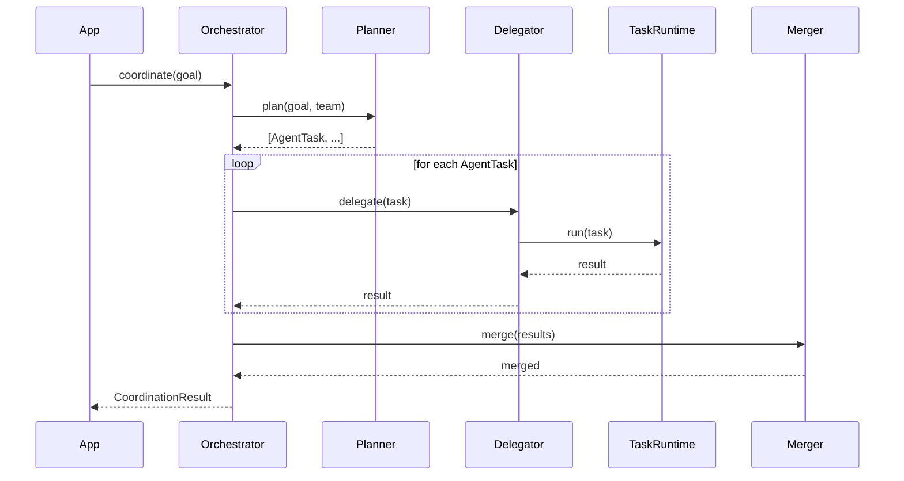

# RFC-013: Multi-Agent Coordination Architecture

**Version:** 1.0
**Date:** 2026-07-13
**Status:** Implemented (v0.23.0)

## Summary

定义 AI-Lab 多 Agent 协作架构。新增 `core/coordination/` 作为 Multi-Agent Coordinating Layer，使 AI-Lab 从单 Agent Runtime 演化为多 Agent 协作系统。

## Motivation

当前 Agent Runtime 仅支持单 Agent 执行。未来需要：
- 多 Agent 协作完成复杂任务
- Agent 间通信和消息传递
- Agent Team 管理和角色分配
- 任务分解和委派

需要一个新的协调层，不修改 Agent Runtime 核心职责。

## Architecture

```
Application
    ↓
AgentOrchestrator (唯一入口)
    ├── MultiAgentPlanner   (任务分解)
    ├── TaskDelegator       (委派执行，复用 Task Runtime)
    ├── AgentMessageBus     (Agent 间通信)
    ├── ResultMerger        (结果合并)
    ├── AgentTeamRegistry   (Team + Role 管理)
    └── EventBus            (事件发布)
    ↓
Agent Runtime → Workflow Runtime → Task Runtime
```

## Key Design Decisions

1. **Orchestrator 是唯一入口**：Application 层只和 Orchestrator 交互
2. **复用 Task Runtime**：Delegator 委托给 Task Runtime，不重新实现任务调度
3. **不直接共享 Memory**：通过 CollaborationContext 保存中间结果
4. **AgentMessageBus 基于 EventBus**：所有消息通过事件系统发布
5. **Protocol First**：所有模块遵循 Protocol 接口

## Data Flow



## Files

- `core/coordination/models.py` — 数据模型
- `core/coordination/protocol.py` — 抽象接口
- `core/coordination/orchestrator.py` — AgentOrchestrator
- `core/coordination/communication.py` — AgentMessageBus
- `core/coordination/delegation.py` — TaskDelegator
- `core/coordination/merger.py` — ResultMerger
- `core/coordination/planner.py` — MultiAgentPlanner
- `core/coordination/registry.py` — AgentTeamRegistry
- `core/coordination/events.py` — 事件类型
- `core/coordination/config.py` — 配置
- `core/coordination/exceptions.py` — 异常
